# 盒子模型与视觉格式化模型

HTML文档中的每个元素在渲染时都会被描述成一个矩形盒子，盒模型是用来表示元素盒子所占空间大小的模型，为元素生成并根据视觉格式化模型(visual formatting model)进行布局的矩形框。盒子模型是用来处理元素内部属性的,而视觉格式化模型是用来处理盒子摆放的.

<!-- more -->

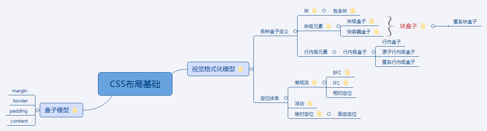

## 盒子模型基础知识

盒子包括content(内容), padding(内边距), border(边框), margin(外边距)区域

盒子content区域的宽高取决于几个因素: 盒子是否显式设置宽高(width/height); 盒子是否包含text或者其他盒子; 盒子是否为表格;

content,padding,border的背景由'background'属性指定; margin的背景总是透明的.

margin,border,padding存在各种定义好的属性和参数,以后再详细介绍.

    W3C标准下：盒总宽/高度 = width/height + padding + border + margin;
    
    怪异模式下：盒总宽/高度 = width/height + margin = 内容宽/高度 + padding + border + margin;
    
    CSS3中， box-sizing 默认为 content-box ，即采用W3C标准盒模型，若取值 border-box 则采用怪异模式盒模型。

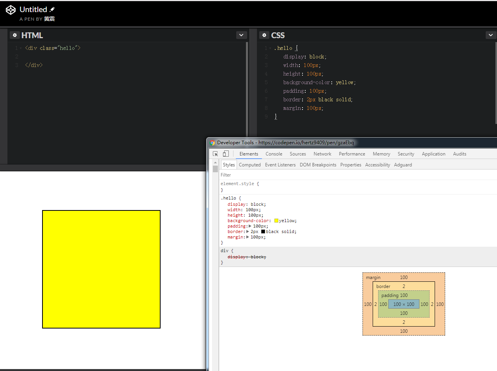

## 视觉格式化模型(visual formatting model)

视觉格式化模型是用来处理和在视觉媒体上显示文档时使用的计算规则.

视觉格式化模型会根据CSS盒子模型将文档中的元素转换为一个个盒子,每个盒子的布局由以下因素决定:

* 盒子的尺寸和类型
* 定位方案（positioning scheme）：普通流定位、浮动定位或绝对定位
* 文档树中的其它元素：即当前盒子的子元素或兄弟元素
* 外部信息:如视口尺寸与位置,图片大小等

视觉格式化模型会根据盒子的包含块的边界来渲染盒子.盒子会创建一个包含其后代元素的包含块,但盒子并不由包含块所限制,当盒子的布局跑到包含块外面时称为溢出.

        常见名词定义:
        块: block，一个抽象的概念，一个块在文档流上占据一个独立的区域，块与块之间在垂直方向上按照顺序依次堆叠.
        包含块：containing block，包含其他盒子的块称为包含块,一般来说盒子生成的块就是盒子子元素的包含块.
        块级元素: Block-level elements,元素的 display 为 block、list-item、table 时，该元素将成为块级元素.视觉上呈现为块,竖直排列.每个块级元素生成一个主要的块级盒来包含后代盒和生成的内容,并参与定位.
        块级盒: Block-level box, 由块级元素生成,参数块级格式化上下文(BFC).描述元素和它的父元素与兄弟元素之间的表现.
        块容器盒: Block container box, 只包含其他块级盒,或生成一个行内格式化上下文(IFC),只包含行内盒.描述元素和它后代之间的关系.
        块盒: Block boxes, 同时是块容器盒的块级盒.
        匿名块盒: Anonymous block boxes, 没有名字,不能被css选择符选中.块容器盒只包含块级盒或者行内盒,当两者都存在时,将会创建匿名块盒来包含相邻的行内盒.
        行内级元素：inline-level element，display 为 inline、inline-block、inline-table 的元素称为行内级元素。
        行内级盒: inline-level boxes, 由行内级元素生成,参与行内格式化上下文的创建.
        行内盒:inline box, 一个其内容会参与创建其容器的行内格式化上下文的行内级盒子.
        原子行内级盒子:atomic inline-level box, 内容不参与行内格式化上下文创建的行内级盒子,在同一个IFC中,原子行内级盒子不能被拆分成多行
        匿名行内盒:类似于块盒子，CSS引擎有时候也会自动创建一些行内盒子。这些行内盒子无法被选择符选中，因此是匿名的，它们从父元素那里继承那些可继承的属性，其他属性保持默认值 initial.

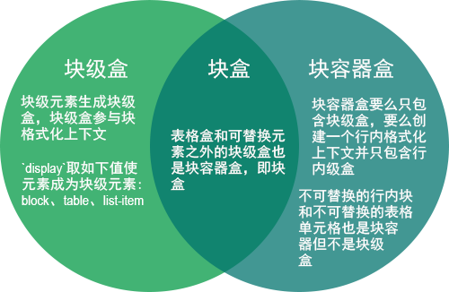

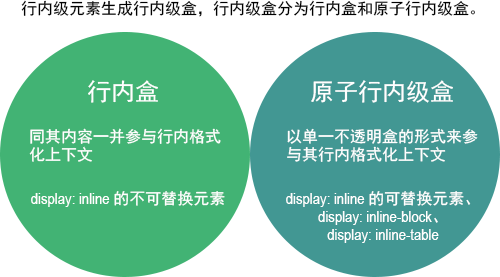

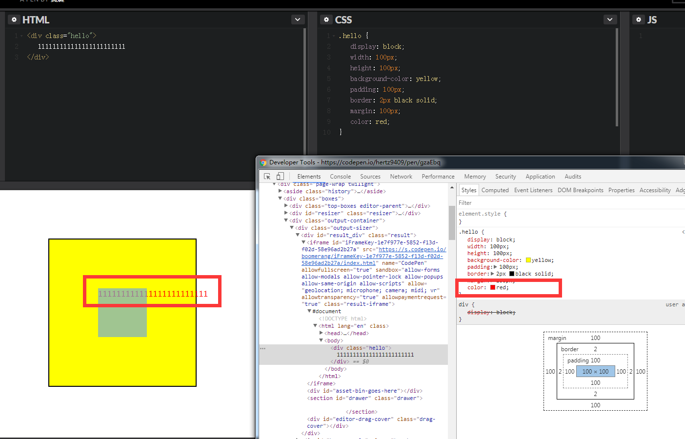

在div盒子的内容区域有一串文字,选择器无法选中,出现内容溢出,且从父元素继承颜色属性,这样的一个行内盒称为匿名行内盒.

### 'display'属性

属性值及对应含义：

    block: 让元素生成一个块盒；
    inline-block: 让元素生成一个行内级块容器，元素内部被格式化为一个块盒，而元素本身则是原子行内级盒子；
    inline: 让元素生成一个或多个行内盒子；
    list-item: 让元素(li)生成一个主块盒和一个标记盒；
    none：该值不会创建盒子，也不会让元素在视窗中显示
    ...

## 定位体系

1. 常规流, 按照次序定位每个盒子,包括块级盒的块格式化,行内盒的行内格式化,块级盒和行内盒的相对定位.在块格式化上下文中,盒子在垂直方向依次排列;在行内格式化上下文中,盒子水平排列.当CSS的 position 属性为 static 或 relative，并且 float 为 none 时，其布局方式为普通流。

2. 浮动, 盒首先根据常规流布局,然后从常规流中脱离并尽可能地向左向右位移,内容可以布局在浮动周围,一个盒子的 float 值不为 none，并且其 position 为 static 或 relative 时，该盒子为浮动定位。

3. 绝对定位, 盒完全从常规流中脱离并根据包含块来分配位置,如果元素的 position 为 absolute 或 fixed，该元素为绝对定位。

### position 属性

1. static: 常规盒,根据常规流布局,top、right、bottom、left属性不生效
2. relative: 盒子的定位根据常规流计算,接着盒子相对常规位置移动,当盒子相对定位后,盒子后面的盒定位时就当盒子没有移动一样计算.
3. absolute: 盒子的位置由top、right、bottom、left属性指定,这些属性根据盒子的包含块来规定移动.绝对定位盒子脱离文档流,这意味着他们对之后的同胞盒布局没有影响,同时这个盒子不会出现外边距合并
4. fixed: 和absolute类似,除此以外,盒相对某些参照物保持固定

## BFC(Block Formatting Context)-块级格式化上下文

触发条件:

* 根元素或包含根元素的元素
* 浮动元素（元素的 float 不是 none）
* 绝对定位元素（元素的 position 为 absolute 或 fixed）
* 行内块元素（元素的 display 为 inline-block）
* 表格单元格（元素的 display为 table-cell，HTML表格单元格默认为该值）
* 表格标题（元素的 display 为 table-caption，HTML表格标题默认为该值）
* overflow 值不为 visible 的块元素
* 弹性元素（display为 flex 或 inline-flex元素的直接子元素）
* 网格元素（display为 grid 或 inline-grid 元素的直接子元素）

布局规则:

1. BFC内部的盒子会在垂直方向一个个放置
2. 盒子垂直方向的距离由margin决定,同一个BFC中的两个相邻盒子的margin会发生重叠
3. 每个盒子的左外边缘紧贴包含块的左边缘(从右往左的格式里,则为盒右边缘紧贴包含块右边缘),甚至有浮动也是如此(尽管盒里的行盒可能由于浮动而收缩),除非盒子创建一个新的BFC(这样盒子本身可能由于浮动而变窄)
4. BFC是一个独立的容器,容器内的子元素不会影响到外面的元素
5. 计算BFC高度时,考虑BFC包含的所有子元素,浮动元素也参与计算

应用:

* 避免外边距折叠
* 解决边框塌陷问题
* 避免文字环绕

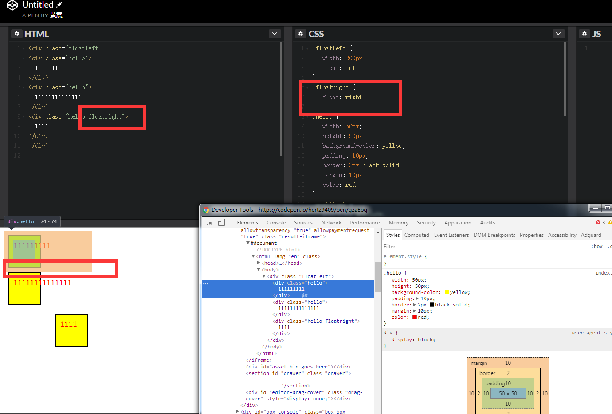

BFC内部元素垂直放置,距离由margin决定,同一个BFC中的两个相邻盒子margin会发生重叠,浮动元素也要参与BFC高度计算.

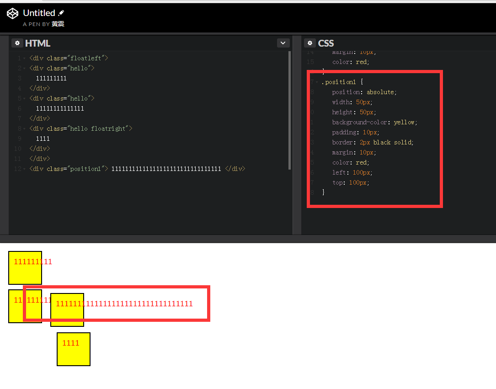

BFC容器独立,子元素不会影响外部元素.

BFC解决文字环绕问题

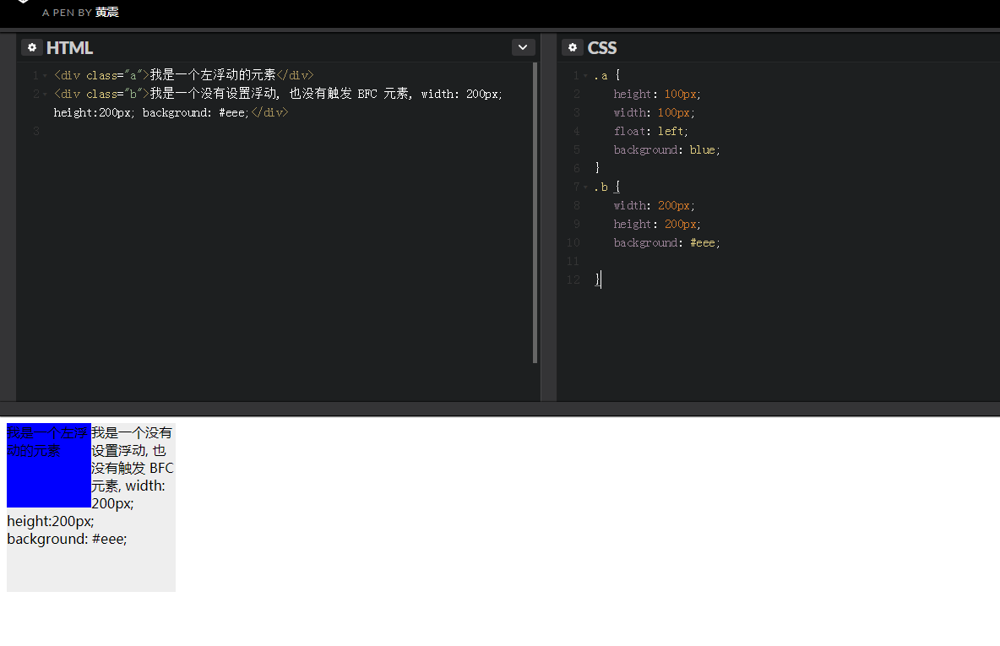
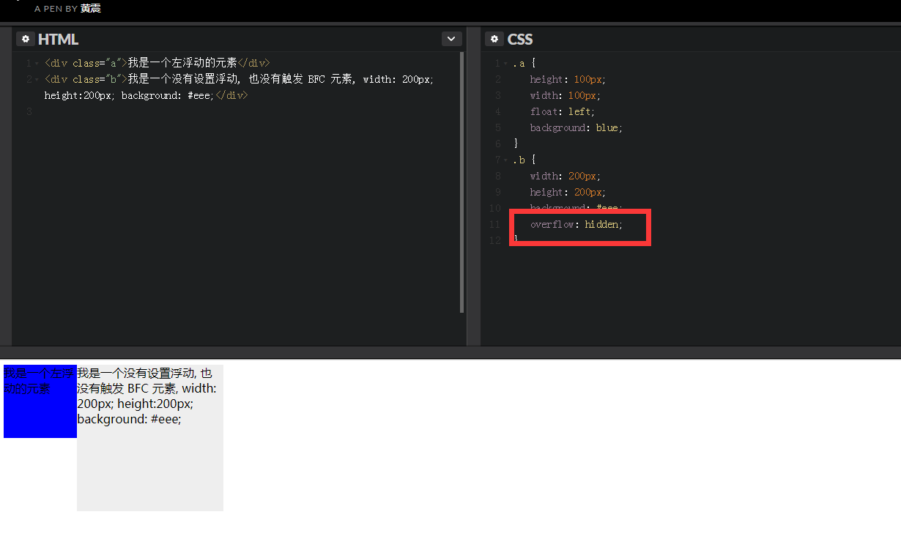

BFC解决子元素浮动导致的高度塌陷问题,BFC浮动元素也参与高度计算

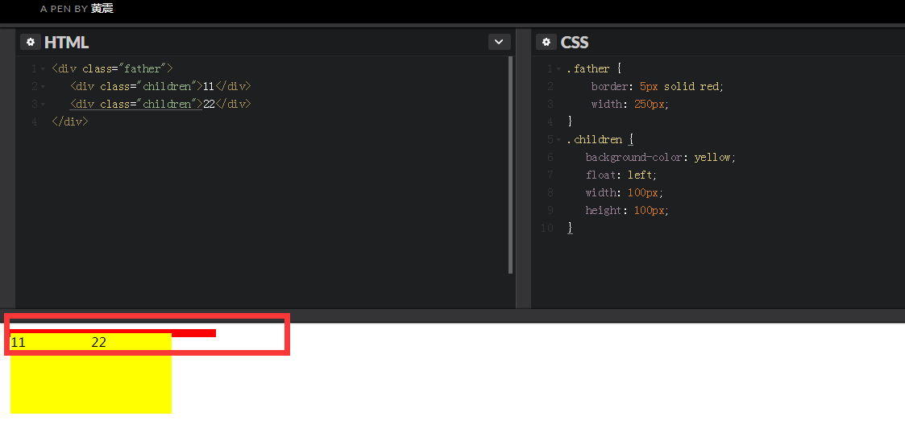
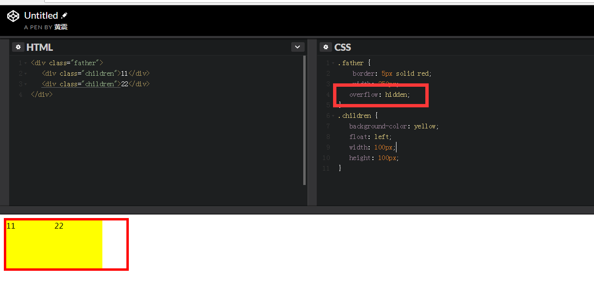

## IFC(Inline Formatting Context)-行内格式化上下文

布局规则:

1. IFC内部的盒子会在水平方向一个个放置
2. 盒子垂直方向的起点从包含块的顶部开始
3. 摆放盒子时,盒水平方向的外边距、边框和内边距在布局时都会考虑在内
4. 垂直方向上,可能以不同方式对齐: 使用顶部或底部对齐,或通过内部文本基线对齐
5. 行盒: Line Box,能把在一行上的盒子都包含进去的一个矩形区域.行盒的宽度由包含块和浮动来定
6. IFC中的行盒一般左右边紧贴包含块,但会因float元素的存在而缩短.
7. IFC中的行盒高度由CSS行高计算规则来确定,同个IFC下的多个行盒高度可能不同
8. 当行内级盒的总宽度小于包含它们的行盒,其水平渲染规则由text-align属性来确定,如果取值为justify,那么浏览器会对行内盒的文字和空格进行拉伸
9. 当行内盒超过行盒的宽度时,它会被分割成多个盒子,这些盒子被分布在多个行盒中,如果行内盒不能被分割(如设置nowrap,white-space),那么这个行内盒会溢出,如果行内盒被分割，那么它的外边距，边框和内边距在发生分割的地方没有视觉效果

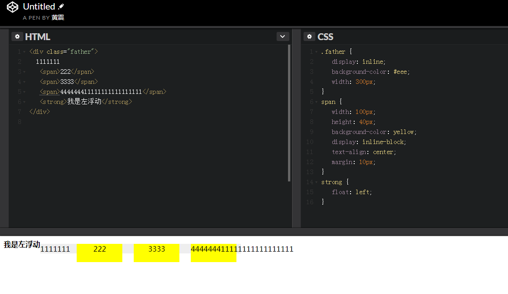

## 外边距折叠(collapsing margins)

相邻的两个盒子的外边距结合为一个单独的外边距,其大小取其中的最大者,这种行为称为外边距折叠.浮动元素和绝对定位元素的外边距不会折叠.

相邻垂直外边距发生折叠,除了以下两种情况:

* 根元素的盒的外边距不折叠
* 如果一个有空隙的元素的上下外边距相邻,其外边距将同其后同胞的相邻外边距折叠,但不同父块的下外边距折叠
* 如果属性min-height非零和height为auto的盒子的上外边距与他文档流中的最后一个子元素的下外边距折叠,则子元素的底外边距不会和父元素的底外边距折叠

水平外边距不会重叠

两个外边距相邻:

* 属于一个块格式化上下文的文档流内的块级盒子
* 没有行盒、空隙、内边距和边框分隔它们（注意某些零高度行盒）
* 盒边缘垂直相邻:
    * 盒子上外边距及其第一个文档流内盒子上外边距
    * 盒子下外边距及下一个文档流内的同级盒子的上外边距
    * 父盒子高度为auto时,文档流内最后一个子盒子的下外边距和它父盒子的下外边距
    * 一个没有生成BFC且min-height为0,height为0或者auto,且文档流中没有子元素的盒子的上下外边距

当两个及以上的外边距折叠,所得边距的宽度是折叠边距宽度的最大值.如果折叠外边距中存在负值,则为最大正数外边距减去最小负数外边距的绝对值.如果折叠外边距都为负数,则为最小负数外边距.

如果一个盒子的上下外边距相邻,则外边距可能穿过盒子而折叠,这种情况下,元素的定位取决于它同其他外边距折叠的元素的关系:
* 如果元素外边框同其父元素的上外边距折叠,则该盒子的上外边框边缘同其父元素的上外边框边缘相同
* 否则，要么该元素的父元素的外边距不折叠，要么只有父元素的下外边距折叠。上边框边缘位置是假定该元素下边框非零时的位置

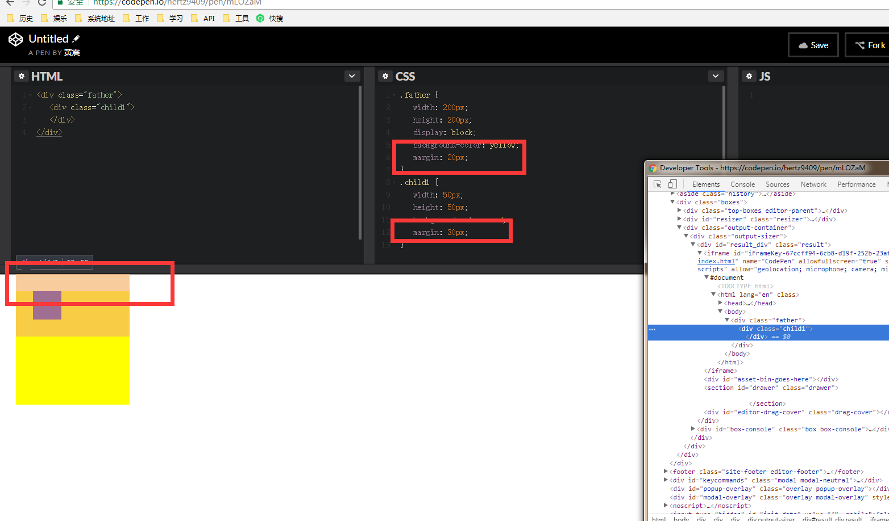

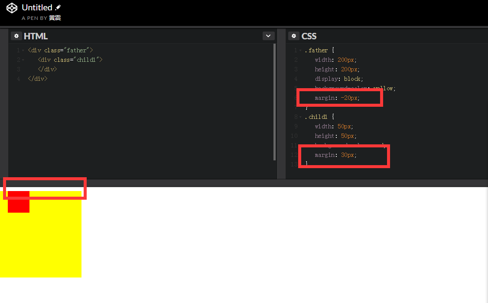

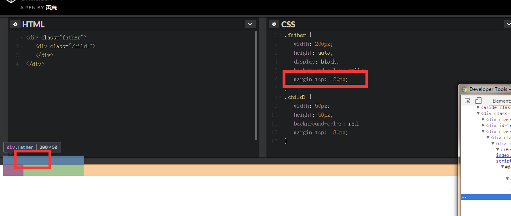

## 相对定位(relative)

普通流定位中的一种,定位元素的位置相对于它在普通流中的位置进行移动,元素依然占据原来的位置,相对移动会导致元素覆盖其他的盒子.当相对定位导致具有'overflow:auto'或'overflow:scroll'的盒溢出时,浏览器为了能够显示内容，会创建滚动条，可能会影响布局。在动态修改相对定位盒的偏移时会产生动画效果。

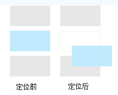

## 浮动(float)

浮动盒会被移动至左侧或右侧,直至其外侧紧贴包含块的边缘或另一个浮动的外边缘,如果存在行盒,浮动盒的顶部外边缘将与行盒顶部对齐,如果水平方向没有足够的空间容纳浮动,它将下移至能够放下它后者没有其他浮动.浮动盒会导致其他内容沿着它的一侧排列(参照上面提到的文字环绕)，通过'clear'属性可以禁止这种行为。

### 'clear'属性

    该属性说明了元素盒的哪一边不能与之前的浮动盒相邻。
    left/right/both: 要求该盒的上边框边界位于源文档中在该元素之前的元素形成的所有左浮动盒/右浮动盒/左浮动盒和右浮动盒的下外边界下方;
    none: 对该盒相对于浮动盒的位置没有约束。
    
    值不为'none'就隐含了要引入空隙（clearance）。空隙会阻止外边距合并，并作为元素margin-top上方的空间。用来在垂直方向上把元素推离浮动（元素）

## 绝对定位(absolute)

盒子从常规流中完全脱离,位置相对于距离它最近的那个已经定位的祖先元素决定,绝对定位盒子为其常规流子元素和绝对定位后代创建包含块,但绝对定位元素的内容不在其他盒子的流中,绝对定位是否被遮盖取决于重叠盒子的栈级(Stack Level)

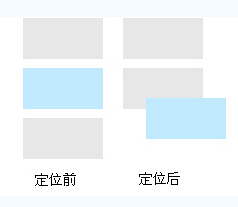

### 固定定位(fixed)

固定定位盒子的包含块是有视口创建的,当文档滚动时,固定盒子不动.(如网页中经常出现的回到顶部，不管网页怎么滚动，按钮位置保持不变)

## 'display','position'和'float'之间的关系

    1. 如果'display'值为'none'，那么'position'和'float'不会生效。此时，元素不生成盒
    2. 否则，如果'position'值为'absolute'或者'fixed'，盒就是绝对定位的。'float'的计算值置为'none'且display设置为'block'。盒的位置将由'top'，'right'，'bottom'和'left'属性以及盒的包含块决定
    3. 否则，如果'float'值不为'none'，那么盒是浮动的，display设置为'block'.
    4. 否则，其它'display'属性值（计算值）就用指定值
## 可视化效果

### 溢出和裁剪

一般情况下,一个块盒的内容被限制在该盒的内容边界内,但是在某些情况下,盒子会出现溢出:

* 一行无法拆分,行框比块盒宽
* 一个块级盒对其包含块来说太宽了
* 一个元素的高度超出了为其包含快显式指定的高度
* 一个后代盒子是绝对定位,并且部分内容在父盒子外部时
* 一个后代盒具有负margin,导致它的部分内容被定位在该盒外部
* 'text-indent'属性让一个行框挂在该块盒的左边界或右边界上

overflow属性:指定了块容器元素的内容从该元素的盒中溢出时是否需要裁剪

* visible: 内容不会被裁剪
* hidden:内容会被裁剪
* scroll: 内容会被裁剪,但是会提供滚动条
* auto: 依赖于浏览器自行判断,如果溢出则类似scroll处理

clip属性:裁剪区域（clipping region）定义了一个元素边框框中的哪一部分是可见的.当需要展示不规则dom时,可以采用此方法

* auto: 不裁剪
* shape : rect(top, right, bottom, left),目前只可以裁剪矩形,css3中增加了新的属性**clip-path**可以裁剪不规则图形

## 使用JS访问元素样式和大小

任何一个支持style特性的HTML元素在js中都有一个对应的`style`属性,这个`style`对象是`CSSStyleDeclaration`的实例,包含了通过HTML的style特性指定的所有样式信息,但不包括与外部样式表或嵌入样式表经层叠而来的样式,但是可以获得内联样式表定义的样式.如果要获取实时计算的样式,可以使用`getComputedStyle()`方法,IE9一下需要使用`currentStyle`属性.

1. 偏移量: 元素在屏幕上占用的所有可见的空间

   * offsetHeight: 元素在垂直方向上占用的空间大小,以像素为单位,包括元素高度,(可见的)水平滚动条高度,上下边框高度
   * offsetWidth: 元素在水平方向上占用的空间大小.
   * offsetLeft: 元素左外边框至包含元素的父元素左内边框之间的像素距离
   * offsetTop: 元素的上外边框至包含元素的父元素的上内边框之间的像素距离

2. 客户区大小: 元素内容及其内边距所占据的空间大小

   * clientWidth: 元素内容区宽度加左右内边距宽度
   * clientHeight: 元素内容区高度加上下内边距高度

3. 滚动大小: 包含滚动内容的元素的大小

   * scrollHeight: 在没有滚动条的情况下,元素内容的总高度(元素内容的实际大小)
   * scrollWidth: 在没有滚动条的情况下,元素内容的总宽度
   * scrollLeft: 被隐藏在内容区域左侧的像素数,通过设置这个属性可以改变元素的滚动位置
   * scrollTop: 被隐藏在内容区域上方的像素数

4. getBoundingClientRect()

   该方法返回一个矩形对象,包含left,top,right,bottom属性,这几个属性分别表示元素距离浏览器视口的位置.

`上述属性的读取和修改都会造成浏览器回流,产生性能问题`