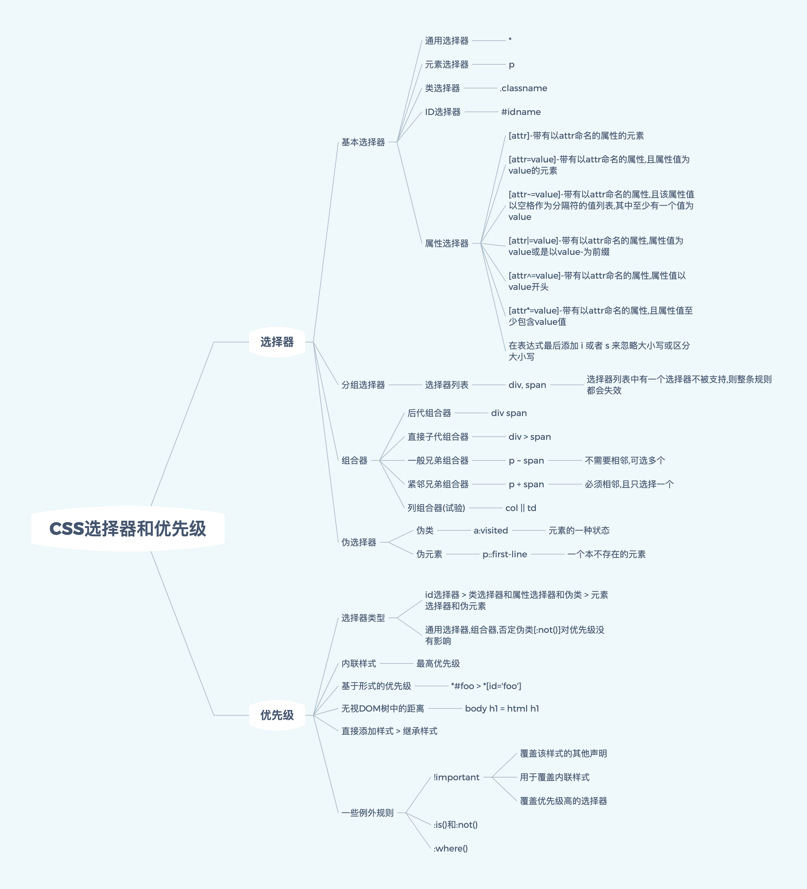
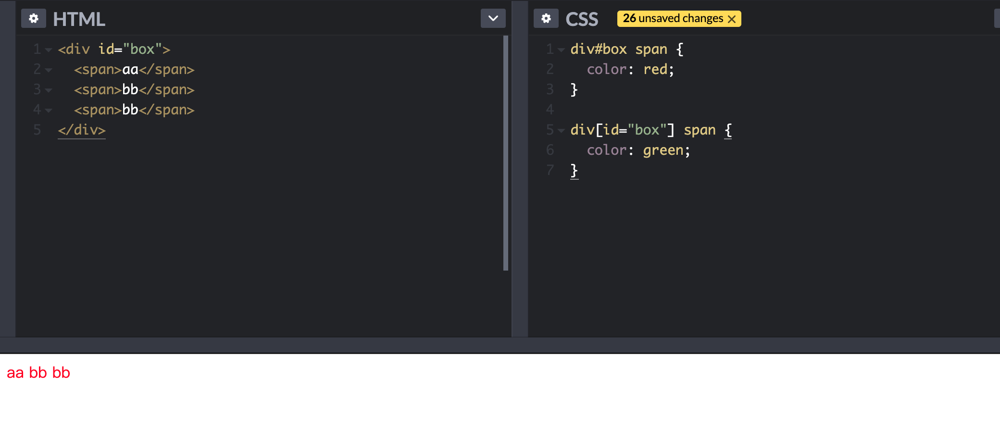
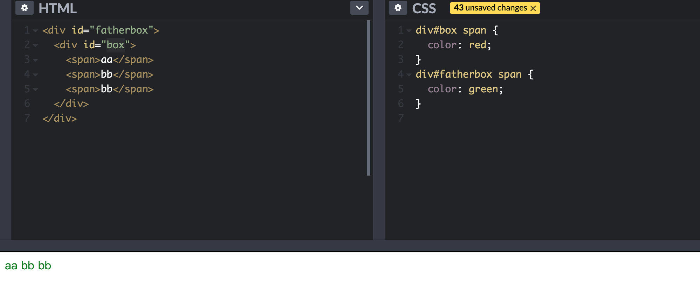
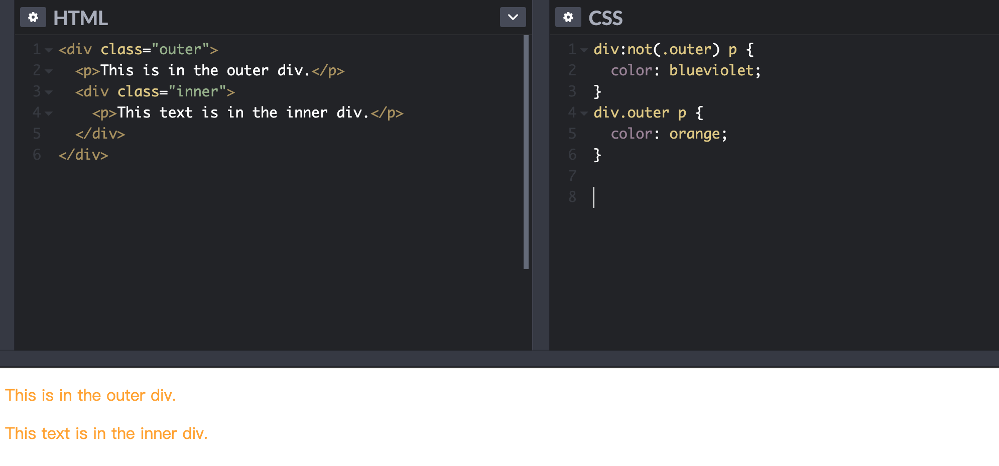
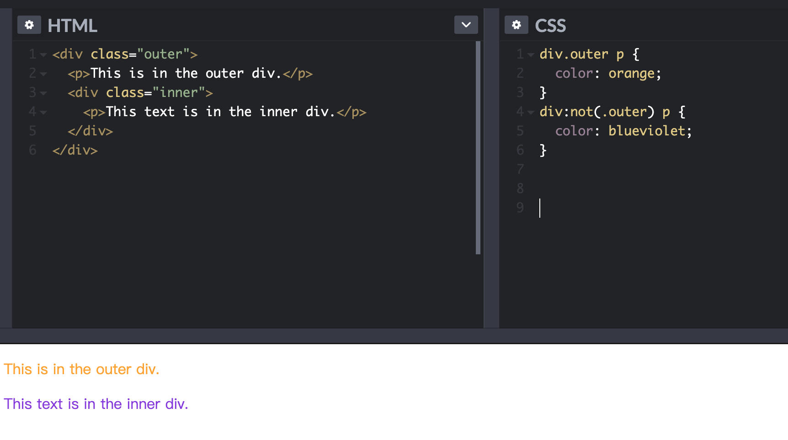
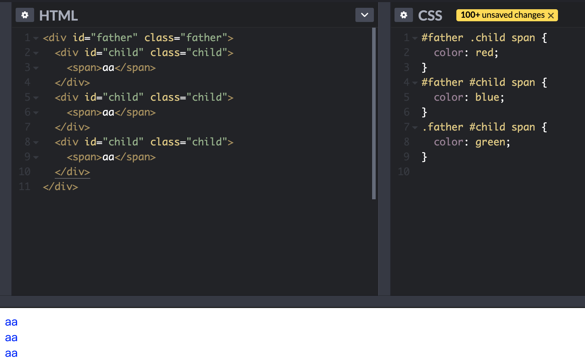
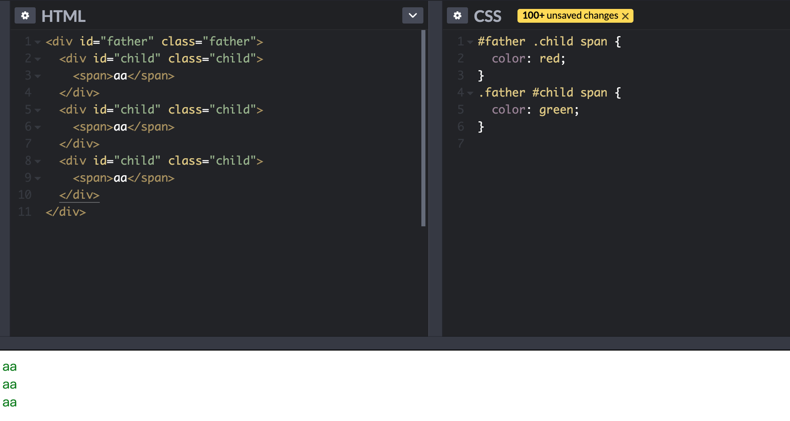
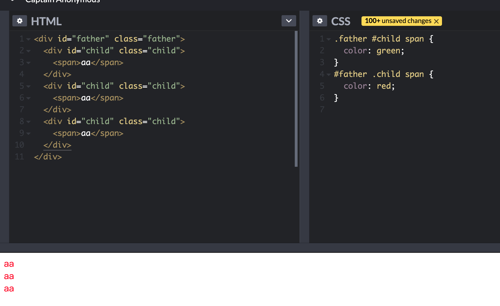

# 选择器及优先级

### 选择器语法

|           语法           |                                   解释                                    |       选择器描述       |
| :----------------------: | :-----------------------------------------------------------------------: | :--------------------: |
|            \*            |                               匹配所有元素                                |       通配选择器       |
|            E             |                           匹配所有 E 类型的元素                           | 类型选择器(标签选择器) |
|        .classname        |                       匹配 class="classname"的元素                        |        类选择器        |
|         #idname          |                          匹配 id="idname"的元素                           |       ID 选择器        |
|           E F            |                      匹配所有 E 元素后代中的 F 元素                       |       后代选择器       |
|          E > F           |                      匹配所有 E 元素子集中的 F 元素                       |        子选择器        |
|      E:first-child       |                      匹配父元素下子集中第一个 E 元素                      |   :first-child 伪类    |
|     E:link E:visited     |            匹配未访问过的或者已被访问过的超链接源锚点的 E 元素            |       link 伪类        |
| E:active E:hover E:focus |                     匹配处于某些用户动作期间的 E 元素                     |        动态伪类        |
|        E:lang(c)         |                          匹配语言为 c 的 E 元素                           |      :lang()伪类       |
|          E + F           |                匹配所有前面紧跟着一个 E 元素兄弟的 F 元素                 |       相邻选择器       |
|          E[foo]          |                     匹配所有设置了 foo 属性的 E 元素                      |       属性选择器       |
|     E[foo="warning"]     |                 匹配所有 foo 属性设置为"warning"的 E 元素                 |       属性选择器       |
|    E[foo~="warning"]     | 匹配所有"foo"属性值为一列空格分隔的值，且其中之一恰好是"warning"的 E 元素 |       属性选择器       |
|    E[lang&#124;="en"]    | 匹配所有"lang"属性值为一列以"en"开头（从左向右）用连字符分隔的值的 E 元素 |       属性选择器       |
|       DIV.warning        |            _语言特定的_（HTML 中，与 DIV[class~="warning"]相同            |        类选择器        |
|          E#myid          |                       匹配所有 ID 为"myid"的 E 元素                       |       id 选择器        |

### 伪类和伪元素

为了允许根据文档树之外的信息来格式化,CSS 引入了伪类和伪元素的概念

- 伪元素建立了对超出文档语言指定的文档树的抽象
- 伪类根据元素的特征分类,而不是名字,属性或者内容

通俗得讲 伪类的效果可以通过添加实际的类来实现,而伪元素的效果可以通过添加实际的元素来实现
它们的本质区别就是**是否抽象创造了新元素**

[所有伪类](https://developer.mozilla.org/zh-CN/docs/Web/CSS/Pseudo-classes#%E6%A0%87%E5%87%86%E4%BC%AA%E7%B1%BB%E7%B4%A2%E5%BC%95)

[所有伪元素](https://developer.mozilla.org/zh-CN/docs/Web/CSS/Pseudo-elements#%E6%A0%87%E5%87%86%E4%BC%AA%E5%85%83%E7%B4%A0%E7%B4%A2%E5%BC%95)

### 样式优先级

样式表来源:

- 编写者: 编写者根据文档语言约定给源文档指定样式表(程序员)
- 用户: 用户可能会给某个特定文档指定样式信息
- 用户代理(浏览器): 遵循 CSS 规范,应用一份默认的样式表

优先级排序: 用户重要声明 > 编写者重要声明 > 编写者常规声明 > 用户常规声明 > 用户代理(浏览器)声明

相同优先级下的样式则根据样式选择器优先级来应用样式:

内联样式 > ID 选择器 > 类选择器/伪类选择器/属性选择器 > 标签选择器/伪元素选择器

当出现!important,一律使用此样式.

@media 规则:一般用于指定特定媒体类型(设备类型)下的样式,可用于做界面自适应.

#### 基本计算规则(a, b, c)

- ID 选择器个数为 a, 类/伪类/属性选择器个数为 b, 标签/伪元素选择器个数为 c
- 按 a,b,c 顺序依次比较大小,大的优先级高,相等则比较下一个
- 若选择符 a,b,c 都相等,则按照先后顺序判断

#### 基于形式的优先级

a,b,c: 1,0,2 ; 0,1,2

#### 无视 DOM 树距离

a,b,c: 1, 0, 2 ; 1, 0, 2

#### :not()

a,b,c: 0, 1, 2 ; 0, 1, 2

a,b,c: 0, 1, 2 ; 0, 1, 2

a,b,c: 1, 1, 1; 2, 0, 1;1,1,1;

a,b,c: 1, 1, 1 ; 1, 1, 1;

a,b,c: 1, 1, 1 ; 1, 1, 1;
