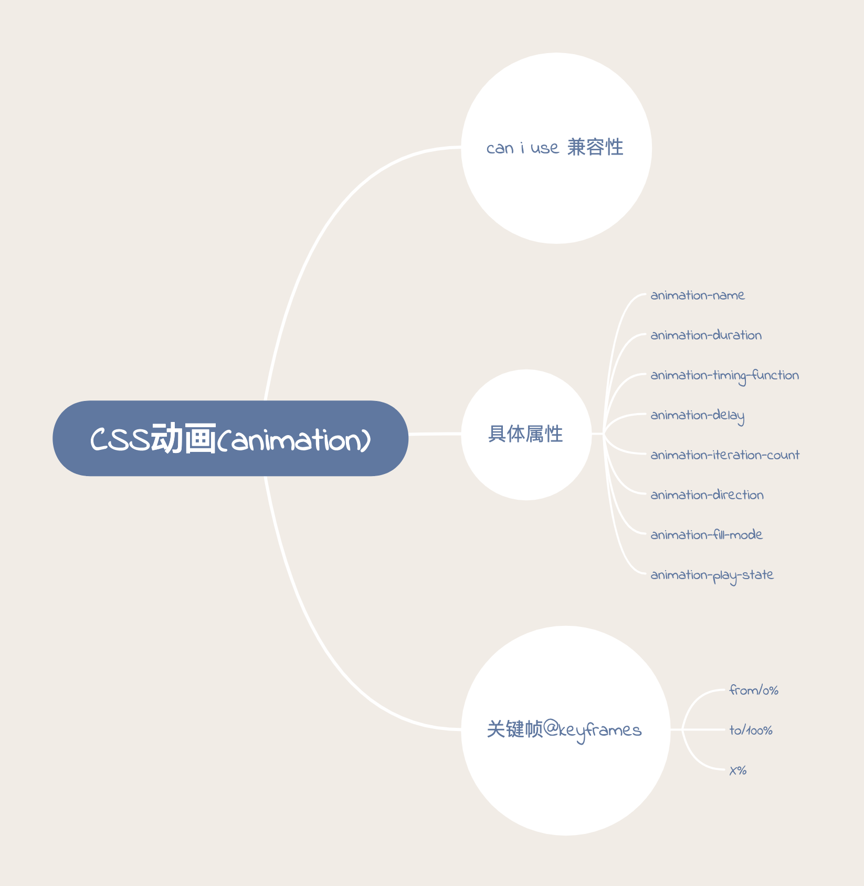

# CSS 变换,过渡,动画

## transition 过渡 -- 平滑的改变 CSS 的值

transition 属性是几个属性的缩写:

- transition-property: 过渡属性值,如 all 代表所有,opacity 代表透明度
- transition-duration: 过渡持续时间
- transition-delay: 过渡延迟时间
- transition-timing-function: 过渡动画缓动类型,包括`ease`,`linear`,`ease-in`,`ease-out`,`ease-in-out`,`cubic-bezier()`等

[MDN.eg](https://developer.mozilla.org/zh-CN/docs/Web/CSS/transition)

## transform 变换 -- 斜拉(skew),缩放(scale),旋转(rotate),偏移(translate)

此属性是通过修改 CSS 视觉格式化模型的坐标空间来实现的.

注意: 此属性只能应用于由盒模型定位的元素(display: block/inline-block)

[MDN.eg](https://developer.mozilla.org/zh-CN/docs/Web/CSS/transform)

属性值:

| 值                                                                        | 描述                                    |
| :------------------------------------------------------------------------ | :-------------------------------------- |
| none                                                                      | 定义不进行转换。                        |
| matrix(_n_,_n_,_n_,_n_,_n_,_n_)                                           | 定义 2D 转换，使用六个值的矩阵。        |
| matrix3d(_n_,_n_,_n_,_n_,_n_,_n_,_n_,_n_,_n_,_n_,_n_,_n_,_n_,_n_,_n_,_n_) | 定义 3D 转换，使用 16 个值的 4x4 矩阵。 |
| translate(_x_,_y_)                                                        | 定义 2D 转换。                          |
| translate3d(_x_,_y_,_z_)                                                  | 定义 3D 转换。                          |
| translateX(_x_)                                                           | 定义转换，只是用 X 轴的值。             |
| translateY(_y_)                                                           | 定义转换，只是用 Y 轴的值。             |
| translateZ(_z_)                                                           | 定义 3D 转换，只是用 Z 轴的值。         |
| scale(_x_,_y_)                                                            | 定义 2D 缩放转换。                      |
| scale3d(_x_,_y_,_z_)                                                      | 定义 3D 缩放转换。                      |
| scaleX(_x_)                                                               | 通过设置 X 轴的值来定义缩放转换。       |
| scaleY(_y_)                                                               | 通过设置 Y 轴的值来定义缩放转换。       |
| scaleZ(_z_)                                                               | 通过设置 Z 轴的值来定义 3D 缩放转换。   |
| rotate(_angle_)                                                           | 定义 2D 旋转，在参数中规定角度。        |
| rotate3d(_x_,_y_,_z_,_angle_)                                             | 定义 3D 旋转。                          |
| rotateX(_angle_)                                                          | 定义沿着 X 轴的 3D 旋转。               |
| rotateY(_angle_)                                                          | 定义沿着 Y 轴的 3D 旋转。               |
| rotateZ(_angle_)                                                          | 定义沿着 Z 轴的 3D 旋转。               |
| skew(_x-angle_,_y-angle_)                                                 | 定义沿着 X 和 Y 轴的 2D 倾斜转换。      |
| skewX(_angle_)                                                            | 定义沿着 X 轴的 2D 倾斜转换。           |
| skewY(_angle_)                                                            | 定义沿着 Y 轴的 2D 倾斜转换。           |
| perspective(_n_)                                                          | 为 3D 转换元素定义透视视图。            |

[关于 transform 的 3D 渲染](https://www.zhangxinxu.com/wordpress/2012/09/css3-3d-transform-perspective-animate-transition/)

### transform-origin: 更改一个元素的原点.

属性值可以为 1 个,2 个或者 3 个:

- 1 个: 值为像素长度或百分比或者 left,center,right,top,bottom 关键字
- 2 个: 第一个值必须是像素长度,百分比或者 left,center,right 关键字,第二个值必须是像素长度,百分比或者 top,center,bottom 关键字
- 3 个: 前两个值和只有两个值时的用法相同.第三个值必须是像素长度,代表 Z 轴偏移量.

[MDN.eg](https://developer.mozilla.org/zh-CN/docs/Web/CSS/transform-origin)

### transform-style: 设置元素的子元素位于 3D 空间中(preserve-3d)还是平面中(flat)

当使用 3D 转换时,需要设置为 preserve-3d.

## animation 动画

transition 基本上能够实现我们需要的动效,但是有个问题,transition 之所以称之为过渡而非动画,就是在于其变化需要手动触发,而 animation 属性设置后,可以按照要求自动执行.

### 浏览器兼容性

### 属性值

animation 属性也是一个简写属性,它可以包括:

- animation-name: 指定应用的一系列动画的名称,每个名称代表一个由`@keyframes`定义的动画序列

- animation-duration: 指定一个动画周期的时长,默认 0s(无动画)

- animation-timing-function: 和 transition-timing-function 一样,指定动画执行节奏

  - steps(nunber, start/end): number 为数字,表示将动画关键帧之间设置为 number 步执行;第二个参数表示动画第一帧如何执行,start 表示直接跳过第一帧,保持第一帧结束状态,end 表示保持第一帧开始状态
  - step-start: steps(1,start)
  - step-end: steps(1,end)

  

- animation-delay: 动画延迟执行时间,默认 0s,如果为负值会让动画立即执行,但是动画会从动画序列中的某个位置开始执行,如定义为-1s,则从 1s 立即开始执行.

- animation-iteration-count: 动画循环次数,可以是数字或者 infinite(无限循环)

- animation-direction: 指示动画是否反向播放

  - normal: 每个循环内从 from 到 to 播放
  - alternate: 动画交替反向运行,即第一次先从 from 到 to,第二次从 to 到 from,第三次再从 from 到 to
  - reverse: 与 normal 相对,动画反向执行,从 to 向 from 播放
  - alternate-reverse: 反向交替,反向开始交替

  

  

- animation-fill-mode: 设置动画在开始播放前和结束播放后的状态.

  - none: 默认值,不会将任何样式赋予目标

  - forwards: 目标保留最后一个关键帧的计算值样式

  - backwards: 动画应用于目标时立即应用第一个关键帧的计算值样式

  - both: 动画遵循 forwards 和 backwards 规则,在两个方向上扩展动画属性

    [MDN.eg](https://developer.mozilla.org/zh-CN/docs/Web/CSS/animation-fill-mode)

- animation-play-state: 定义一个动画是否运行或着暂停

### 关键帧`@keyframes`

通过在动画序列中定义关键帧的样式来控制 css 动画序列的中间步骤.

- 如果关键帧没有指定开始或结束状态,则以元素现有样式为开始/结束状态
- 如果定义了不能作为动画的属性,会被忽略
- 多个关键帧使用同一个名称,以最后一个定义为准
- 一个关键帧内的百分比存在重复,则所有属性都会有效并且遵循 css 样式的层叠性
- 关键帧中!important 被忽略

关键帧 key 值使用百分比来表示阶段,存在特殊关键字 from(0%)和 to(100%)
