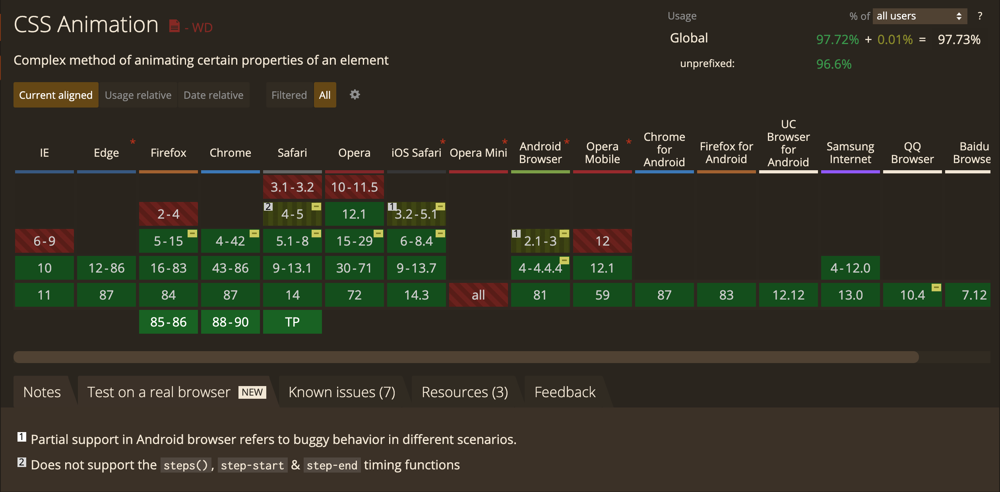
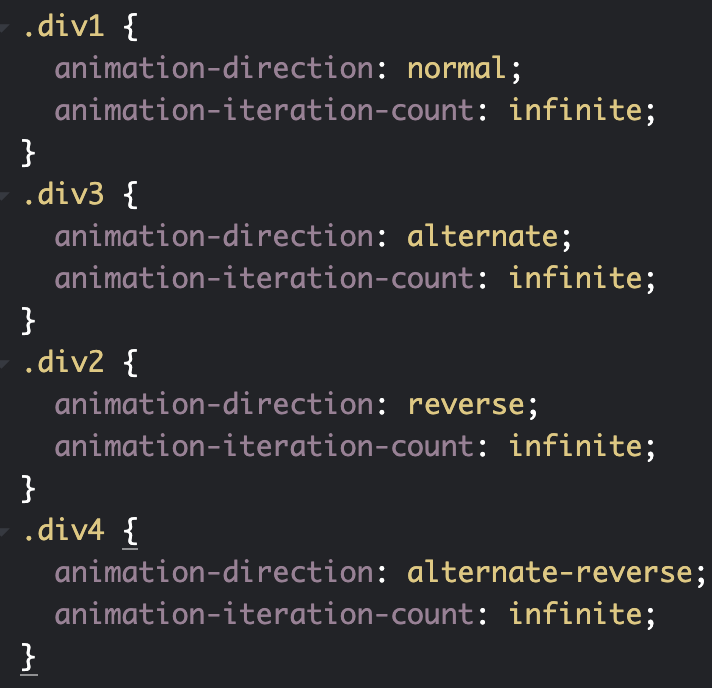

# CSS变换,过渡,动画

## transition 过渡 -- 平滑的改变CSS的值

transition属性是几个属性的缩写:

* transition-property: 过渡属性值,如all代表所有,opacity代表透明度
* transition-duration: 过渡持续时间
* transition-delay: 过渡延迟时间
* transition-timing-function: 过渡动画缓动类型,包括`ease`,`linear`,`ease-in`,`ease-out`,`ease-in-out`,`cubic-bezier()`等

[MDN.eg](https://developer.mozilla.org/zh-CN/docs/Web/CSS/transition)

## transform 变换 -- 斜拉(skew),缩放(scale),旋转(rotate),偏移(translate)

此属性是通过修改CSS视觉格式化模型的坐标空间来实现的.

注意: 此属性只能应用于由盒模型定位的元素(display: block/inline-block)

[MDN.eg](https://developer.mozilla.org/zh-CN/docs/Web/CSS/transform)

属性值:

| 值                                                           | 描述                                    |
| :----------------------------------------------------------- | :-------------------------------------- |
| none                                                         | 定义不进行转换。                        |
| matrix(*n*,*n*,*n*,*n*,*n*,*n*)                              | 定义 2D 转换，使用六个值的矩阵。        |
| matrix3d(*n*,*n*,*n*,*n*,*n*,*n*,*n*,*n*,*n*,*n*,*n*,*n*,*n*,*n*,*n*,*n*) | 定义 3D 转换，使用 16 个值的 4x4 矩阵。 |
| translate(*x*,*y*)                                           | 定义 2D 转换。                          |
| translate3d(*x*,*y*,*z*)                                     | 定义 3D 转换。                          |
| translateX(*x*)                                              | 定义转换，只是用 X 轴的值。             |
| translateY(*y*)                                              | 定义转换，只是用 Y 轴的值。             |
| translateZ(*z*)                                              | 定义 3D 转换，只是用 Z 轴的值。         |
| scale(*x*,*y*)                                               | 定义 2D 缩放转换。                      |
| scale3d(*x*,*y*,*z*)                                         | 定义 3D 缩放转换。                      |
| scaleX(*x*)                                                  | 通过设置 X 轴的值来定义缩放转换。       |
| scaleY(*y*)                                                  | 通过设置 Y 轴的值来定义缩放转换。       |
| scaleZ(*z*)                                                  | 通过设置 Z 轴的值来定义 3D 缩放转换。   |
| rotate(*angle*)                                              | 定义 2D 旋转，在参数中规定角度。        |
| rotate3d(*x*,*y*,*z*,*angle*)                                | 定义 3D 旋转。                          |
| rotateX(*angle*)                                             | 定义沿着 X 轴的 3D 旋转。               |
| rotateY(*angle*)                                             | 定义沿着 Y 轴的 3D 旋转。               |
| rotateZ(*angle*)                                             | 定义沿着 Z 轴的 3D 旋转。               |
| skew(*x-angle*,*y-angle*)                                    | 定义沿着 X 和 Y 轴的 2D 倾斜转换。      |
| skewX(*angle*)                                               | 定义沿着 X 轴的 2D 倾斜转换。           |
| skewY(*angle*)                                               | 定义沿着 Y 轴的 2D 倾斜转换。           |
| perspective(*n*)                                             | 为 3D 转换元素定义透视视图。            |

[关于transform的3D渲染](https://www.zhangxinxu.com/wordpress/2012/09/css3-3d-transform-perspective-animate-transition/)

### transform-origin: 更改一个元素的原点.

属性值可以为1个,2个或者3个:

* 1个: 值为像素长度或百分比或者left,center,right,top,bottom关键字
* 2个: 第一个值必须是像素长度,百分比或者left,center,right关键字,第二个值必须是像素长度,百分比或者top,center,bottom关键字
* 3个: 前两个值和只有两个值时的用法相同.第三个值必须是像素长度,代表Z轴偏移量.

[MDN.eg](https://developer.mozilla.org/zh-CN/docs/Web/CSS/transform-origin)

### transform-style: 设置元素的子元素位于3D空间中(preserve-3d)还是平面中(flat)

当使用3D转换时,需要设置为preserve-3d.

## animation 动画

transition基本上能够实现我们需要的动效,但是有个问题,transition之所以称之为过渡而非动画,就是在于其变化需要手动触发,而animation属性设置后,可以按照要求自动执行.

### 浏览器兼容性

### 属性值

animation属性也是一个简写属性,它可以包括:

* animation-name: 指定应用的一系列动画的名称,每个名称代表一个由`@keyframes`定义的动画序列

* animation-duration: 指定一个动画周期的时长,默认0s(无动画)

* animation-timing-function: 和transition-timing-function一样,指定动画执行节奏

  * steps(nunber, start/end): number为数字,表示将动画关键帧之间设置为number步执行;第二个参数表示动画第一帧如何执行,start表示直接跳过第一帧,保持第一帧结束状态,end表示保持第一帧开始状态
  * step-start: steps(1,start)
  * step-end: steps(1,end)

  

* animation-delay: 动画延迟执行时间,默认0s,如果为负值会让动画立即执行,但是动画会从动画序列中的某个位置开始执行,如定义为-1s,则从1s立即开始执行.

* animation-iteration-count: 动画循环次数,可以是数字或者infinite(无限循环)

* animation-direction: 指示动画是否反向播放

  * normal: 每个循环内从from到to播放
  * alternate: 动画交替反向运行,即第一次先从from到to,第二次从to到from,第三次再从from到to
  * reverse: 与normal相对,动画反向执行,从to向from播放
  * alternate-reverse: 反向交替,反向开始交替

  

  

* animation-fill-mode: 设置动画在开始播放前和结束播放后的状态.

  * none: 默认值,不会将任何样式赋予目标

  * forwards: 目标保留最后一个关键帧的计算值样式

  * backwards: 动画应用于目标时立即应用第一个关键帧的计算值样式

  * both: 动画遵循forwards和backwards规则,在两个方向上扩展动画属性

    [MDN.eg](https://developer.mozilla.org/zh-CN/docs/Web/CSS/animation-fill-mode)

* animation-play-state: 定义一个动画是否运行或着暂停

### 关键帧`@keyframes`

通过在动画序列中定义关键帧的样式来控制css动画序列的中间步骤.

* 如果关键帧没有指定开始或结束状态,则以元素现有样式为开始/结束状态
* 如果定义了不能作为动画的属性,会被忽略
* 多个关键帧使用同一个名称,以最后一个定义为准
* 一个关键帧内的百分比存在重复,则所有属性都会有效并且遵循css样式的层叠性
* 关键帧中!important被忽略

关键帧key值使用百分比来表示阶段,存在特殊关键字from(0%)和to(100%)

