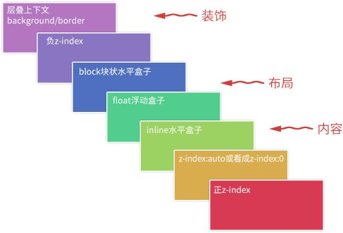

# CSS层叠

层叠,就是指当网页元素发生重叠时,谁放上面,谁放下面的规则.我们最常接触到的一个属性就是`z-index`.

## z-index(z轴顺序)

注意: `z-index`只有和`positon`不为`static`的元素(或css3中flex盒子子元素)在一起时才会起作用.理论上,数值越大层级越高.

## 层叠上下文,层叠水平,层叠顺序

层叠上下文: 和BFC类似,一个不影响外部的容器,内部变化不会影响到外面.

层叠水平: 决定了`同一个层叠上下文`中元素在z轴上的显示顺序.

层叠顺序: 元素发生层叠时的特定的垂直显示顺序.

* 最下面的`background/border`指的是层叠上下文的边框和背景色.
* `inline水平盒子`指的是`inline/inline-block/inline-table`元素的层叠顺序
* 从层叠水平上看,`z-index:0`和`z-index:auto`在表现上是一样的.

两条层叠准则: 
1. 谁大谁上: 当具有明显层叠水平标识时(z-index),`在同一层叠上下文中`,层叠水平值大的在上面.
2. 后来居上: 当元素层叠水平一致,层叠顺序相同时,在DOM流中处于后面的元素在上面. 

### 层叠上下文

特性:

* 层叠上下文的层叠水平要比普通元素高
* 层叠上下文可以阻断元素的混合模式
* 层叠上下文可以嵌套,内部层叠上下文及其所有子元素受制于外部层叠上下文
* 层叠上下文和兄弟元素独立,进行渲染和层叠变化时,不需要考虑兄弟元素
* 层叠上下文自成体系,当元素发生层叠时,整个元素被认为是在父层叠上下文的层叠顺序中

创建层叠上下文:

* 页面根元素`<html>`
* `z-index`值为数值的定位元素
* 其他css3属性: 
  * 元素为flex布局(父元素`display:flex|inline-flex`)同时`z-index`值不为auto
  * 元素`opacity`值不为1
  * 元素`transform`值不是none
  * 元素`mix-blend-mode`值不是normal
  * 元素`filter`值不是none
  * 元素`isolation`值是isolate
  * 元素`will-change`属性值为opacity,transform,mix-blend-mode,filter,isolation
  * 元素`-webkit-overflow-scrolling`为touch

### 层叠上下文自身的层叠顺序

* 层叠上下文不依赖`z-index`数值,则其层叠顺序为`z-index:auto`,可看成`z-index:0`
* 层叠上下文依赖`z-index`数值时,由其值决定