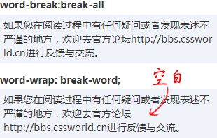

<!--
 * @Author: Hertz
 * @Date: 2020-12-11 09:54:21
 * @LastEditTime: 2020-12-11 15:24:34
 * @LastEditors: Hertz
 * @Description:
 * @FilePath: \VuePressBlog\docs\FrontEnd\CSS\CSS文本样式\README.md
-->

# CSS 文本样式

## font-size 与 line-height

line-height 的数值属性值和百分比值属性值相对于 font-size 进行计算

## line-height 与 vertical-align

vertical-align 属性:

- inherit
- baseline(默认值),top,middle,bottom
- text-top,text-bottom
- sub,super
- 数值
- 百分比,相对于 line-height 进行计算

## font-size 与 vertical-align

当将 vertical-align 设置为百分比值时,实际计算结果值为 `font-size*line-height*vertical-align`

这样计算时其实并不是很方便,我们可以使用替代方案`em`,此时就可以做到 vertical-align 计算值只与 font-size 有关,避免其他属性的影响.

## font-size 与 ex,em,rem

ex: 字符 x 高度(x 为 baseline 参考字符),font-size 越大,ex 越大;

em: 当 em 单位用于 font-size 属性时,1em 为父元素的 font-size 大小;当 em 单位用于其他 css 属性时,1em 为当前元素 font-size 大小.

rem: root em,1em 为根元素 1em 的大小,即根元素 font-size 大小.

## font-size

font-size 除了支持长度值和百分比值以外,还有一些关键字属性:

- 相对尺寸 larger,smaller: `<big>`元素和`<small>`元素的默认 font-size 属性值.
- 绝对尺寸,与浏览器设置字号有关,实际很少用到,不过多赘述

chrome 浏览器默认最小字号为 12px,当字号设置小于 12px 时,会被渲染为 12px,这就会导致一些网页自适应问题的出现.但是,并不是说小于 12px 的 font-size 都不会生效.当 font-size=0 时,文字会被直接隐藏.

## font

### font-family

用于定义网页字体,由操作系统和浏览器共同决定是否能够生效.

属性分为字体名和字体族,字体名就是形如'simsun'(宋体),'Microsoft Yahei'(微软雅黑)这样的描述,设置多个字体名时用逗号隔开,浏览器会依次在系统中寻找对应字体文件.

字体族: 衬线字体(serif),无衬线字体(sans-serif),等宽字体(monospace),手写字体(cursive),奇幻字体(fantasy),系统 UI 字体(system-ui)

### font-weight,font-style,font

字重,表示文本的粗细程度.(normal=400,bold=700,100,200,300,500,600,800,900)

文字造型,表示文本是否倾斜.(normal,italic(使用斜体字体),oblique(文字倾斜))

font 用于文本样式的缩写[ [ font-style || font-variant || font-weight ]?font-size [ / line-height ]? font-family ].
注意: font-size 和 font-family 是必须的属性.

font 除了可以用于文本样式缩写外,还提供了几个关键字属性:

- caption: 使用活动窗口标题栏使用的字体
- icon: 使用包含图标内容所使用的字体(文件夹名称这种)
- menu: 使用菜单使用的字体
- message-box: 使用消息盒里面的字体
- small-caption: 使用调色板标题的字体
- status-bar: 使用窗体状态栏字体

可以发现,设置了这几个关键字后,网页会使用系统部件对应的字体.

## @font face

`@font face的本质是变量`

```css
@font-face {
  　font-family: ICON;
  　src: url('icon.eot') format('eot');
  　src: url('icon.eot?#iefix') format('embedded-opentype'), url('icon. woff2')
      format('woff2'), url('icon.woff') format('woff'), url('icon.ttf') format('typetrue'),
    url('icon.svg#icon') format('svg');
  　font-weight: normal;
  　font-style: normal;
}
```

- font-family: 字体名称,可以随意命名
- src: 引入的字体资源路径,系统字体使用 local().外部字体使用 url()
  - svg 格式: 兼容 ios4.1 及以前版本
  - eot 格式: ie 私有
  - woff 格式: 专门为 Web 开发而设计的字体格式
  - woff2 格式: 比 woff 尺寸更小的字体,优先使用
  - ttf 格式: 系统安装字体,体积较大
  - format: 让浏览器知道字体格式
- font-style: 定义字体文件是正体字还是斜体字,浏览器会获取对应字体文件
- font-weight: 定义字体文件的字重,浏览器会根据属性自动获取对应字体文件
- unicode-range: 让特定字符使用指定字体

字体图标本质上也是引入了一个新的字体,只不过字体编码对应的字体被换成了图标.

## 文本展示控制

- text-indent

  控制文本缩进,当值设置很大时,可以用来隐藏文本.

- letter-spacing

  控制字符间距,具有继承性,默认为 normal 而不是 0,支持负值.

- word-spacing

  控制文本中的空格间距,和 letter-spacing 类似

- word-break

  - normal: 默认换行规则
  - break-all: 允许非中日韩文本单词断行
  - keep-all: 不允许中日韩文本单词换行,只能在空格或连字符处换行

- word-wrap(overflow-wrap)

  - normal: 默认换行规则
  - break-word: 一行单词中实在没有换行点时换行



- white-space

  - normal: 合并空白字符和换行符,允许文本环绕
  - pre: 空白字符和换行符不合并,内容只在有换行符的地方换行,不允许文本环绕
  - nowrap: 合并空白字符和换行符,不允许文本环绕,此时元素宽度为最大可用宽度
  - pre-wrap: 空白字符和换行符不合并,内容只在有换行符的地方换行,允许文本环绕
  - pre-line: 合并空白字符,保留换行符,内容只在有换行符的地方换行,允许文本环绕
