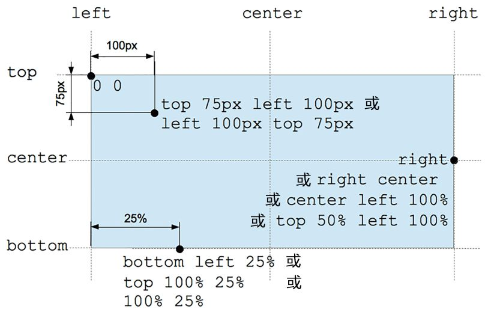

# 颜色与背景

## 颜色 color

在 CSS 世界中,颜色表达有很多种方法,包括‘颜色关键字’,‘十六进制表达 HEX’,‘RGB 表达’,‘RGBA 表达’,‘HSL 表达’,‘HSLA 表达’.

由于历史原因,颜色关键字在早期并不是很丰富,虽然 CSS3 中进行了大量新增,但是在实际开发过程中,我们很少使用颜色关键字,更多的是使用 HEX 十六进制表达式,而在最新的 CSS4 中,标准对 HEX 进行了扩展(由 3 位或 6 位扩展为 4 位或 8 位),使其能够支持透明度,要知道,以前要想在颜色中使用透明度,我们得使用 RGBA 表达.

HEX 表达方式使用#000000 或#000 这样的值来表示颜色,12 位代表 R,34 位代表 G,56 位代表 B,新增的 78 位代表 A,当他们 12 位,34 位,56 位,78 位各自相等时,可以精简一个值,变为 3 位或 4 位的值.

RGBA 表达方式如今主要还是用在存在透明度的颜色上,毕竟并不是所有浏览器都能支持 CSS4 的特性.不过,RGBA 表达式中的数值是支持百分比的,虽然很少用到.不过其中的数值不能是小数,否则,浏览器会无视小数部分.RGB 分别表示红绿蓝三原色,范围 0-255,A 为透明度,范围 0-1.

HSLA 表达方式和 RGBA 类似,不过 H 代表了 hue(色调),取值 0-360,按照红橙黄绿青蓝紫变化,S 代表 saturation(饱和度),用 0-100%表示,值越大饱和度越高,颜色越亮,当值为 0 时,颜色会变为 l 代表的亮度,l 代表 lightness(亮度),用 0-100%表示,值越亮,颜色越亮,100%为白色,0%为黑色,A 表示透明度,0-1 之间,0 为全透明.

### transparent

`transparent`关键字表示一个完全透明的颜色,在现代 CSS 定义中,它等同于`rgba(0,0,0,0)`.

### currentColor

`currentColor`关键字代表原始的`color`属性的计算值.

### opacity

`opacity`属性虽然也是透明度,但是这个参数针对的是整个 dom 节点,这个参数会让整个 dom 节点都有透明度,不管是 dom 内容还是 dom 背景.

- 各种颜色表示写法推荐直接参考[MDN 样例](https://developer.mozilla.org/zh-CN/docs/Web/CSS/color_value#RGB%E7%9A%84%E5%A4%9A%E7%A7%8D%E8%AF%AD%E6%B3%95).

## 背景 background

background 属性包括:

- background-image
- background-position
- background-repeat
- background-attachment
- background-color
- background-size
- background-origin
- background-clip
- background-break

## background-image

用于为一个元素设置一个或多个背景图像,这个属性除了支持图片外,还可以[定义渐变色](https://developer.mozilla.org/zh-CN/docs/Web/CSS/background-image)

## background-origin

`background-origin`规定了背景图片`background-image`属性的原点位置的背景相对区域.
但是,当`background-attachment`为`fixed`时,该属性将被忽略.
属性值:`border-box`背景图片摆放以 border 区域为参考,`padding-box`(默认值)背景图片摆放以 padding 区域为参考,`content-box`背景图片摆放以 content 区域为参考

## background-attachment

决定图像的位置是在视口内固定,还是随着包含区域滚动.[.eg](https://developer.mozilla.org/zh-CN/docs/Web/CSS/background-attachment)

- fixed: 背景相对于视口固定,背景不会随着元素内容滚动
- local: 背景相对于内容固定
- scroll: 默认值,背景相对于元素本身固定

## background-position,

为背景图片设置初始位置,该位置相对于由`background-origin`定义的位置,可以设置 1-4 个值.[.eg](https://developer.mozilla.org/zh-CN/docs/Web/CSS/background-position)

- 关键字 center,表示居中背景图片
- 关键字 top,left,bottom,right 表示指定背景图片相对于哪边偏移

注意: 在 background-position 属性中,百分比值有特殊的计算公式.

`X offset = (容器宽度 - 图片宽度) * positionX%`

`Y offset = (容器高度 - 图片高度) * positionY%`

## background-repeat

定义背景图片的重复方式,可以接收一个值或两个值,分别表示 x 和 y 方向的重复方式.

- repeat: 背景图像按需重复来覆盖整个背景图片所在区域,最后一个图像不合适时会被裁剪.
- space: 图像会尽可能重复,但不会裁剪,但是当图片大过容器时,还是会存在裁剪
- round: 拉伸重复,当多余的空间不足以放下一张背景图时,拉伸其他图片,直至填满
- no-repeat: 图像不重复

## background-color

设置背景颜色,可以是颜色表达或者`transparent`(默认值).

## background-size

设置背景图片的大小,可以是原有大小,或者拉伸到新的尺寸或者保持比例缩放.

- auto: 以背景图片的比例缩放背景图片
- cover: 缩放背景图片以完全覆盖(图片可能有部分看不见)
- contain: 缩放背景图片以完成显示在背景区域(背景区域可能有部分空白)
- 单值或双值: 为单值时表示图片宽度,高度为 auto;为双值时表示宽高

## background-clip

设置背景是否可以延伸到边框,内边距盒子,内容盒子下面[.eg](https://developer.mozilla.org/zh-CN/docs/Web/CSS/background-clip)

- border-box: 背景延伸到边框外沿(在边框下层)
- padding-box: 背景延伸至内边距(padding)外沿
- content-box: 背景被裁剪至内容区外沿
- text: 背景被裁剪成文字的前景色

## background-break

该属性用于定义当元素换行或者被分配在不同区域时背景如何表现.[css 标准](https://www.w3.org/TR/2008/WD-css3-background-20080910/#the-background-break)

- bounding-box: 背景定位区域为包围元素的所有断开框的最小矩形
- continuous:默认值,忽略区域间的间隙,进行背景布局,然后再将背景根据间隙分开
- each-box: 在每个框中独立绘制

目前未在 chrome 浏览器发现这个属性.
