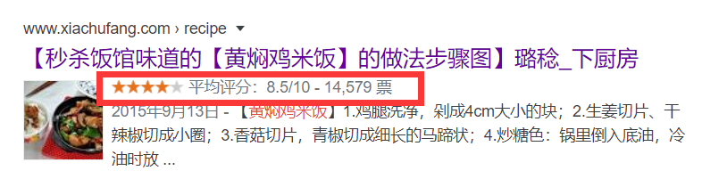
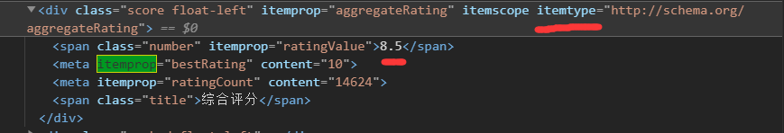

# 前端页面语义化

## 优点
* 易修改,易维护
* 无障碍阅读支持
* 搜索引擎友好,利于SEO
* 面向未来的HTML,浏览器在未来可能提供更丰富的支持

## 结构语义化

语义元素仅仅是页面结构的规范化,并不会对内容有本质的影响


### 头部(`<header>`)

header有两种用法,一种是标注内容的标题,另一种是标注网页的页眉.网页中可以包含多个header元素,按照html5的规定,header应该包含标题,如果不希望显示某个标题,设置`display:none`,同时注意header元素不能作为address,footer或header的子元素

### 导航栏(`<nav>`)

一个页面可以包含多个nav元素,但通常仅仅在页面的主要导航部分使用它.
```
<nav>
    <aside></aside>
    <aside></aside>
</nav>
或着
<aside>
    <nav>
    </nav>
    <section></section>
    <div></div>
</aside>
```
导航栏通常包含一组链接,通常使用列表来组织
```
<nav>
    <ul>
        <li><a href="#" title="链接">链接</a></li>
        <li><a href="#" title="链接">链接</a></li>
    </ul>
</nav>
```

### 附注(`<aside>`)

aside表示与周围内容没有密切关系的内容,被认为是独立与该内容的一部分并且可以被单独拆分出来而不会影响整体的,通常展示为侧边栏或嵌入内容.作为嵌入内容时可以展示文章的标注或相关链接等,作为侧栏时,可以展示广告,搜索或分享功能等

### 专题组(`<section>`)

section表示文档中的一个区域,通常是带有标题的内容.如: 与页面主体并列显示的小内容块,独立性的内容,分组内容,长文档的一部分等.

### 内容块(`<article>`)

article表示文档,页面或应用中独立的结构,是可独立分配的,可复用的结构.如论坛帖子,用户评论等内容.在article中插入图片时,推荐使用figure标签.
```
<article>
    <h1>标题</h1>
    <p></p>
    <figure>
        
        <figcaption>这是个插图</figcaption>
    </figure>
</article>
```

`注意: article比section更具有独立性,完整性,article中的内容脱离文档流后依然完整独立`

### 页脚(`<footer>`)

footer标签仅仅可以包含版权,来源信息,法律限制等等之类的文本或链接信息,如果想要在页脚中显示其他内容,推荐使用div.

### 主要内容(`<main>`)

main定义文档的主要内容,该内容在文档中应当是独一无二的不包含任何在文档中重复的内容,一个文档中不能出现多个main标签,main标签通常是body的子标签或者全局div的子标签.

## 文本级语义化

一般文本语义化是为了搜索引擎seo而准备的,为了使搜索引擎展示效果更好.

在google中搜索黄焖鸡米饭,会出现如下链接信息

其中评分信息是怎么来的呢,这其实就是google在做seo时,爬取到网页信息中的语义化文本保存下来的


文本语义化的属性有很多,如time,output等.

`前端语义化是一个长期积累坚持的过程.这样做了以后,不光我们读取代码方便,而且如果未来浏览器支持的话,只需要一点微小的改动甚至不需要修改,我们的网页就能展示新特性,最后前端语义化对于障碍人士也更加友好,很多屏幕辅助工具都是借助语义化标签快速定位识别.`