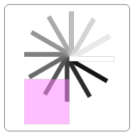
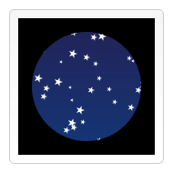

# Canvas基础一

## 背景

canvas元素是html5中最受欢迎的元素,该元素负责在页面中设定一个区域,然后通过javascript动态地在该区域中绘制图形.除了具备基本回图能力的2D上下文,canvas还提供了名为WebGL的3D上下文,随着操作系统和硬件能力的提升,几乎所有的现代浏览器对WebGL的支持都非常好.

canvas可以用于动画,游戏,数据可视化,图片编辑及实时视频处理等方面.canvas api主要聚焦于2D图形,WebGL api则用于绘制硬件加速的2D和3D图形.

## 基本用法

### `<canvas>`元素

`<canvas id="myCanvas" width="150" height="150"></canvas>`

canvas看起来和img元素很像,但是canvas标签只有`width`和`height`两个属性.当没有设置宽高时,canvas会初始化为宽度300px,高度150px.该元素也可使用css来定义大小,但在绘制时图像会伸缩以适应框架尺寸--如果css的尺寸与初始画布的比例不一致,图像会出现扭曲.

* 替代内容
canvas也像img,picture元素一样,在浏览器不支持此特性时显示替代内容

`<canvas id="mycanvas">此浏览器不支持canvas,请升级浏览器</canvas>`

* `</canvas>`标签不可省略
### 渲染上下文

canvas元素创造一个固定大小的画布,公开了一个或多个渲染上下文,可以用来绘制和处理要展示的内容.canvas起初是空白的,为了展示,我们首先要获取到渲染上下文,在它上面绘制.canvas提供了getContext()方法来获取渲染上下文.我们可以使用getContext()方法检查浏览器是否支持canvas.
```
var canvas = document.getElementById('myCanvas');
var ctx = canvas.getContext('2d');
```
## 绘制形状

### 画布栅格和坐标空间

canvas元素默认被网格覆盖,通常网格中的一个单元相当于canvas元素中的一个像素,栅格的起点为左上角,坐标为(0,0).所有元素的位置都相对于原点定位.

### 绘制矩形

canvas只支持两种形式的图形绘制: 矩形和路径(由一系列点连成的线段).所有其他类型的图形都是通过一条或多条路径组合而成.

canvas提供了三种绘制矩形的方法:

* fillRect(x,y,width,height) 绘制一个填充的矩形
* strokeRect(x,y,width,height) 绘制一个矩形边框
* clearRect(x,y,width,height) 清除指定矩形区域,让清除部分完全透明

x,y指定了在canvas画布上所绘制的矩形的左上角(相对于原点)的坐标.width和height设置矩形的尺寸.这三个函数在绘制后会立即生效.

### 绘制路径

图形的1基本元素是路径.路径是通过不同颜色和宽度的线段或曲线相连形成的不同形状的点的集合.路径是闭合的.

路径绘制一般步骤:

1. 创建路径起始点
2. 使用画图命令绘制路径
3. 路径封闭
4. 通过描边或填充路径区域来渲染图形

* beginPath() 新建一条路径,生成之后,图形绘制命令被指向到路径上生成路径
* closePath() 闭合路径之后图形绘制命令又重新指向到上下文
* stroke() 通过线条来绘制图形轮廓
* fill() 通过填充路径的内容区域来生成实心的图形

注意,当我们调用fill()方法时,所有没有闭合的形状会自动闭合.

#### 绘制一个三角形
```
var canvas = document.getElementById('myCanvas');
if(canvas.getContext) {
    var ctx = canvas.getContext('2d');
    ctx.beginPath();
    ctx.moveTo(75, 50);
    ctx.lineTo(100, 75);
    ctx.lineTo(100, 25);
    ctx.fill();
}
```

* moveTo(x,y) 将笔触移动到指定的坐标上,不绘制任何内容
* lineTo(x,y) 绘制一条从当前位置到指定xy位置的直线
* arc(x,y,radius,startAngle,endAngle,anticlockwise) 画一个以(x,y)为圆心的以radius为半径的圆弧(圆),从startAngle开始到endAngle结束(弧度单位,以x轴为基准),按照anticlockwise(布尔值,true逆时针,false顺时针)给定的方向(默认顺时针)来生成
* quadraticCurveTo(cp1x,cp1y,x,y) 绘制二次贝塞尔曲线,cp1x,cp1y为一个控制点,x,y为结束点
* bezierCurveTo(cp1x,cp1y,cp2x,cp2y,x,y) 绘制三次贝塞尔曲线,cp1x,cp1y为控制点一,cp2x,cp2y为控制点二,x,y为结束点
* rect(x,y,width,height) 绘制一个左上角坐标为(x,y),宽度为width,高度为height的矩形,当该方法执行时,当前笔触会自动重置到默认坐标(0,0)

### Path2D对象--缓存或记录绘画命令,快速回顾路径

`new Path2D()`返回一个新初始化的Path2D对象,可以将某段路径作为变量来创建一个副本,或者将一个包含SVG path数据的字符串作为变量

* Path2D.addPath(path [, transform]) 添加一条路径到当前路径(可能添加一个变换矩阵)

```
var ctx = canvas.getContext('2d');
var rectangle = new Path2D();
rectangle.rect(10, 10, 50, 50);

var circle = new Path2D();
circle.moveTo(125, 35);
circle.arc(100, 35, 25, 0, 2 * Math.PI);

var p = new Path2D("M10 10 h 80 v 80 h -80 Z");

ctx.stroke(rectangle);
ctx.fill(circle);
ctx.fill(p);
```

## 使用样式和颜色

### 色彩Colors

* fillStyle = color 设置图形填充颜色
* strokeStyle = color 设置图形轮廓颜色

color可以是表示css颜色值得字符串,渐变对象或者图案对象,默认情况下为黑色

注意,一旦设置了fillStyle或者strokeStyle值,那么这个新值就会成为新绘制图形得默认值,如果要给每个图形上不同得颜色,需要重新设置color值

### 透明度Transparency

* globalAlpha = transparencyValue 影响canvas中所有图形得透明度,有效范围在0到1之间,默认为1
  
注意,如果所有图形得透明度一致,我们推荐使用此属性,如果图形透明度不同我们推荐使用rgba格式的颜色设置.

### 线型Line Style

* lineWidth = value 线条宽度,线宽是指给定路径的中心到两边的粗细,换句话说就是路径的两边各绘制线宽的一半,所以要特别注意奇数线宽.当颜色填充没有填满整个canvas画布的一个像素时,未填充部分会使用实际笔触颜色一半色调的颜色来填充整个区域.

* lineCap = type 线条末端样式: butt, round, square

* lineJoin = type 线条与线条间接合处的样式: round, bevel, miter

* miterLimit = value 限制两条线相交时交接处最大长度,交接处长度(斜接长度)指线条交接处内角顶点到外角顶点的长度.
* getLineDash() 返回一个包含当前虚线样式,长度为非负偶数的数组
* setLineDash(segments) 设置当前虚线样式
* lineDashOffset = value 设置虚线样式的起始偏移量

### 渐变Gradients

* createLinearGradient(x1, y1, x2, y2) 创建一个canvasGradient对象,起点(x1,y1),终点(x2,y2)
* createRadialGradient(x1,y1,r1,x2,y2,r2) 创建一个canvasGradient对象,起点为中心为(x1,y1),半径为r1的圆,终点为中心为(x2,y2),半径为r2的圆

创建出canvasGradient对象后,使用addColorStop方法上色

* gradient.addColorStop(position, color) position为0-1之间的数值,表示渐变中颜色的相对位置,如0.5表示颜色在正中间.color为有效的css颜色值.
```
var lingrad = ctx.createLinearGradient(0,0,0,150);
lingrad.addColorStop(0, '#00ABEB');
lingrad.addColorStop(0.5, '#fff');
lingrad.addColorStop(0.5, '#26C000');
lingrad.addColorStop(1, '#fff');

var lingrad2 = ctx.createLinearGradient(0,50,0,95);
lingrad2.addColorStop(0.5, '#000');
lingrad2.addColorStop(1, 'rgba(0,0,0,0)');

ctx.fillStyle = lingrad;
ctx.strokeStyle = lingrad2;

ctx.fillRect(10,10,130,130);
ctx.strokeRect(50,50,50,50);
```


### 图案样式Patterns

* createPattern(image, type) image可以是一个image对象的引用,或者另一个canvas对象,type为字符串值: repeat,repeat-x,repeat-y,no-repeat.

注意,如果使用image对象,需要先确认image对象已经加载完毕.

```
var img = new Image();
img.src = 'https://mdn.mozillademos.org/files/222/Canvas_createpattern.png';
img.onload = function() {
    var ptrn = ctx.createPattern(img, 'repeat');
    ctx.fillStyle = ptrn;
    ctx.fillRect(0, 0, 150, 150);
}
```

### 阴影Shadows

* shadowOffsetX = float
* shadowOffsetY = float  
shadowOffsetX和shadowOffsetY用来设定阴影在X和Y轴的延申距离,不受变换矩阵影响,负值表示阴影向上或左延伸,正值表示阴影向下或右延伸,默认为0.
* shadowBlur = float shadowBlur用于设定阴影的模糊程度,其数值并不跟像素数量挂钩,也不受变换矩阵影响,默认为0
* shadowColor = color 标准css颜色值,用于设定阴影颜色效果,默认全透明黑色

### Canvas填充规则

当使用fill(或clip,isPointinPath)时,可以设置填充规则,该填充规则根据某处在路径外面或者里面来决定该处是否被填充.

* fill(String) nonzero(非零缠绕规则),evenodd(奇偶缠绕规则)

## 绘制文本

### 绘制文本

* fillText(text, x, y [, maxWidth]) 在指定的(x,y)位置填充指定的文本,绘制的最大宽度可选,文字实心
* strokeText(text, x, y [, maxWidth]) 在指定的(x,y)位置绘制文本边框,绘制的最大宽度可选,文字空心

```
ctx.font = "48px serif";
ctx.fillText("Hello world", 10, 50);

ctx.strokeText("Hello world", 10, 50);
```

### 有样式的文本

* font = value 绘制文本的样式,使用和css font属性相同的语法,默认10px sans-serif
* textAlign = value 文本对齐选项,start,end,left,right,center
* textBaseline = value 基线对齐选项,alphabetic,top,hanging,middle,ideographic,bottom
* direction = value 文本方向,inherit,ltr,rtl


### 预测量文本宽度

* measureText() 返回一个TextMetrics对象的宽度,所在像素
```
var text = ctx.measureText("foo");
text.width; // 16;
```

## 使用图像

canvas的图像操作能力,拓宽了浏览器处理图片和开发大型游戏的能力

### 获取需要绘制的图片

canvas api可以使用以下几种类型作为图片的源:

* HTMLImageElement 由Image()函数构造或者``元素
* HTMLVideoElement 使用`<video>`元素作为图片源
* HTMLCanvasElement 使用另外一个`<canvas>`元素作为图片源
* ImageBitmap 高性能位图

#### 从相同页面获取图片

* document.images
* document.getElementsByTagName()
* document.getElementById()

#### 跨域获取图片

在HTMLImageElement上使用crossOrigin属性,我们可以请求加载其他域下的图片,如果图片服务器允许跨域访问图片,则可以在canvas上使用该图片,否则使用该图片会污染canvas而报错.

#### 使用其他canvas元素

通过document.getElementsByTagName()和document.getElementById()方法获取其他canvas元素,此canvas必须已经创建

#### 从零开始创建图像

通过js脚本创建一个HTMLImageElement对象,加载图片后,调用drawImage方法,如果图片没加载完调用,那么canvas上什么也不会有

#### 通过data:url方式嵌入图像

使用base64编码的字符串来定义一张图片,此方法加载的图片速度很快,但是图片没法缓存,而且如果图片大的话,url数据会很长

#### 使用视频帧

使用`<video>`中的视频帧,即使视频是不可见的

### 绘制图片

获得图像源以后,就可以使用drawImage方法来将它渲染到canvas里了

* drawImage(image, x, y) image为image或canvas对象,x,y是其在目标canvas里的起始坐标
* drawImage(image, x, y, width, height) width和height两个参数控制向canvas画入时应该缩放到的大小
* drawImage(image, sx, sy, sWidth, sHeight, dx, dy, dWidth, dHeight) sx,sy,sWidth,sHeight定义图像源的切片的位置和大小, dx,dy,dWidth,dHeight则定义了切片的目标显示位置和大小


## 变形

### 状态的保存和恢复

* save() 保存画布的所有状态
* restore() 恢复上次canvas状态

canvas状态指的时当前画布的所有样式和变形的一个快照(只是样式和变形,不包括路径),存储在栈中,每当save()调用后,当前状态就被推入栈中保存.

一个绘画状态包括: 1. 当前应用的变形(移动,旋转,缩放) 2. 前文定义的各种样式,颜色,偏移,阴影,渐变等 3. 当前的裁切路径

每次调用restore()方法,上一个保存的状态就从栈中弹出所有设定都恢复

### 移动Translating

* translate(x, y) x为左右偏移量,y为上下偏移量,此方法用来移动canvas和它的原点位置

### 旋转Rotaing

* rotate(angle) angle为旋转的角度,顺时针方向,单位为弧度,此方法以canvas原点为中心点进行旋转

### 缩放Scaling

* scale(x,y) x为水平缩放因子,y为垂直缩放因子,此方法用来增减图形在canvas中的像素数目,对形状或位图进行缩小和放大.画布初始情况下,是以左上角坐标为原点的第一象限,如果参数为负实数,相当于以x或y轴作为对称轴镜像反转.

### 变形Transforms

* transform(m11, m12, m21, m22, dx, dy) 此方法将当前变形矩阵乘以上一个基于自身参数的矩阵

m11: 水平方向的缩放
m12: 水平方向的倾斜偏移
m21: 竖直方向的倾斜偏移
m22: 竖直方向的缩放
dx: 水平方向的移动
dy: 竖直方向的移动
* setTransform(m11, m12, m21, m22, dx, dy) 此方法将当前变形矩阵重置为单位矩阵,然后用相同的参数调用transform方法
* resetTransform() 重置当前变形为单位矩阵,等价与ctx.setTransform(1, 0, 0, 1, 0, 0);
```
var sin = Math.sin(Math.PI/6);
var cos = Math.cos(Math.PI/6);
ctx.translate(100, 100);
var c = 0;
for (var i=0; i <= 12; i++) {
  c = Math.floor(255 / 12 * i);
  ctx.fillStyle = "rgb(" + c + "," + c + "," + c + ")";
  ctx.fillRect(0, 0, 100, 10);
  ctx.transform(cos, sin, -sin, cos, 0, 0);
}

ctx.setTransform(-1, 0, 0, 1, 100, 100);
ctx.fillStyle = "rgba(255, 128, 255, 0.5)";
ctx.fillRect(0, 50, 100, 100);
```


## 合成与裁剪

### globalCompositeOperation

我们不仅可以在已有图形后面再画新图形,还可以用来遮盖指定区域,清除画布中的某些部分以及更多其他操作

* globalCompositeOperation = type 设定在画新图形时采用的遮盖策略
1. source-over 默认设置,在现有画布上下文上绘制新图形
2. source-in 新图形旨在新图形和目标画布重叠的地方绘制,其他都是透明的
3. source-out 在不与现有画布内容重叠的地方绘制新图形
4. source-atop 新图形只在与现有画布内容重叠的地方绘制
5. destination-over 在现有画布内容后面绘制新的图形
6. destination-in 现有的画布内容保持在新图形和现有画布内容重叠的位置,其他都是透明的
7. destination-out 现有内容保持在新图形不重叠的地方
8. destination-atop 现有画布只保留与新图形重叠的部分,新图形是在画布内容后面绘制的
9. lighter 两个重叠图形的颜色是通过颜色值想加来确定的
10. copy 只显示新图形
11. xor 图像中,那些重叠和正常绘制外的其他地方是透明的
12. multiply 将顶层像素与底层相应像素相乘,结果是一幅更黑暗的图片
13. screen 像素倒转,相乘,再倒转,结果是一幅更明亮的图片
14. overlay multiply和screen的结合,暗的地方更暗,亮的地方更亮
15. darken 保留两个图层中最暗的像素
16. lighten 保留两个图层中最亮的像素
17. color-dodge 将底层除以顶层的反置
18. color-burn 将反置的底层除以顶层,然后将结果反过来
19. hard-light 屏幕相乘,类似于叠加,但上下图层互换
20. soft-light 用顶层减去底层或者相反来得到一个正值
21. difference 一个柔和版本的强光(hard-light),纯黑或纯白不会导致纯黑或纯白
22. exclusion 和differencr相似,但对比度较低
23. hue 保留底层的亮度和色度,同时采用顶层的色调
24. saturation 保留底层的亮度和色调,采用顶层的色度
25. color 保留底层的亮度,采用顶层的色调和色度
26. luminosity 保持底层的色调和色度,采用顶层的亮度

😂(￣_￣|||) 类型太多了,只做个记录

### 裁切路径

裁切路径和普通的canvas图形差不多,不同的是它的作用是遮罩,用来隐藏不需要的部分.

* clip() 将当前正在构建的1路径转换为当前的裁剪路径
```
var ctx = document.getElementById('canvas').getContext('2d');
// 绘制黑色背景
ctx.fillRect(0,0,150,150);
// 将原点移动到中心
ctx.translate(75,75);
// 绘制圆形路径
ctx.beginPath();
ctx.arc(0,0,60,0,Math.PI*2,true);
// 圆形路径裁剪
ctx.clip();
// 背景渐变色
var lingrad = ctx.createLinearGradient(0,-75,0,75);
lingrad.addColorStop(0, '#232256');
lingrad.addColorStop(1, '#143778');

ctx.fillStyle = lingrad;
ctx.fillRect(-75,-75,150,150);
// draw stars
for (var j=1;j<50;j++){
  ctx.save();
  ctx.fillStyle = '#fff';
  // 星星位置随机分布
  ctx.translate(75-Math.floor(Math.random()*150),
                75-Math.floor(Math.random()*150));
  drawStar(ctx,Math.floor(Math.random()*4)+2);
  ctx.restore();
}
// 绘制随机大小的星星
function drawStar(ctx,r){
  ctx.save();
  ctx.beginPath()
  ctx.moveTo(r,0);
  for (var i=0;i<9;i++){
    ctx.rotate(Math.PI/5);
    if(i%2 == 0) {
      ctx.lineTo((r/0.525731)*0.200811,0);
    } else {
      ctx.lineTo(r,0);
    }
  }
  ctx.closePath();
  ctx.fill();
  ctx.restore();
}
```

