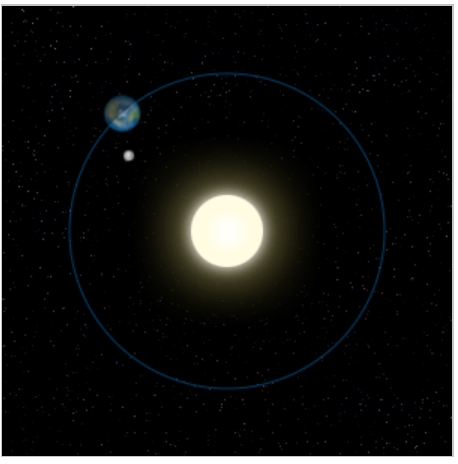

# Canvas基础二

## 动画
canvas动画最大的限制是图像一旦绘制,就一直保持原样,如果要移动它,必须对所有东西重绘
### 动画的基本步骤
1. 清空canvas clearRect()
2. 保存canvas状态
3. 绘制动画图形
4. 恢复canvas状态

### 操控动画
在canvas中绘制内容是用canvas提供的方法,通常,我们仅仅在脚本执行结束后才能看到结果.因此,为了实现动画,我们需要定时执行重绘

#### 有安排的更新画布
* setInterval(function, delay) 多次定期执行
* setTimeout(function, delay) 执行一次
* requestAnimationFrame(callback) 告诉浏览器希望执行动画,在重绘前,请求浏览器执行一个特定的函数来更新动画

```
var sun = new Image();
var moon = new Image();
var earth = new Image();
function init(){
  sun.src = 'https://mdn.mozillademos.org/files/1456/Canvas_sun.png';
  moon.src = 'https://mdn.mozillademos.org/files/1443/Canvas_moon.png';
  earth.src = 'https://mdn.mozillademos.org/files/1429/Canvas_earth.png';
  window.requestAnimationFrame(draw);
}

function draw() {
  var ctx = document.getElementById('canvas').getContext('2d');

  ctx.globalCompositeOperation = 'destination-over';
  ctx.clearRect(0,0,300,300); // clear canvas

  ctx.fillStyle = 'rgba(0,0,0,0.4)';
  ctx.strokeStyle = 'rgba(0,153,255,0.4)';
  ctx.save();
  ctx.translate(150,150);

  // Earth
  var time = new Date();
  ctx.rotate( ((2*Math.PI)/60)*time.getSeconds() + ((2*Math.PI)/60000)*time.getMilliseconds() );
  ctx.translate(105,0);
  ctx.fillRect(0,-12,50,24); // Shadow
  ctx.drawImage(earth,-12,-12);

  // Moon
  ctx.save();
  ctx.rotate( ((2*Math.PI)/6)*time.getSeconds() + ((2*Math.PI)/6000)*time.getMilliseconds() );
  ctx.translate(0,28.5);
  ctx.drawImage(moon,-3.5,-3.5);
  ctx.restore();

  ctx.restore();
  
  ctx.beginPath();
  ctx.arc(150,150,105,0,Math.PI*2,false); // Earth orbit
  ctx.stroke();
 
  ctx.drawImage(sun,0,0,300,300);

  window.requestAnimationFrame(draw);
}

init();
```


小球动画并通过鼠标控制
```
var canvas = document.getElementById('canvas');
var ctx = canvas.getContext('2d');
var raf;
var running = false;

var ball = {
  x: 100,
  y: 100,
  vx: 5,
  vy: 1,
  radius: 25,
  color: 'blue',
  draw: function() {
    ctx.beginPath();
    ctx.arc(this.x, this.y, this.radius, 0, Math.PI * 2, true);
    ctx.closePath();
    ctx.fillStyle = this.color;
    ctx.fill();
  }
};

function clear() {
  ctx.fillStyle = 'rgba(255,255,255,0.3)';
  ctx.fillRect(0,0,canvas.width,canvas.height);
}

function draw() {
  clear();
  ball.draw();
  ball.x += ball.vx;
  ball.y += ball.vy;

  if (ball.y + ball.vy > canvas.height || ball.y + ball.vy < 0) {
    ball.vy = -ball.vy;
  }
  if (ball.x + ball.vx > canvas.width || ball.x + ball.vx < 0) {
    ball.vx = -ball.vx;
  }

  raf = window.requestAnimationFrame(draw);
}

canvas.addEventListener('mousemove', function(e){
  if (!running) {
    clear();
    ball.x = e.clientX;
    ball.y = e.clientY;
    ball.draw();
  }
});

canvas.addEventListener('click',function(e){
  if (!running) {
    raf = window.requestAnimationFrame(draw);
    running = true;
  }
});

canvas.addEventListener('mouseout', function(e){
  window.cancelAnimationFrame(raf);
  running = false;
});

ball.draw();
```

## 像素操作

### ImageData对象
ImageData对象中存储着canvas对象真实的像素数据,包含几个只读属性:

* width 图片宽度,单位为像素
* height 图片高度
* data 一维数组,包含RGBA格式的整型数据,包含所有像素数据,每个像素使用四个值(RGBA)代表

### 创建一个ImageData对象
1. var myImageData = ctx.createImageData(width, height);
   
   创建一个width和height固定的ImageData对象,所有像素被预设为透明黑

2. var myImageData = ctx.createImageData(anotherImageData);
   
   创建一个和anotherImageData宽高相同的ImageData对象,所有像素被预设为透明黑

### 获取场景像素数据
* var myImageData = ctx.getImageData(left, top, width, height);

  getImageData方法会返回一个ImageData对象,代表了画布区域的对象数据

### 在场景中写入像素数据

* ctx.putImageData(myImageData, dx, dy); dx,dy参数表示希望场景内左上角绘制的像素数据的坐标

### 反锯齿
* imageSmoothingEnabled  boolean类型,默认为true,开启反锯齿

### 保存图片
* canvas.toDataURL('image/png') 默认设置,将canvas导出为png图片
* canvas.toDataURL('image/jpeg', quality) 创建一个jpg图片,quality为0-1的值,1表示图片品质最好,0表示不被辨析但文件体积较小
* canvas.toBlob(callback, type, encoderOptions) 创建一个图片的Blob对象,callback回调函数可获取生成的Blob对象,type指定图片格式,默认image/png,encoderOptions为Number类型,值在0-1之间,请求格式为image/jpeg,image/webp时用来指定图片质量

## 性能优化

* 在离屏canvas上预渲染相似的图形或重复的对象
* 避免浮点数的坐标点,用整数取而代之
* 在离屏canvas中缓存图片的不同尺寸,而不要用drawImage去缩放它们
* 使用多层画布去画一个复杂的场景
* 用css设置大的背景图
* 用css transforms特性缩放画布
* 关闭透明度canvas.getContext('2d', { alpha: false })
* 将画布的函数调用集中在一起
* 避免不必要的画布状态改变
* 渲染画布中的不同点,而非整个新状态
* 尽可能避免shadowBlur(模糊程度)特性
* 尽可能避免text rendering(文本渲染)
* 使用不同的办法去清除画布(clearRect, fillRect, 调整canvas大小)
* 有动画时,使用requestAnimationFrame而非setInterval
* 谨慎使用大型物理库