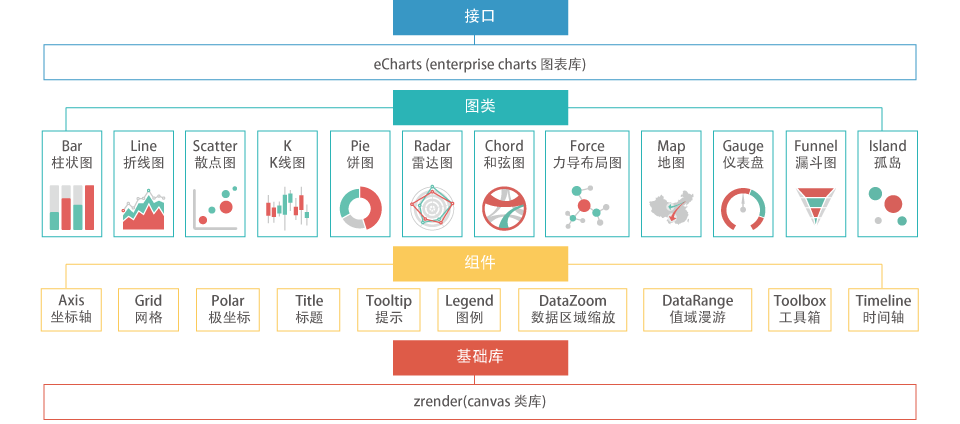

# ECharts 介绍

Echarts是一个纯JavaScript图表库，兼容性强，可运行于大多数浏览器以及PC和移动设备。目前已经迭代到ECharts 3版本。

## 1 ECharts 特性
### 1.1 丰富的图表类型
    ECharts不仅提供折线图，柱状图，散点图，饼图，K线图等，还提供可用于地理数据可视化的地图，热力图，线图，以及其他一些图表类型，并且图表之间支持混搭。
### 1.2 多个坐标系支持
    ECHarts除支持直角坐标系以外，还支持极坐标系和地理坐标系。
### 1.3 移动端优化
    ECharts可根据需求自己进行打包，减小体积。同时对移动端的交互也进行了优化。
### 1.4 强大的数据交互能力
    ECharts提供多种组件对数据进行筛选过滤展示，并且对交互进行优化，同时数据筛选的动画效果也十分惊人。
### 1.5 大数据量的支持
    ECharts可轻松暂时万级的数据量。
### 1.6 多维数据支持，动态数据展示，地理数据可视化特效
    ECharts支持更多维度数据展示，通过时间轴可以实现数据的动态展示，以及在地图上实现绚丽的效果。

## 2 ECharts的使用
### 2.1 获取ECharts
    可在官网进行下载，并且根据需要提供了不同版本。
### 2.2 引入ECharts
    ECharts3不再使用AMD方式引入，只需要像引入普通JavasScript库一样使用script标签引入。
### 2.3 使用ECharts创建图表
    通过echarts.init方法初始化echarts实例并通过 setOption方法生成图表。
### 2.4 使用ECharts提供的组件

    ECharts提供了很多用于进行数据筛选和数据展示的组件，使用方便灵活。
- 2.4.1 title-标题组件

    >包括主标题和副标题，并且在ECharts3中可存在任意多个标题。
- 2.4.2 legend-图例组件     

    >图例组件可控制数据的显隐。
- 2.4.3 dataZoom-区域缩放组件   

    >提供3种缩放组件:      
    >1.内置型数据区域缩放组件(内置于坐标系中,用户可以在坐标系上通过鼠标拖拽,鼠标滚轮来缩放或漫游坐标系)   
    >2.滑动条型数据区域缩放组件(有单独的滑动条，用户在滑动条上进行缩放或漫游)     
    >3.框选型数据区域缩放组件(提供选框进行数据区域缩放)        
- 2.4.4 visualMap-视觉映射组件      

    >该组件可以说是另一种意义上的图例组件，只不过它通过数据值进行划分，而不是通过数据类型划分。
- 2.4.5 tooltip-提示框组件  

    >展示数据详细信息的提示框。
- 2.4.6 toolbox-工具栏     

    >内置导出图片，数据视图，动态类型切换，数据区域缩放，重置五个工具。
- 2.4.7 geo-地理坐标系组件    

    >用于地图绘制，目前只支持从官方下载地图，而官方的底图数据是一个geojson数据，后期还要看看能否突破限制，使用普通地图服务。
- 2.4.8 timeline-时间轴    

    >通过给ECharts图表设置多个数据源，可实现时间轴播放时动态改变数据。
    
## 3 ECharts 优缺点及应用场景
### 3.1 优势
- 3.1.1 使用方便，图表资源丰富，效果绚丽。
- 3.1.2 百度出品，免费开源，学习成本低，对国人使用友好。
- 3.1.3 可以根据自己的要求打包图表组件，减小体积。
- 3.1.4 提供了主题构建工具，生成统一风格图表方便。
- 3.1.5 自适应支持好，兼容性强。
- 3.1.6 社区创意资源丰富。

### 3.2 不足
- 3.2.1 在地理数据可视化上没有做更多的拓展，功能简单且不够开放。

### 3.3 在一张图产品中的应用
由于一张图中需要进行图表展示的功能相对较少，所以在使用中可以只提取几个主要的图表模块就行。而在地理数据可视化方面，ECharts功能相对简单，且只能使用geojson地图数据，后期在一张图产品上的应用还需要进行研究和拓展，不过它目前使用的地理数据可视化效果却可以提供借鉴，为以后一张图专题图生成提供帮助。

