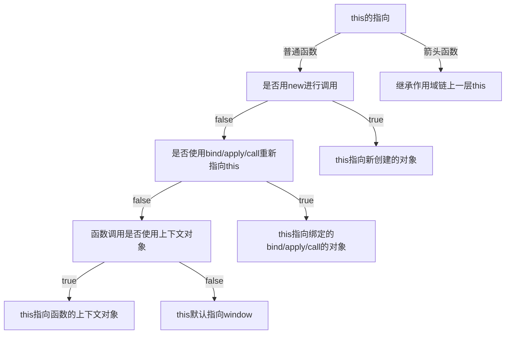

# this 指向及 bind、call、apply 使用

## this

`this`是`JavaScript`语言中的一个关键字 它是函数运行时，在函数体内部自动生成的一个对象，只能在函数体内部使用。函数在不同使用场合，`this`有不同的值。总之，`this`就是函数运行时所在的环境对象。

一般 this 的指向有这几种情况

- 直接函数调用
- 对象方法调用
- 构造函数调用
- es6 箭头函数调用

### 直接函数调用

#### 全局环境下 this

在全局环境下使用 this，无论 是否严格模式，都会指向全局对象

```javascript
//浏览器中
this === window; // true
// 严格模式
('use strict');
this === window; // true
```

非严格模式下 this 指向全局对象，严格模式下 this 保持进入执行环境值，默认为 undefined

```javascript
function fn() {
  console.log(this);
}
fn(); // window
// 严格模式
('use strict');
function fn() {
  console.log(this);
}
fn(); // undefined
```

#### setTimeout 中调用

对于延时函数内部的回调函数的 this 指向全局对象 window（当然我们可以通过 bind 方法改变其内部函数的 this 指向）。

```js
//默认情况下代码
function Person() {
    setTimeout(function() {
        console.log(this);
    }, 1000);
}

var p = new Person(); // 1秒后返回 window 对象
==============================================
//通过bind绑定
function Person() {
    setTimeout((function() {
        console.log(this);
    }).bind(this), 1000);
}

var p = new Person(); // 1秒后返回构造函数新生成的对象 Person{...}
```

#### 行内绑定中调用

onclick 内部调用函数实际运行环境在全局 window 对象下

```html
<input type="button" value="按钮" onclick="clickFun()" />
<script>
  function clickFun() {
    console.log(this.value); //输出undefined， 此函数的运行环境在全局window对象下，因此this指向window;
  }
</script>

<input type="button" value="按钮" onclick="this" />
<!-- 运行环境在节点对象中，因此this指向本节点对象 -->
```

#### 事件绑定中调用

因为动态绑定的事件本就是为节点对象的属性(事件名称前面加'on')重新赋值为一个匿名函数，因此函数在执行时就是在节点对象的环境下，this 自然就指向了本节点对象。

```html
<input type="button" value="按钮" id="btn" />
<script>
  var btn = document.getElementById('btn');
  btn.onclick = function() {
    console.log(this.value); // 输出值为“按钮”，this指向本节点对象
  };

  btn.addEventListener('click', function() {
    console.log(this.value); //"按钮"
  });
</script>
```

### 对象方法调用

this 是指向运行时的环境，而对象调用方法 this 将会指向调用对象

多层嵌套的对象，内部方法的 this 指向离被调用函数最近的对象（window 也是对象，其内部对象调用方法的 this 指向内部对象， 而非 window）。

```javascript
var obj = {
  fn: function() {
    console.log(this);
  },
  attr: {
    fn1: function() {
      console.log(this);
    }
  }
};
obj.fn(); // obj
obj.attr.fn1(); // attr
```

### 构造函数调用

函数作为构造函数调用，会生成一个新的对象，此时 this 指向这个新对象

```javascript
function Person(name) {
  this.name = name;
}
var person = new Person('one');
console.log(person.name); // one
var Person1 = Person.bind({ test: 1 }, 'two');
var person1 = new Person();
// 无法改变person1指向实例，可以传入参数two对this.name进行修改
console.log(person1.test, person1.name); // undefined two
```

注意：当构造器返回的默认值是一个对象时，则实例绑定的就是该对象，如果返回值不是一个对象（如 null，undefined，false, 'string'等），返回 this。

```javascript
function Person(name) {
  this.name = name;
  return {};
}
var person = new Person('one'); // person指向的是 {}
console.log(person.name); // undefined

function Person1(name) {
  this.name = name;
  return null; // 这里传null，undefined，false, 'string'都一样
}
var person1 = new Person1('two'); // person1指向Person1的实例
console.log(person1.name); // two
```

### 箭头函数调用

es6 中提供了箭头函数，而箭头函数中的 this 是始终指向函数定义时的 this，而非执行时。

```javascript
var fn = () => {
  console.log(this);
};
fn(); // window
var obj = {
  fn: () => {
    console.log(this);
  },
  fn1: function() {
    (() => {
      console.log(this);
    })();
  },
  attr: 1
};
obj.fn(); // window
obj.fn1(); // obj

// babel解析之后等价于

var _this = this;

var fn = function fn() {
  console.log(_this);
};

fn(); // window

var obj = {
  fn: function fn() {
    console.log(_this);
  },
  fn1: function fn1() {
    var _this2 = this;

    (function() {
      console.log(_this2);
    })();
  },
  attr: 1
};
obj.fn(); // window

obj.fn1(); // obj
```

### 指向判断图

下图是 this 的一个指向判断图



### 规范类型中理解

首先需要明白 ECMAScript 的类型分为语言类型和规范类型，具体从规范类型理解 this 可以查看[原文](https://github.com/mqyqingfeng/Blog/issues/7)。

- 语言类型是开发者直接使用 ECMAScript 可以操作的。其实就是我们常说的 Undefined, Null, Boolean, String, Number, 和 Object。

- 规范类型是用算法描述 ECMAScript 语言结构和 ECMAScript 语言类型的。规范类型包括：Reference, List, Completion, Property Descriptor, Property Identifier, Lexical Environment, 和 Environment Record。

而其中的规范类型中的 Reference 与 this 的指向有着密切的关联

#### Reference 的组成

具体的内容可以知道 Reference 由三部分组成

```javascript
var foo = 1;
// foo对应的Reference类型如下
var fooReference = {
  base: EnvironmentRecord,
  name: 'foo',
  strict: false
};
```

- base value

  就是属性所在的对象或者就是 EnvironmentRecord，它的值只可能是 undefined, an Object, a Boolean, a String, a Number, or an environment record 其中的一种。

- referenced name

  比较好理解就是属性的名称

- strict reference

  是否是严格模式

##### getValue 方法

从上面的例子来看，在获取 foo 的值的时候调用了 getValue 方法：

- GetValue(fooReference) // 1
- GetValue 返回对象属性真正的值，但是要注意： **调用 GetValue，返回的将是具体的值，而不再是一个 Reference** 。这个很重要，这个很重要，这个很重要。

##### 获取 Reference 的组成方法

GetBase 和 IsPropertyReference。

- GetBase

  > GetBase(V). Returns the base value component of the reference V

  返回 base 值

- IsPropertyReference

  > IsPropertyReference(V). Returns true if either the base value is an object or HasPrimitiveBase(V) is true; otherwise returns false.

  如果 base 值是对象返回 true

##### 如何由 Reference 确定 this

1. 先确认 MemberExpression（简单来说就是（）左边的内容）返回结果赋值给 ref

2. 然后判断 ref 是否 Reference 类型

   > 1. 如果 ref 是 Reference，并且 IsPropertyReference(ref) 是 true, 那么 this 的值为 GetBase(ref)
   > 2. 如果 ref 是 Reference，并且 base value 值是 Environment Record, 那么 this 的值为 ImplicitThisValue
   > 3. 如果 ref 不是 Reference，那么 this 的值为 undefined

下面看这个例子

```javascript
var value = 1;
var foo = {
  value: 2,
  bar: function() {
    return this.value;
  }
};
console.log(foo.bar()); // 2
console.log((foo.bar, foo.bar)()); // 1
```

第一个结果：左侧的 foo.bar 是 对应的 MemberExpression，由规范 Property Accessors 可知这里展示了一个计算过程，可以看定义，

> Return a value of type Reference whose base value is baseValue and whose referenced name is propertyNameString, and whose strict mode flag is strict.

最后可以知道表达式返回的是一个 Reference 类型。

```javascript
var Reference = {
  base: foo,
  name: 'bar',
  strict: false
};
```

可以直接利用 GetBase(ref)确认 this 值，this = GetBase(ref)得到结果是 foo，最终 foo.value 的值就是 2

第二个结果：左侧的(foo.bar, foo.bar)是逗号操作符，最后会返回一个结果相当于是调用了 getValue 方法，最后返回了一个 foo.bar 对应的函数，因为上面也提到了第 3 点，可以判断 this 为 undefined，并且在非严格模式下会被隐式转化为全局对象。

## bind、call、apply 使用

### call 方法

- **`call()`** 方法使用一个指定的 `this` 值和单独给出的一个或多个参数来调用一个函数。（引用[MDN](https://developer.mozilla.org/zh-CN/docs/Web/JavaScript/Reference/Global_Objects/Function/call)）

- 语法

  ```javascript
  function.call(thisArg, arg1, arg2, ...)
  ```

  ##### **`thisArg`**

  ​ 可选的。在 **function** 函数运行时使用的 this 值。请注意，this 可能不是该方法看到的实际值：如果这个函数处于[非严格模式](https://developer.mozilla.org/zh-CN/docs/Web/JavaScript/Reference/Strict_mode)下，则指定为 null 或 undefined 时会自动替换为指向全局对象，原始值会被包装。

  ##### **`arg1, arg2, ...`**

  ​ 指定的参数列表。

- 示例

  ```javascript
  var a = {
    user: 'shuiz'
  };
  var fn = function(a, b) {
    console.log(this.user + a + b);
  };
  fn.call(a, ' is ', ' hahaha '); // shuiz is  hahaha
  ```

- 源码实现
  ```javascript
  Function.prototype.es3call = function(context) {
    var content = context || window;
    content.fn = this;
    var args = [];
    for (var i = 1, len = arguments.length; i < len; i++) {
      args.push('arguments[' + i + ']');
    }
    var result = eval('content.fn(' + args + ')');
    delete content.fn;
    return result;
  };
  ```

### apply 方法

- **`apply()`** 方法调用一个具有给定`this`值的函数，以及作为一个数组（或[类似数组对象](https://developer.mozilla.org/zh-CN/docs/Web/JavaScript/Guide/Indexed_collections#Working_with_array-like_objects)）提供的参数。（引用[MDN](https://developer.mozilla.org/zh-CN/docs/Web/JavaScript/Reference/Global_Objects/Function/apply)）

- 语法

  ```javascript
  function.apply(thisArg, [argsArray])
  ```

  ##### **`thisArg`**

  ​ 必选的。在 **func** 函数运行时使用的 this 值。请注意，this 可能不是该方法看到的实际值：如果这个函数处于[非严格模式](https://developer.mozilla.org/zh-CN/docs/Web/JavaScript/Reference/Strict_mode)下，则指定为 null 或 undefined 时会自动替换为指向全局对象，原始值会被包装

  ##### **`argsArray`**

  ​ 可选的。一个数组或者类数组对象，其中的数组元素将作为单独的参数传给 func 函数。如果该参数的值为 [null](https://developer.mozilla.org/zh-CN/docs/Web/JavaScript/Reference/Global_Objects/null) 或 [undefined](https://developer.mozilla.org/zh-CN/docs/Web/JavaScript/Reference/Global_Objects/undefined)，则表示不需要传入任何参数。从 ECMAScript 5 开始可以使用类数组对象。 [浏览器兼容性](https://developer.mozilla.org/zh-CN/docs/Web/JavaScript/Reference/Global_Objects/Function/apply#Browser_compatibility) 请参阅本文底部内容。

- 示例
  ```javascript
  var a = {
    user: 'shuiz'
  };
  var fn = function(a, b) {
    console.log(this.user + a + b);
  };
  fn.apply(a, [' is ', ' hahaha ']); // shuiz is  hahaha
  ```
- 源码实现

  ```javascript
  Function.prototype.es3apply = function(context, arr) {
    var context = context || window;
    context.fn = this;
    var result;
    if (!arr) {
      result = context.fn();
    } else {
      var args = [];
      for (var i = 0, len = arr.length; i < len; i++) {
        args.push('arr[' + i + ']');
      }
      result = eval('context.fn(' + args + ')');
    }
    delete context.fn;
    return result;
  };

  console.log(add.apply(obj, [1, 2])); // 6
  ```

### bind 方法

- **`bind()`** 方法创建一个新的函数，在 `bind()` 被调用时，这个新函数的 `this` 被指定为 `bind()` 的第一个参数，而其余参数将作为新函数的参数，供调用时使用。（引用[MDN](https://developer.mozilla.org/zh-CN/docs/Web/JavaScript/Reference/Global_Objects/Function/bind))

- 语法

  ```
  function.bind(thisArg, arg1, arg2, ...)
  ```

  ##### **`thisArg`**

  调用绑定函数时作为 `this` 参数传递给目标函数的值。 如果使用[`new`](https://developer.mozilla.org/zh-CN/docs/Web/JavaScript/Reference/Operators/new)运算符构造绑定函数，则忽略该值。当使用 `bind` 在 `setTimeout` 中创建一个函数（作为回调提供）时，作为 `thisArg` 传递的任何原始值都将转换为 `object`。如果 `bind` 函数的参数列表为空，或者`thisArg`是`null`或`undefined`，执行作用域的 `this` 将被视为新函数的 `thisArg`。

  ##### **`arg1, arg2, ...`**

  当目标函数被调用时，被预置入绑定函数的参数列表中的参数。

  ##### **返回值**

  返回一个原函数的拷贝，并拥有指定的 **`this`** 值和初始参数。

- 示例

  ```javascript
  var a = {
    user: 'shuiz'
  };
  var fn = function(a, b) {
    console.log(this.user + a + b);
  };
  var b = fn.bind(a, ' is ');
  b(' hahaha '); // shuiz is  hahaha
  ```

- 源码实现

  ```javascript
  Function.prototype.es3bind = function(target) {
    target = target || window; //如果没有传入,就为window
    var self = this; //谁调用myBind，this就指向谁
    var args = [].slice.call(arguments, 1); //args:[arguments[1],arguments[2]....]
    var temp = function() {};
    var fn = function() {
      var fnArgs = [].slice.call(arguments, 0);
      //this 如果new fn()  this 指向构造出来的对象，否则为window ;this instanceof fn看this的原型链上有没有fn的原形
      return self.apply(
        this instanceof fn ? this : target,
        args.concat(fnArgs)
      );
    };
    temp.prototype = this.prototype;
    fn.prototype = new temp(); //形成继续关系  fn.prototype.__proto__ == this.prototype  true
    return fn;
  };
  ```
