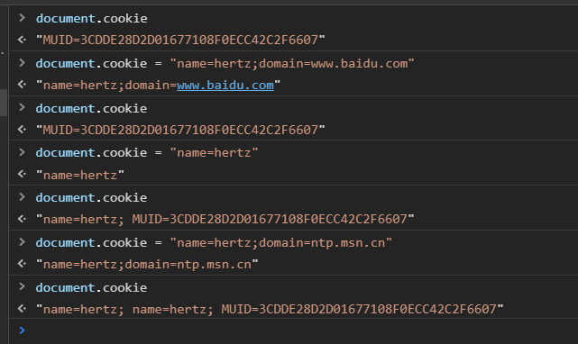

# 浏览器本地存储数据--Cookie,localstorage,sessionStorage,IndexedDB

随着web应用程序的出现,产生了对能够直接在客户端存储用户信息能力的要求,于是cookie就此诞生

## Cookie

cookie是浏览器提供的一小块保存在本地的数据,与具体的Web页面或站点相关.

### cookie特点

* 不同浏览器存放cookie位置不同,不能通用
* 数据存储在客户端,会在浏览器向同一服务器发送请求时被携带并发送到服务器上
* 不可跨域,每个cookie绑定单一域名,无法在其他域名下获取和使用,一级域名和二级域名之间可通过设置cookie的domain信息实现cookie共享
* 一个域名下存放的cookie的个数和大小都是由限制的,一般为20个,小于4k
* cookie默认过期时间是浏览器会话结束时,也可手动设置过期时间

`因为cookie会被浏览器自动添加到请求头中发送给服务器,所以cookie很适合用来存储用户验证信息`

### cookie操作

* 设置cookie
```
document.cookie = 'name=hertz';
document.cookie = 'name=hertz;domain=www.baidu.com';
```
`注意: 虽然设置cookie的操作看着像是在给cookie赋值,但其内部并不是赋值操作,而是一个字符串拼接操作`


* 修改cookie,重新给key赋值就行
```
document.cookie = 'name=hertz11';
```

* 删除cookie,把要删除的cookie的过期时间设置为已经过去的时间
```
document.cookie = 'name=hertz11;expires=Mon, 06 Jan 2020 03:00:45 GMT';
```

* 获取cookie,document.cookie可以直接获取所有cookie组成的字符串,使用分号加空格隔开

由于cookie本身的一些限制,于是又出现了其他的用于存储大量信息的手段.

## sessionStorage

sessionStorage对象存储特定于某个会话的数据,该数据只保持到浏览器关闭

### sessionStorage特点

* 和cookie类似,也会在浏览器关闭后清除
* 存储在sessionStorage中的数据可以跨越页面刷新而存在,同时有些浏览器在崩溃重启后依然可用
* sessionStorage依然只能在单个页面使用,不能跨浏览器tab共享
* 对sessionStorage的操作会触发storage事件
* sessionStorage是挂载在window上的Storage实例,可直接使用,不需要手动实例化

### sessionStorage操作

* 设置sessionStorage
```
sessionStorage.setItem('name', 'hertz');
sessionStorage.name = 'hertz';
```

* 修改sessionStorage
```
sessionStorage.setItem('name', 'hertz11');
sessionStorage.name = 'hertz11';
```

* 删除sessionStorage
```
delete sessionStorage.name;
sessionStorage.removeItem('name');
sessionStorage.clear(); // 全部删除
```

* 获取sessionStorage值
```
sessionStorage.name;
sessionStorage.getItem('name');
```

## localStorage

HTML5规范中提出的一种持久保存客户端数据的方案.要访问同一个localStorage对象,页面必须来自同一个域名(子域名无效),使用同一种协议,在同一个端口.

### localStorage特点

* 数据持久存储,除非调用js方法或清除浏览器缓存,不然数据不会过期
* 存储信息在同一个域中共享,受同源策略限制
* 对localStorage的操作会触发storage事件
* 和sessionStorage一样,localStorage也是挂载在window上的Storage实例,可直接使用,不需要手动实例化

### localStorage操作

`localStorage和sessionStorage都继承自Storage,所以它的操作api和sessionStorage一致.`

`注意: 对localStorage和sessionStorage的修改会触发storage事件,可以通过监听变化实现跨页面通信的操作`

## IndexedDB

IndexedDB是在浏览器中保存结构化数据的一种数据库,所有的操作都是异步执行的.IndexedDB是一个类似MySQL这样的数据库,只不过不是使用表来存储数据,而是使用对象来保存数据,一个IndexedDB数据库,就是一组位于相同命名空间下的对象的集合.

### IndexedDB特点
* 数据以键值对的方式存储
* 所有的操作都是异步操作
* 支持事务,一系列操作步骤中,只要有一个出错,整个事务都会取消,数据库回滚到事务发生前的状态
* 受到同源策略限制
* 存储空间大
* 不仅支持存储字符串,也可以存储二进制数据
* IndexedDB是挂载在window上的一个对象,无需实例化
* IndexedDB不支持SQL查询语句,而是使用游标指针实现遍历

### IndexedDB基本概念

* 数据库: IDBDatabase对象;一系列相关数据的容器,同一个域下可以建任意多个数据库.IndexedDB存在版本的概念,要修改数据库结构,只能通过升级数据库版本完成.
* 对象仓库: IDBObjectStore对象;每个数据库包含若干个对象仓库,类似普通数据库中的表.
* 版本: 当第一次创建数据库时,默认版本为整型1.一个数据库不能同时存在多个版本号,改变版本的唯一方法是通过一个比当前版本号更高的值去打开数据库.这会开启一个`VERSION_CHANGE`事务并且触发`upgradeneeded`事件,只有在该事件的处理函数中才能更新数据库模式
* 索引: IDBIndex对象.一个专门用来查找另一个对象仓库中的记录的对象仓库.索引是一个稳定的键值对存储,其记录的值是引用对象仓库记录中的键,当引用对象仓库中的记录变化时,索引会自动更新.
* 事务: IDBTransaction对象,数据记录的读写和删改操作,需要通过事务来完成.事务有三种模式:读写,只读和版本变更.创建和删除对象仓库的唯一方法就是通过调用版本变更事务.
* 操作请求: IDBRequest对象
* 游标指针: IDBCursor对象
* 主键集合: IDBKeyRange对象
* 数据记录: 对象仓库中保存的是数据记录,每条记录类似普通数据库表中的一行.分为主键和数据体两部分,主键用来建立默认索引,必须不同,否则会报错.数据记录以对象形式保存

### IndexedDB操作

IndexedDB鼓励使用如下基本模式:
1. 打开数据库
2. 在数据库中创建一个对象仓库
3. 启动一个事务,并发送一个请求来执行一些数据库操作,像增加或提取数据等
4. 通过监听正确类型的DOM事件以等待操作完成
5. 在操作结果上进行一些操作

#### 代码实现
1. 创建和打开(open)数据库,关闭和删除(deleteDatabase)数据库

open方法接收两个参数,第一个参数表示数据库名字,字符串类型,如果指定的数据库不存在,则会新建数据库.`第二个参数是整数类型,表示数据库版本,如果不设置,默认为1,不要使用2.3这样的版本号,会被转换成2`

indexedDB.open(databaseName, version)方法返回一个IDBRequest对象.这个对象通过三种事件error(失败), success(成功), upgradeneeded(如果指定版本号大于数据库实际版本号,触发数据库升级事件),处理打开数据库的操作结果.

错误事件遵循冒泡机制,如果不行重复编写错误处理代码,可以只写针对数据库对象的处理程序,因为最终的错误都会冒泡到数据库对象中.

```
let request = indexedDB.open('test');
db.close();
indexedDB.deleteDatabase('test');
```
`注意:当更新数据库版本以修改数据库中对象仓库时,如果已经存在同名对象仓库,要先删除再重新创建,如果要保留数据,要先遍历将数据保存在临时位置`

2. 新建对象仓库,这些操作在upgradeneeded事件中完成,keyPath用于指定主键字段,autoIncrement用于设置自动创建主键.
```
request.onupgradeneeded = function(event) {
  db = event.target.result;
  let objectStore = db.createObjectStore('person', { keyPath: 'id' });
}
```
上述代码在数据库创建完成后,新增一个叫做person的对象仓库,主键为id字段.如果没有合适的可作为主键的属性,可以设置`{autoIncrement:true}`来让数据库自动创建主键.这个主键从1开始递增,并且不会减小,即使中途删除一条记录.

3. 增加,读取,删除数据.需要开启一个事务才能对数据库进行操作,事务来自数据库对象,并且必须指定事务要操作哪些对象仓库.事务提供了三种模式:`readonly`,`readwrite`,`versionchange`.

想要修改数据库模式或结构(新建或删除对象仓库或索引),只能在`versionchange`事务中实现.

使用`readonly`,`readwrite`模式可以从已存在的对象仓库中读取记录,只有在`readwrite`事务中才能修改对象仓库,对于同一个对象仓库,可以创建多个`readonly`事务,但是只能运行一个`readwrite`事务.

使用`IDBDatabase.transaction(storeNames, mode)`启动一个事务,该方法接受两个参数:storeNames是指想访问的对象仓库的数组,mode指事务模式,默认为readyonly,该方法返回一个包含`IDBIndex.objectStore`对象的事务对象,使用此方法可以访问对应的对象仓库

事务接收三种事件:`error`,`abort`,`complete`.
* 增加数据,更新数据
```
let transaction = db.transaction(["person"], "readwrite");
transaction.oncomplete = function(event) {
  alert("All done!");
};
var objectStore = transaction.objectStore("person");
objectStore.add({id: '1', name: 'hertz', email: 'aa'});
objectStore.add({id: '2', name: 'hertz2', email: 'aa2'});
objectStore.put({id: '1', name: 'hertz1', email: 'aa22'});
```
add()方法调用时,对象仓库中不能存在相同键的对象,如果要修改一个已存在的条目,或者并不关心是否数据已存在,可以使用put()方法

* 删除数据,delete()方法接收主键作为参数
```
db.transaction(["person"], "readwrite").objectStore("person").delete("1");
```

* 读取数据,get()方法,一次读取所有数据getAll()方法.
```
db.transaction("person").objectStore("person").get("1");
```

4. 使用游标指针,使用get()方法时要求提供主键,如果要遍历对象仓库中的值,就得使用游标指针
```
let objectStore = db.transaction("person").objectStore("person");
objectStore.openCursor().onsuccess = function(event) {
  var cursor = event.target.result;
  if (cursor) {
    cursor.continue();
  } else {
    alert("没有数据了!");
  }
};
```
openCursor()方法可以接收两个参数,一个key range对象来限制被检索的项目范围,还有一个常量参数.常量`prev`表示游标倒叙遍历,默认时顺序遍历的,常量`nextunique`和`prevunique`用于索引的游标遍历中,用于处理索引key值重复的情况,添加后会返回键最小的那条记录.

key renge对象的使用:
```
// 仅匹配 "Donna"
var singleKeyRange = IDBKeyRange.only("Donna");

// 匹配所有超过“Bill”的，包括“Bill”
var lowerBoundKeyRange = IDBKeyRange.lowerBound("Bill");

// 匹配所有超过“Bill”的，但不包括“Bill”
var lowerBoundOpenKeyRange = IDBKeyRange.lowerBound("Bill", true);

// 匹配所有不超过“Donna”的，但不包括“Donna”
var upperBoundOpenKeyRange = IDBKeyRange.upperBound("Donna", true);

// 匹配所有在“Bill”和“Donna”之间的，但不包括“Donna”
var boundKeyRange = IDBKeyRange.bound("Bill", "Donna", false, true);

// 使用其中的一个键范围，把它作为 openCursor()/openKeyCursor 的第一个参数
index.openCursor(boundKeyRange).onsuccess = function(event) {
  var cursor = event.target.result;
  if (cursor) {
    // 当匹配时进行一些操作
    cursor.continue();
  }
};
```

5. 使用索引,对于上面的person对象仓库,默认主键是id,如果我想通过email来查找记录,那么需要先遍历id,获取正确的email,再获得记录,这样会有效率问题,所以这个时候我们可以使用索引.

要想使用索引,必须在onupgradeneeded中先创建索引.索引其实也是一个对象仓库,这个对象仓库可以使用了一个指定的字段作为主键.

createIndex()方法接收三个参数,索引对象名称,指定的索引字段,配置信息,当unique配置为true时,索引会确保指定的索引字段不会重复.

由于索引是一种特殊的对象仓库,所以它也带有游标指针,也可以使用openCursor()方法使用游标指针
```
objectStore.createIndex("email", "email", {unique: false});

let index = objectStore.index("email");
index.get("aa2").onsuccess = function(event) {
  console.log(event.target.result.name);
}
```

`注意: 由于indexedDB数据库是同域共享的,如果浏览器打开了多个同域的网页,并且都使用了indexedDB,如果某个页面需要变更数据库版本,会触发其他页面的onblocked事件,此时如果不关闭其他页面,那么数据库版本升级不会成功.`

## 总结
目前来说,日常使用比较多的是cookie和storage,indexedDB主要使用在离线应用中.cookie一般用于session验证,而storage则会用于保存用户习惯信息,如账户密码或者是用户设置的系统布局和主题信息等等.indexedDB由于是异步提交,所以需要考虑用户关闭浏览器和浏览器突然崩溃的问题,在这种紧急情况下,如何确保事务的正常执行或正常回退.