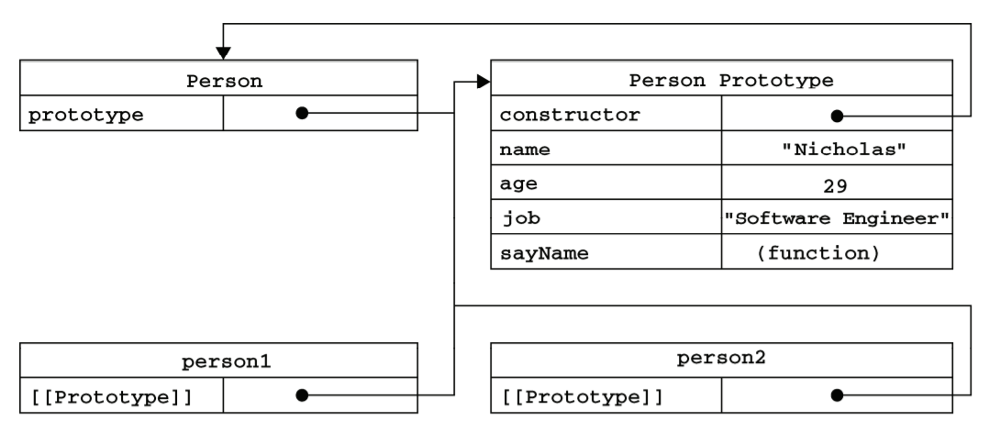

# 对象、原型与继承

### 对象 -- 无序属性的集合,属性可以包含基本值,对象或函数

1. 创建对象: 创建一个Object实例或使用对象字面量语法

```javascript
var person = new Object();person.name = "aa";
var person = { name: "aa"};
```

1.1. 属性类型: 数据属性,访问器属性

* 数据属性: 包含一个数据值的位置.在这个位置可以读取和写入值.

  [[Configurable]]: 能否通过delete删除属性从而重新定义属性,能否修改属性的特性,或者能否把属性修改为访问器属性.

  [[Enumerable]]: 能否通过for-in循环返回属性

  [[Writable]]: 能否修改属性的值

  [[Value]]: 包含这个属性的数据值.读取属性值时,从这个位置读;写入属性值时,把新值保存在这个位置.

  -- 要修改属性默认的特性,得使用Object.defineProperty()方法.这个方法接收三个参数:属性所在对象,属性名字和一个描述符对象,其中描述符对象的属性必须是configurable,enumerable,writable,value.

* 访问器属性: 不包含数据值,包含一对儿getter和setter函数

  [[Configurable]]: 同上
  
  [[Enumberable]]: 同上
  
  [[Get]]: 读取属性时调用的函数
  
  [[Set]]: 写入属性时调用的函数
  
  -- 访问器属性不能直接定义,必须使用Object.defineProperty()定义

1.2. 定义多个属性

由于对对象定义多个属性的可能性很大,所以ECMA又定义了一个Object.definrProperties()方法,利用此方法可以通过描述符一次定义多个属性.

```javascript
var book = {};
Object.defineProperties(book, {
    _year: { value: 2004 },
    edition: { value: 1 },
    year: {
        get: function() { return this._year; },
        set: function(newValue) {
            if(newValue > 2004) {
                this._year = newValue;
                this.edition += newValue - 2004;
            }
        }
    }
});
```

### 原型对象 -- 创建函数后,浏览器会根据特定规则为该函数创建一个prototype属性,此属性指向函数的原型对象

默认情况下,所有原型对象都会自动获得一个constructor(构造函数)属性,这个属性包含一个指向prototype属性所在函数的指针.

当调用构造函数创建一个新实例后,该实例的内部将包含一个指针(内部属性),指向构造函数的原型对象.chrome中使用属性**\_\_proto\_\_**标识.这个连接存在于实例于构造函数的原型对象之间,**不是**存在于实例和构造函数之间.

  

当使用对象字面量来修改原型对象时,即

```JavaScript
Person.prototype = {
    name: "Nicholas",
    age: 29,
    job: "Software Engineer",
    sayName: function() { alert(this.name); }
}
```

此时,Person.prototype的constructor属性不再指向Person构造函数,而是指向了对象Object构造函数,此时执行类型判断:

```javascript
person1 instanceof object; // true
person1 instanceof Person; // true
person1.constructor == Person; // false
person1.constructor == Object; // true
```

如果constructor的值很重要,我们需要特意将它设置回适当的值.

```javascript
Person.prototype.constructor = Person;
```

此时constructor变成了可枚举属性,如果要完全还原,可以使用**Object.defineProperty**方法.(这就是寄生组合继承的一部分操作)

注意: 调用构造函数时会为实例添加一个指向最初原型的指针,而把原型修改为另外一个对象就切断了构造函数于最初原型之间的联系.**实例中的指针指向原型对象,而不指向构造函数**

```javascript
function Person() {};
var friend = new Person();
Person.prototype = {
	constructor: Person,
	name: "Nicholas",
	age: 29,
	sayName: function() { alert(this.name); }
};
friend.sayName(); // error
```


### 继承 -- 依靠原型链实现

#### 原型链

每个构造函数都有一个原型对象(prototype),原型对象包含一个指向构造函数的指针(constructor),而实例包含一个指向原型对象的指针(\_\_proto\_\_), 如果我们让原型对象等于另一个类型的实例,此时原型对象将包含指向另一个原型的指针,另一个原型中也包含指向另一个构造函数的指针.这就构成了原型链.

```javascript
function SuperType() { this.property = true; }
SuperType.prototype.getSuperValue = function() { return this.property; }
function SubType() { this.subproperty = false; }
SubType.prototype = new SuperType();
SubType.prototype.getSubValue = function() { return this.subproperty; }
var instance = new SubType();
alert(instance.getSupervalue()); // true
```


原型链存在的问题: 

* 包含引用类型值的属性会被所有实例共享
* 在创建子类型的实例时,没办法在不影响所有对象实例的情况下,给超类型的构造函数传递参数

为解决原型链的两个问题,js中的继承方法经过了多次发展改进.

1. 借助构造函数 -- 在子类型构造函数的内部调用超类型构造函数,可以在子类型构造函数中向超类型构造函数传递参数

```javascript
function SuperType() { this.colors=["red", "blue", "green"]; }
function SubType() { SuperType.call(this) }
var instance1 = new SubType();
instance1.colors.push("blcak");
alert(instance1.colors); // "red,blue,green,black"
var instance2 = new SubType();
alert(instance2); // red,blue,green
```

问题: 方法在构造函数中定义,无法函数复用;在超类型的原型中定义的方法,对子类型而言是不可见的.

2. 组合继承 -- 将原型链和借用构造函数的方法组合在一起使用.使用原型链实现对原型属性和方法的继承,通过借用构造函数实现对实例属性的继承.

```javascript
function SuperType(name) { 
	this.name = name;
    this.colors = ["red", "blue", "green"];
}
SuperType.prototype.sayName = function() { alert(this.name); }
function SubType(name, age) {
    SuperType.call(this, name);
    this.age = age;
}
SubType.prototype = new SuperType();
SubType.prototype.constructor = SubType;
SubType.prototype.sayAge = function() { alert(this.age); }
var instance1 = new SubType("Nicholas", 29);
instance1.colors.push("black");
alert(instance1.colors); // red,blue,green,black
instance1.sayName(); // Nicholas
instance1.sayAge(); // 29

var instance2 = new SubType("Greg", 27);
alert(instance2.colors); // red,blue,green
instance2.sayName(); // Greg
instance2.sayAge(); // 27
```

问题: 无论什么情况下,都会调用两次超类型构造函数:一次是在创建子类型原型时,一次是在子类型构造函数内部.

3. 原型式继承 -- 借助原型可以基于已有的对象创建新对象,同时还不必因此创建自定义类型.

```javascript
function object(o) {
	function F(){}
	F.prototype = o;
	return new F();
}
```

在object()函数内部,先创建了一个临时性的构造函数,然后将传入的对象作为这个构造函数的原型,最后返回了这个临时类型的新实例.

ECMA通过新增**Object.create()**方法规范化了原型式继承,该方法接收两个参数: 一个用作新对象原型的对象和(可选的)一个为新对象定义额外属性的对象.

问题: 包含引用类型值的属性依然会共享相应的值.

4. 寄生组合式继承 -- 通过借用构造函数来继承属性,通过原型链的混成形式继承方法.

```javascript
function inheritPrototype(subType, superType) {
    var prototype = object(superType.prototype);
    prototype.constructor = subType;
    subType.prototype = prototype;
}
```

函数接收两个参数: 子类型构造函数和父类型构造函数.

先创建超类型原型的副本,然后为创建的副本添加constructor属性,弥补因重写原型而失去的默认constructor属性,最后将新创建的对象赋值给子类型的原型.

```javascript
function SuperType(name) {
    this.name = name;
    this.colors = ["red", "blue", "green"];
}
SuperType.prototype.sayName = function() {
    alert(this.name);
}
function SubType(name, age) {
    SuperType.call(this, name);
    this.age = age;
}
var prototype = Object.create(SuperType.prototype);
prototype.constructor = SubType;
SubType.prototype = prototype;
SubType.prototype.sayAge = function() { alert(this.age); }
```

目前寄生组合继承时引用类型最理想的继承范式,ES6的class语法糖在babel中也是如此来实现的.