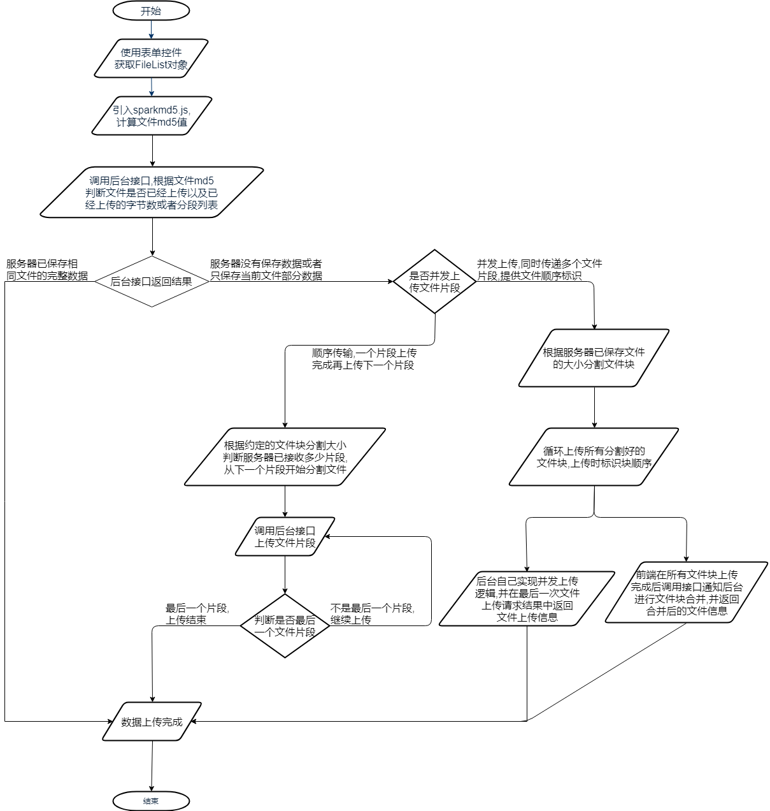
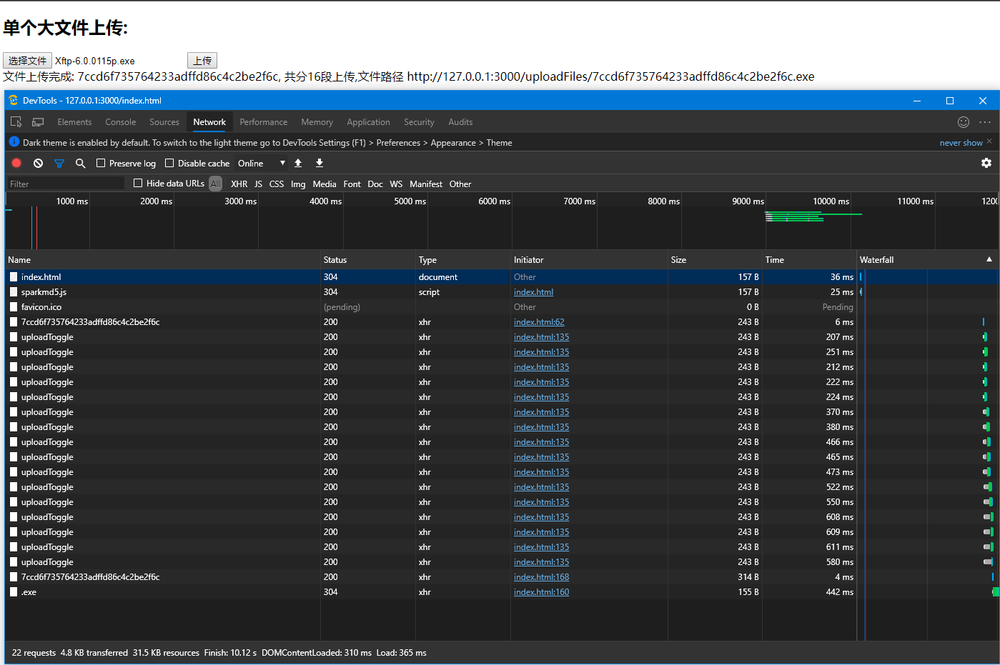
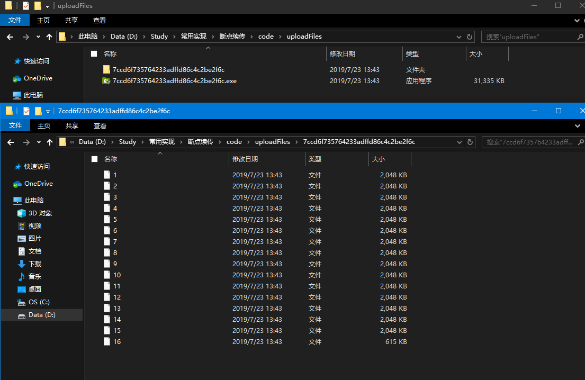

# 断点续传总结

## 一、背景

`断点续传`是指在上传或者下载的过程中,将文件人为的划分为多个部分,每一部分采用一个线程进行上传或者下载,如果碰到网络故障,则可以从已经上传或下载的部分开始继续上传下载未完成的内容,而不必从头开始上传下载,节约时间,提高速度(百度百科).

由于断点续传需要对文件进行分割和拼接,以前都是客户端软件专属技能(web网页受浏览器安全限制,不能直接操作文件),后来在HTML5标准中,W3C添加了新的api(`File.prototype.slice`)可以实现文件的分割,于是,前端也有了实现断点续传的基础,但是断点下载依然不行.

由于使用HTML5的api,所以只有现代浏览器才能支持

## 二、基本实现流程



## 三、基本实现过程

* 3.1 前端实现



1. 使用 `<input type="file">`选择本地文件

2. 计算文件MD5值(使用第三方库[sparkmd5](https://github.com/satazor/js-spark-md5),注意当文件较大时,我们需要将文件读取并切割成arrayBuffer块,分开计算,并且计算速度会较慢,

``` javascript
 // 获取上传文件
        function uploadFile() {
            currentFile = document.getElementById("fileInput").files[0];
            suffix = currentFile.name.match(/.*(\.[a-zA-Z0-9]+)$/)[1];
            getFileMD5(currentFile);
        }
        // 验证文件md5
        function getFileMD5() {
            var blobSlice = File.prototype.slice || File.prototype.mozSlice || File.prototype.webkitSlice,
                chunks = Math.ceil(currentFile.size / chunkSize),
                currentChunk = 0,
                spark = new SparkMD5.ArrayBuffer(),
                frOnload = function (e) {
                    spark.append(e.target.result); // append array buffer
                    currentChunk++;
                    if (currentChunk < chunks) {
                        loadNext();
                    } else {
                        var md5 = spark.end();
                        console.log("加载结束 : 计算后的文件md5:" + md5);
                        checkFileInServe(md5);
                    }
                },
                frOnerror = function (e) {
                    console.log("加载出错" + e);
                };
            function loadNext() {
                var fileReader = new FileReader();
                fileReader.onload = frOnload;
                fileReader.onerror = frOnerror;
                var start = currentChunk * chunkSize,
                    end = ((start + chunkSize) >= currentFile.size) ? currentFile.size : start + chunkSize;
                fileReader.readAsArrayBuffer(blobSlice.call(currentFile, start, end));
            }
            loadNext();
        }
```

`由于计算文件md5需要先将文件读取到内存中,当浏览器要上传很大的文件时,可能会存在爆内存的情况,所以很多网站做大文件上传时都会限制文件大小上限.`

3. 调用后台接口,验证当前文件md5值是否存在已上传的记录或片段,并获取已上传片段标识

`此处验证已上传文件一般是验证文件已上传大小和片段标识(一般为编号)`

``` javascript
// 检查服务器是否已经有文件
        function checkFileInServe(md5) {
            var xhr = new XMLHttpRequest();
            xhr.onreadystatechange = function () {
                if (xhr.readyState == 4 && xhr.status == 200) {
                    console.log(xhr.responseText);
                    var uploadedFileNum = JSON.parse(xhr.responseText).data;
                    //uploadFileBySplitStep(md5, uploadedFileNum);
                    uploadFileBySplitToggle(md5, uploadedFileNum);
                }
            }
            xhr.open('GET', `checkFileInServe/${md5}`);
            xhr.send();
        }
```

4. 文件分割上传,上传时跳过已上传的片段,此处上传模式有两种

   * 一种是异步排队上传,即等到前一个片段上传完成再上传下一个片段

   ``` javascript
   // 分片排队上传文件, 前端排序
           function uploadFileBySplitStep(md5, uploadedFileNum) {
               var chunks = Math.ceil(currentFile.size / chunkSize),
                   currentChunk = 0;
               function loadNext() {
                   var start = currentChunk * chunkSize,
                       end = ((start + chunkSize) >= currentFile.size) ? currentFile.size : start + chunkSize;
                   currentChunk++;
                   if (uploadedFileNum.indexOf(currentChunk) < 0) {
                       // 后台没有当前chunk
                       var formData = new FormData();
                       var fileBlob = currentFile.slice(start, end);
                       formData.append('FileID', md5);
                       formData.append('BlockSize', fileBlob.size);
                       formData.append('CurrentBlock', currentChunk);
                       formData.append('BlockNum', currentChunk + "/" + chunks);
                       formData.append('file', fileBlob);
                       formData.append('Extension', suffix);
   
                       var xhr = new XMLHttpRequest();
                       xhr.onreadystatechange = function () {
                           if (xhr.readyState == 4 && xhr.status == 200) {
                               if (currentChunk < chunks) {
                                   loadNext();
                               } else {
                                   console.log("上传结束");
                                   document.getElementById("message").innerHTML = JSON.parse(xhr.responseText).data;
                               }
                           }
                       }
                       xhr.open('POST', '/upload');
                       xhr.send(formData);
                   } else {
                    loadNext();
                   }
               }
               loadNext();
           }
   ```

   * 同步并发上传,for循环并发上传所有的片段

   ``` javascript
   // 并发上传文件, 后端处理排序
           var uploadCount = 0;
           function uploadFileBySplitToggle(md5, uploadedFileNum) {
               uploadCount = uploadedFileNum.length;
               var chunks = Math.ceil(currentFile.size / chunkSize),
                   currentChunk = 0;
               if (uploadCount === chunks) {
                   getUploadedFileInfo(chunks, md5);
                   return;
               }
   
               function loadNext() {
                   var start = currentChunk * chunkSize,
                       end = ((start + chunkSize) >= currentFile.size) ? currentFile.size : start + chunkSize;
                   currentChunk++;
                   if (uploadedFileNum.indexOf(currentChunk) < 0) {
                       // 后台没有当前chunk
                       var formData = new FormData();
                       var fileBlob = currentFile.slice(start, end);
                       formData.append('FileID', md5);
                       formData.append('BlockSize', fileBlob.size);
                       formData.append('CurrentBlock', currentChunk);
                       formData.append('AllBlock', chunks);
                       formData.append('BlockNum', currentChunk + "/" + chunks);
                       formData.append('file', fileBlob);
                       formData.append('Extension', suffix);
   
                       var xhr = new XMLHttpRequest();
                       xhr.onreadystatechange = function () {
                           if (xhr.readyState == 4 && xhr.status == 200) {
                               uploadCount++;
                               getUploadedFileInfo(chunks, md5);
                           }
                       }
                       xhr.open('POST', '/uploadToggle');
                       xhr.send(formData);
                       if (currentChunk < chunks) {
                           loadNext();
                       }
                   } else {
                    loadNext();
                   }
               }
               loadNext();
           }
   ```

5. 所有文件块上传完成后,后台就会拼接文件块并返回最终结果.(为防止数据错漏,我们可以再通过md5校验一次文件块上传记录是否完整).为简化后台逻辑,我们可以手动调用接口,通知后台对文件块进行合并.

``` javascript
// 并发上传完成后通知服务器合并文件
        function getUploadedFileInfo(chunks, md5) {
            if (uploadCount === chunks) {
                var xhr = new XMLHttpRequest();
                xhr.onreadystatechange = function () {
                    if (xhr.readyState == 4 && xhr.status == 200) {
                        console.log(xhr.responseText);
                        var uploadedFileNum = JSON.parse(xhr.responseText).data;
                        if (uploadedFileNum.length === chunks) {
                            var finalxhr = new XMLHttpRequest();
                            finalxhr.onreadystatechange = function () {
                                if (finalxhr.readyState == 4 && finalxhr.status == 200) {
                                    console.log(finalxhr.responseText);
                                    document.getElementById("message").innerHTML = JSON.parse(finalxhr.responseText).data;
                                }
                            }
                            finalxhr.open('GET', `/stitchUploadFile/${md5}/${suffix}`);
                            finalxhr.send();
                        } else {
                            // 上传存在错漏,重新上传错漏部分
                            uploadFileBySplitToggle(md5, uploadedFileNum);
                        }
                    }
                }
                xhr.open('GET', `checkFileInServe/${md5}`);
                xhr.send();
            }
        }
```

* 3.2 后端实现(以nodejs为例)

后端部分使用nodejs + express + multer + fs实现.express为nodejs框架,提供常用实现,multer可以解析FormData提交信息,并保存提交的文件,fs则用于操作读取写入文件

后端提供三个接口:

* 通过md5校验是否已经上传文件片段

``` javascript
app.get('/checkFileInServe/:md5', function (req, res, next) {
    let fileMd5 = req.params.md5;
    fs.readdir('./uploadFiles/', function (err, folder) {
        if (folder.indexOf(fileMd5) >= 0) {
            // 存在md文件夹
            fs.readdir(`./uploadFiles/${fileMd5}/`, function (err, files) {
                let chunkArr = [];
                files.forEach(fileName => {
                    chunkArr.push(Number(fileName));
                });
                res.send({ message: 'success', data: chunkArr });
            });
        } else {
            res.send({ message: 'success', data: [] });
        }
    });
});
```

* 文件上传

``` javascript
app.post('/uploadToggle', upload.any(), function (req, res, next) {
    let fileInfo = req.body;
    res.send({ message: 'success', data: [] });
});
```

* 文件合并

``` javascript
app.get('/stitchUploadFile/:md5/:extension', function (req, res, next) {
    try {
        stitchUploadFile(req.params.md5, req.params.extension, res);
    } catch (err) {
        console.log("错误", err);
    }
});
// 合并文件
const stitchUploadFile = (md5, Extension, res) => {
    fs.readdir(`./uploadFiles/${md5}`, function (err, files) {
        console.log(files);
        let readPromises = [];
        for(let i=0;i<files.length;i++) {
            let file = i + 1; // 需要按顺序拼接
            readPromises.push(new Promise((resolve, reject) => {
                fs.readFile(`./uploadFiles/${md5}/${file}`, (err, data) => {
                    if (err) throw err;
                    resolve(data);
                })
            }));
        }
        Promise.all(readPromises).then(resArr => {
            let hash = crypto.createHash('md5');
            let fsFile = Buffer.concat(resArr);
            hash.update(fsFile);
            let backMD5 = hash.digest('hex');
            console.log(backMD5);
            if(md5 !== backMD5) {
                res.send({ message: 'faild', data: `文件上传错误,后台验证MD5不一致!` });
                return;
            }
            fs.writeFile(`./uploadFiles/${md5}${Extension}`,  fsFile, (err) => {
                if (err) throw err;
                console.log('文件已被保存');
                res.send({ message: 'success', data: `文件上传完成: ${md5}, 共分${files.length}段上传,文件路径 http://127.0.0.1:3000/uploadFiles/${md5}${Extension}` });
              });
        }).catch(err => {
             throw err;
        })
    });
};
```

nodejs后台部分只是进行简单实践,不涉及数据库保存以及文件片段记录和文件片段临时文件失效处理,并且为方便fs读取写入和文件拼接操作,上传文件块保存在以上传文件md5命名的文件夹中,并且文件块以上传编号命名.



## 总结

断点续传其实是一个很简单的功能,其核心就在于对slice方法的应用,主要工作都在后台中.目前公司java后台已实现相关接口.

拓展: 前端由于浏览器限制只能进行文件断点上传,但是nodejs突破了这一限制,我们是可以通过js在node下实现一个断点下载的工具.而判断一个资源是否支持断点续传,查看响应头中是否含有`Access-Ranges:bytes`标识就行,如果存在标识,则代表资源支持断点续传.

我们请求资源时,请求头携带`Ranges:bytes=1000-2000`信息,表示获取1000byte到2000byte的文件块数据,而此时响应头就会返回`Content-Range: bytes 1000-1999/1000`信息,标识响应信息.在请求过程中,可以通过`If-Range`来区分资源文件是否变动,它的值来自`ETag`或者 `Last-Modifled`.如果资源文件有改动,会重新走下载流程,这几个字段在视频播放缓冲中很常用.

html5提供了一个webkitdirectory的属性(只有chrome和火狐支持),用于实现上传文件夹,对于文件夹的上传,是否有必要支持断点续传,如何实现?