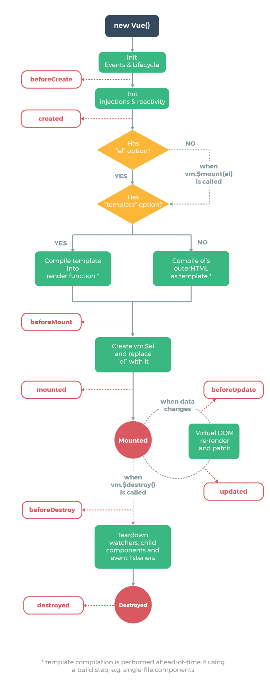

# Vue语法糖(以伪代码为例)
Vue是一套用于构建用户界面的渐进式框架，只关注视图层MVVM(MVC).

1.文本插值
```
    <div id='app'>
        {{ message }}
    </div>
    var app = new Vue({
        el: '#app',
        data: {
            message: 'Hello Vue!'
        }
    })
```
2.使用指令v-bind(:)绑定元素
```
    <div id='app'>
         <span v-bind:title="message">aa</span>
    </div>
    var app = new Vue({
        el: '#app',
        data: {
            message: 'Hello Vue!'
        }
    })
```
3.条件(v-if,v-else)与循环(v-for)
```
    <div id='app'>
        <p v-if='seen'>现在你看到我了</p>
    </div>
    var app = new Vue({
        el: '#app',
        data: {
            seen: true
        }
    })
    
    <div id="app">
        <ol>
            <li v-for="(todo,index) in todos">{{ todo.text }}</li>
        </ol>
    </div>
    var app = new Vue({
        el: '#app',
        data: {
            todos: [
                {text: 'JavaScript'},
                {text: 'Vue'}
            ]
        }
    })
```
4.事件监听v-on(@)
```
    <button v-on:click='sendMessage'>aa</button>
    var app = new Vue({
        el: '#app',
        data: {
            message: 'Hello Vue'
        },
        methods: {
            sendMessage: function() {
                this.message = 'aaaaa'
            }
        }
    })
```
5.表单输入与数据的双向绑定v-model
```
    <input v-model='message'>
    var app = new Vue({
        el: '#app'
        data: {
            message: 'Hello Vue'
        }
    })
```
修饰符:

* .lazy  在“change”时而非“input”时更新
* .number  自动将用户的输入值转为数值类型
* .trim  自动过滤用户输入的首尾空白字符

6.组件化component,data必须是函数
```
    <div id="app">
        <ol>
        <!--现在我们为每个 todo-item 提供 todo 对象,todo 对象是变量，即其内容可以是动态的。
        我们也需要为每个组件提供一个“key”-->
            <todo-item
            v-for="item in groceryList"
            v-bind:todo="item"
            v-bind:key="item.id">
        </todo-item>
        </ol>
    </div>
    Vue.component('todo-item', {
        props: ['todo'],
        template: '<li>{{ todo.text }}</li>',
        data: function () {
            return { message: 'hello' }
        }
    })
    var app7 = new Vue({
        el: '#app',
        data: {
            groceryList: [
                { id: 0, text: '蔬菜' },
                { id: 1, text: '奶酪' },
                { id: 2, text: '随便其它什么人吃的东西' }
            ]
        }
    })
```
prop验证：为组件的 prop 指定验证规则。如果传入的数据不符合要求，Vue 会发出警告
```
    props: {
        // 基础类型检测 (`null` 指允许任何类型)
        propA: Number,
        // 可能是多种类型
        propB: [String, Number],
        // 必传且是字符串
        propC: {
            type: String,
            required: true
        },
        // 数值且有默认值
        propD: {
            type: Number,
            default: 100
        },
        // 数组/对象的默认值应当由一个工厂函数返回
        propE: {
            type: Object,
            default: function () {
                return { message: 'hello' }
            }
        },
        // 自定义验证函数
        propF: {
            validator: function (value) {
            return value > 10
            }
        }
    }
```
7.Vue实例的生命周期



8.插入原始Html(v-html)
```
    var rawHtml = '<span style="color: red">This should be red.</span>'
    <p>Using v-html directive: <span v-html="rawHtml"></span></p>
```
9.指令后接收参数或修饰符(以半角句号.指明的特殊后缀)
```
    <a v-bind:href="url">...</a>
    <a v-on:click="doSomething">...</a>
    <form v-on:submit.prevent="onSubmit">...</form>
```
* .prevent 修饰符告诉 v-on 指令对于触发的事件调用 event.preventDefault()
* .stop  阻止单击事件继续传播
* .capture 添加事件监听器时使用事件捕获模式,即元素自身触发的事件先在此处处理，然后才交由内部元素进行处理
* .self 只当在 event.target 是当前元素自身时触发处理函数,即事件不是从内部元素触发的
* .once 事件将只会触发一次

10.计算属性computed VS 方法methods VS 侦听属性watch
```
    var vm = new Vue({
        el: '#example',
        data: {
            message: 'Hello'
        },
        computed: {
            // 计算属性的 getter
            reversedMessage: function () {
                // `this` 指向 vm 实例
                return this.message.split('').reverse().join('')
            }
        },
        methods: {
            reversedMessage: function () {
                return this.message.split('').reverse().join('')
            }
        },
         watch: {
            message: function (val) {
                this.message = val.split('').reverse().join('')
            }
        }
    })
```
* 计算属性：基于依赖进行缓存，只在相关依赖改变时才会重新求值
* 方法： 总是会重新执行函数
* 侦听属性：当一些数据需要随着其他数据改变而改变时使用

11.将v-bind用于class和style时,表达式除字符串外，还可以是对象或数组
```
    <div class="static"
        v-bind:class="{ active: isActive, 'text-danger': hasError }">
    </div>
    data: {isActive: true, hasError: false}
    
    <div v-bind:class="[activeClass, errorClass]"></div>
    data: {activeClass: 'active', errorClass: 'text-danger'}
    
    <div v-bind:style="styleObject"></div>
    data: {
        styleObject: {color: 'red',fontSize: '13px'}
    }
```
12.v-show VS v-if

v-show 的元素始终会被渲染并保留在 DOM 中,v-show 只是简单地切换元素的 CSS 属性 display

13.按键修饰符
```
    <input v-on:keyup.enter="submit">
.enter </br>
.tab </br>
.delete (捕获“删除”和“退格”键) </br>
.esc </br>
.space </br>
.up </br>
.down </br>
.left </br>
.right </br>
```
14.简单的非父子组件通信
```
    var bus = new Vue()
    // 触发组件 A 中的事件
    bus.$emit('id-selected', 1)
    // 在组件 B 创建的钩子中监听事件
    bus.$on('id-selected', function (id) {
        // ...
    })
```
15.插槽( slot )
单个插槽：当子组件模板只有一个没有属性的插槽时，父组件传入的整个内容片段将插入到插槽所在的 DOM 位置，并替换掉插槽标签本身，最初在slot标签中的任何内容都被视为备用内容。

具名插槽：slot元素可以用一个特殊的特性 name 来进一步配置如何分发内容

16.动态组件
```
    var vm = new Vue({
        el: '#example',
        data: {
            currentView: 'home'
        },
        components: {
            home: { /* ... */ },
            posts: { /* ... */ },
            archive: { /* ... */ }
        }
    })
    <component v-bind:is="currentView">
        <!-- 组件在 vm.currentview 变化时改变！ -->
    </component>
```
keep-alive：如果把切换出去的组件保留在内存中，可以保留它的状态或避免重新渲染
```
    <keep-alive>
        <component :is="currentView">
        <!-- 非活动组件将被缓存！ -->
        </component>
    </keep-alive>
```
17.过渡动画(css动画/js动画)

单元素/组件过渡(transition)
```
    <transition name="fade">
        <p v-if="show">hello</p>
    </transition>
    .fade-enter-active, .fade-leave-active {
        transition: opacity .5s;
    }
    .fade-enter, .fade-leave-to {
        opacity: 0;
    }
```
过渡过程中的类名(6个)

1. v-enter : 定义进入过渡的开始状态
2. v-enter-active : 定义过渡的状态，可以用来定义过渡过程时间，延迟和曲线函数
3. v-enter-to : 定义进入过渡的结束状态
4. v-leave ：定义离开过渡的开始状态
5. v-leave-active ：定义离开过渡的状态
6. v-leave-to ：定义离开过渡的结束状态

对于这些在 enter/leave 过渡中切换的类名，v- 是这些类名的前缀。
使用`<transition name="my-transition">`可以重置前缀，比如 v-enter 替换为 my-transition-enter


自定义过渡类名：enter-class , enter-active-class , enter-to-class , 
leave-class , leave-active-class , leave-to-class 

js钩子：before-enter,enter,after-enter,enter-cancelled,
before-leave,leave,after-leave,leave-cancelled

! 当只用 JavaScript 过渡的时候,在 enter 和 leave 中,回调函数 done 是必须的

过渡模式(mode)：

* in-out : 新元素先进行过渡，完成之后当前元素过渡离开
* out-in : 当前元素先进行过渡，完成之后新元素过渡进入

列表过渡(transition-group):

* 不同于 `<transition>`，它会以一个真实元素呈现：默认为一个 `<span>`。你也可以通过 tag 特性更换为其他元素。
* 内部元素 总是需要 提供唯一的 key 属性值

18.混入(mixins)
```
var Component = Vue.extend({mixins: [myMixin]})
var vm = new Vue({mixins: [mixin]})`
```
选项合并原则：

* 数据对象在内部会进行浅合并(一层属性深度),在和组件的数据发生冲突时以组件数据优先
* 同名钩子函数将混合为一个数组，因此都将被调用。另外，混入对象的钩子将在组件自身钩子之前调用
* 值为对象的选项，例如 methods, components 和 directives，将被混合为同一个对象。两个对象键名冲突时，取组件对象的键值对

19.自定义指令

注册全局指令：
```
    Vue.directive('focus', {
        // 当被绑定的元素插入到 DOM 中时……
        inserted: function (el) {
            // 聚焦元素
            el.focus()
        }
    })
```
注册局部指令,组件可接收directives选项：
```
    directives: {
        focus: {
            // 指令的定义
            inserted: function (el) {
                el.focus()
            }
        }
    }
```
使用：
```
    <input v-focus>
```
钩子函数：

* bind：只调用一次，指令第一次绑定到元素时调用。在这里可以进行一次性的初始化设置。

* inserted：被绑定元素插入父节点时调用 (仅保证父节点存在，但不一定已被插入文档中)。

* update：所在组件的 VNode 更新时调用，但是可能发生在其子 VNode 更新之前。指令的值可能发生了改变，也可能没有。但是你可以通过比较更新前后的值来忽略不必要的模板更新 (详细的钩子函数参数见下)。

* componentUpdated：指令所在组件的 VNode 及其子 VNode 全部更新后调用。

* unbind：只调用一次，指令与元素解绑时调用。

钩子函数参数：

* el ： 指令所绑定的元素，可以用来直接操作DOM
* binding : 一个对象，包含以下属性：

    * name : 指令名称，不包括v-前缀
    * value : 指令绑定值
    * oldValue ：指令绑定的前一个值
    * expression : 字符串形式的指令表达式
    * arg ：传给指令的参数
    * modifiers : 一个包含修饰符的对象
* vnode ： Vue编译生成的虚拟节点
* oldVnode ：上一个虚拟节点