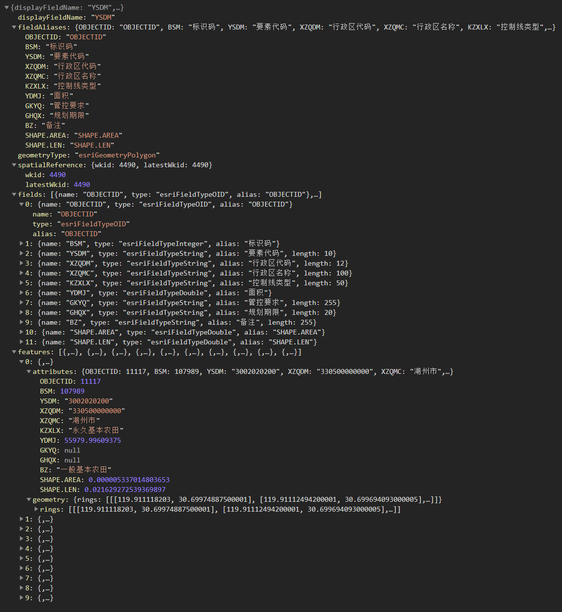
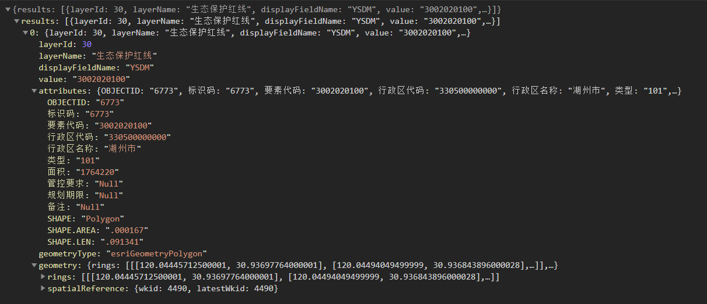
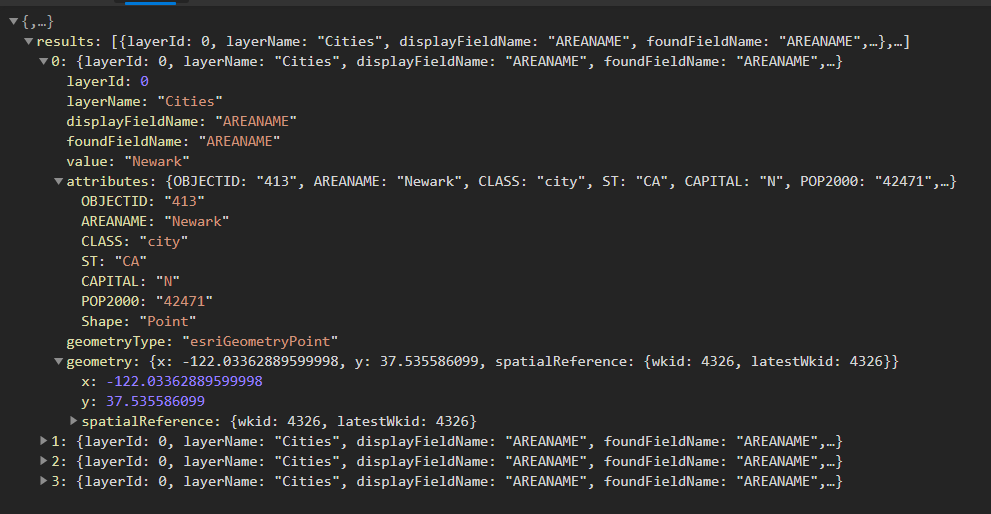

# ArcGIS Task

## 背景介绍

WebGIS前端开发的核心能力就是实现`数据展示(map,layer)`,`查询(三大查询)`和`简单分析(soe,geometryService)`.其中分析功能在有计算后台参与的情况下,可以交给后台通过开发SOE插件或WebAPI接口来实现,查询功能是我们前端WebGIS开发最常使用的API,在没有后台可依赖的情况下,前端要想实现服务信息的统计分析,依赖于对查询功能的灵活使用.

### 地图服务元数据信息

| 属性名称 | 属性含义 |
| --- | ---|
| Spatial Reference | 地图服务坐标系,图层坐标系 |
| Initial Extent | 地图初始化范围 |
| Full Extent | 地图全图范围 |
| Units | 地图数据单位 |
| Supported Image Format Types | 地图支持输出的图像格式 |
| Supports Dynamic Layers | 支持动态修改地图图层顺序和渲染 |
| MaxRecordCount | 查询一次支持最大输出要素的个数 |
| MaxImageHeight | 一次请求输出的图片最大像素高度 |
| MaxImageWidth | 一次请求输出的图片最大像素宽度 |
| Min Scale, Max Scale | 限制比例尺,地图服务仅在此比例尺范围内可见 |
| Display Field | 图层默认展示字段 |
| Type | 图层类型 |
| Geometry Type | 图层要素类型 |
| Default Visibility | 图层是否默认可见 |
| Supports Statistics | 是否支持统计查询 |
| Extent | 图层数据范围 |
| Drawing Info | 图层配图信息 |
| Fields | 图层属性字段名称,别名,类型 |

## 三大查询的对比

| API | 说明 | 特点 | 使用场景 |
| --- | --- | ------ | -------- |
| QueryTask | 对图层进行空间和属性查询的功能类 | 查询某个地图服务的某个子图层,空间查询的地图服务不必加载到Map中,返回FeatureSet结果,其中包含Graphic对象,其中属性字段key值为属性名称 | 基础查询类型,前端进行数据查询时基本都是使用此类 |
| IdentifyTask | 对服务空间查询功能类 | 查询一个服务的多个图层,空间查询,返回IdentifyResults数组,其中包含Graphic对象,其中属性字段key值为属性别名 | 系统中的属性查询功能使用此类 |
| FindTask | 对服务属性查询功能类 | 查询一个地图服务的多个图层的多个字段,不能进行空间查询,返回FindResults数组,其中包含Graphic对象,其中属性字段key值为属性别名 | 当实现地块查询,定位查询时,可使用此类 |

## [QueryTask](https://developers.arcgis.com/javascript/latest/api-reference/esri-tasks-QueryTask.html), [Query](https://developers.arcgis.com/javascript/latest/api-reference/esri-tasks-support-Query.html)

参数说明:

* Where  `查询过滤SQL语句,如: 1=1, OBJECTID > 10, OBJECTID like '%11'`
* Text  `模糊查询的值,查询字段为"Display Field"`
* Object IDs  `ObjectID数组,返回结果从其中挑选`
* Input Geometry  `查询范围`
* Geometry Type  `输入范围类型:"Envelope", "Point", "Polyline", "Polygon", "MultiPoint"`
* Input Spatial Reference  `输入图形坐标系`
* Spatial Relationship  `定义输入范围与输出结果间的空间关系:"intersects","contains","crosses","disjoint","envelope-intersects","index-intersects","overlaps","touches","within","relation"`
* Relation  `高级空间关系,使用DE-9IM九交模型矩阵表示`
* Out Fields  `输出结果包含的属性字段数组,一般输入[*]表示返回所有字段`
* Return Geometry  `是否返回geometry图形信息,图形信息还和发布的服务是否勾选携带图形信息(SHAPE)有关`
* Geometry Precision  `返回的图形的坐标点小数位数`
* Output Spatial Reference  `返回的几何图形的空间参考系`
* Return IDs Only  `只返回ObjectID, 设置此参数可突破ArcGIS服务的MaxRecordCount配置`
* Return Count Only  `只返回查询结果总数`
* Order By Fields  `返回结果排序字段,数组可设置多个,字段后添加ASC或DESC可设置升序降序`
* Group By Fields (For Statistics)
* Output Statistics  `高级统计查询,按照配置规则,对查询结果进行统计,`[参考](https://developers.arcgis.com/javascript/latest/api-reference/esri-tasks-support-Query.html#statistic)
* Return Distinct Values  `是否返回不同的值,此参数要求Out Fields为一个字段`
* Format  `返回结果格式,一般使用json`

返回结果:

## [IdentifyTask](https://developers.arcgis.com/javascript/latest/api-reference/esri-tasks-IdentifyTask.html), [IdentifyParameters](https://developers.arcgis.com/javascript/latest/api-reference/esri-tasks-support-IdentifyParameters.html)

参数说明:

* Geometry  `输入的查询范围`
* Geometry Type  `输入范围类型:"Envelope", "Point", "Polyline", "Polygon"`
* Spatial Reference  `输入输出以及Map Extent的空间坐标系`
* Layers  `执行查询的图层数组`
* Layer Definitions  `图层过滤参数,格式和地图过滤参数一致(数组-sql)`
* Tolerance  `屏幕像素与查询范围间的距离,即容差`
* Map Extent  `当前查询操作的地图显示范围`
* Image Display  `图像长宽和dpi(1969,1062,96),此参数由arcgis api自动计算,如果我们手动进行rest请求,需要主动赋值`
* Return Geometry  `返回结果是否带有几何图形`
* Geometry Precision  `返回的图形的坐标点小数位数`
* Format  `返回结果格式,一般使用json`
* returnFieldName  `ArcGIS Server10.5新增属性,表示返回属性字段key是否为字段别名`
* returnUnformattedValues   `ArcGIS Server10.5新增属性,表示返回属性字段value值是否经过格式化,如时间字段等`

返回结果:

## [FindTask](https://developers.arcgis.com/javascript/latest/api-reference/esri-tasks-FindTask.html), [FindParameters](https://developers.arcgis.com/javascript/latest/api-reference/esri-tasks-support-FindParameters.html)

参数说明:

* Search Text  `搜索文本`
* Contains  `是否精确匹配文本`
* Search Fields  `搜索字段数组`
* Spatial Reference  `返回结果空间坐标系`
* Layers  `搜索图层数组`
* Layer Definitions  `搜索图层过滤条件`
* Return Geometry  `是否返回图形信息`
* Geometry Precision  `返回的图形的坐标点小数位数`
* Format  `返回结果格式,一般使用json`

返回结果:

## [PrintTask](http://52.82.98.186:6080/arcgis/rest/services/Utilities/PrintingTools/GPServer/Export%20Web%20Map%20Task)

ArcGIS Server自带一个地图打印服务,通过这个服务,我们可以实现地图数据的高清打印.

优点:
* 使用地图打印服务,可以实现数据的高清打印,dpi可手动设置
* 代码逻辑简单,服务器性能好,效率高

缺点:
* 需要预先使用ArcGIS Desktop制作地图出图模板,对实施人员水平有一定要求
* 预留参数和制图元素较少,不能实现各种个性化出图(只有标题,作者,版权,图例,比例尺,指北针等制图组件)
* 一些丰富的专题图输出不能实现

目前前端实现界面出图功能都是通过canvas实现的,在ArcGIS的3.xAPI中,地图数据通过img节点渲染,此时使用canvas时会存在跨域问题,我们也经过多次探索,勉强解决了问题.

现在的4.xAPI中,地图数据完全渲染在canvas中,前端天然就支持直接进行图片导出,所以MapView的类中能够直接提供takeScreenshot方法来实现地图截图导出.

并且OpenLayer等开源WebGIS平台也使用canvas渲染地图,在这样的大背景下,我们基本不再使用PrintTask来实现地图导出,而是前端直接使用canvas导出,这样做不仅可以快速导出,而且可以实现更多丰富的效果.

## [SOE -- server object extensions](https://developers.arcgis.com/rest/services-reference/service-extension.htm)

SOE服务是ArcGIS Server服务的扩展,旨在将ArcGIS Desktop强大的分析能力带到服务中来,从而实现web端的实时分析.目前SOE服务由计算团队开发维护,以rest服务接口的形式展现.

当前端查询分析能力存在瓶颈或者效率低下时,可借助服务器强大的性能以及可以直接读取空间数据库表的能力,利用SOE服务来实现数据分析.

SOE服务在实践过程中也发现一些问题,如假死,只能挂载在一个服务上并只能读取挂载的服务的数据等

## 总结

本节主要介绍了ArcGIS中的三大查询,地图打印服务和SOE服务,其中地图打印服务已很少使用,SOE服务就是普通的REST服务接口,直接ajax调用就可以.主要是三大查询,要理解各自的特点以及使用场景,在具体的业务中可以灵活选用.