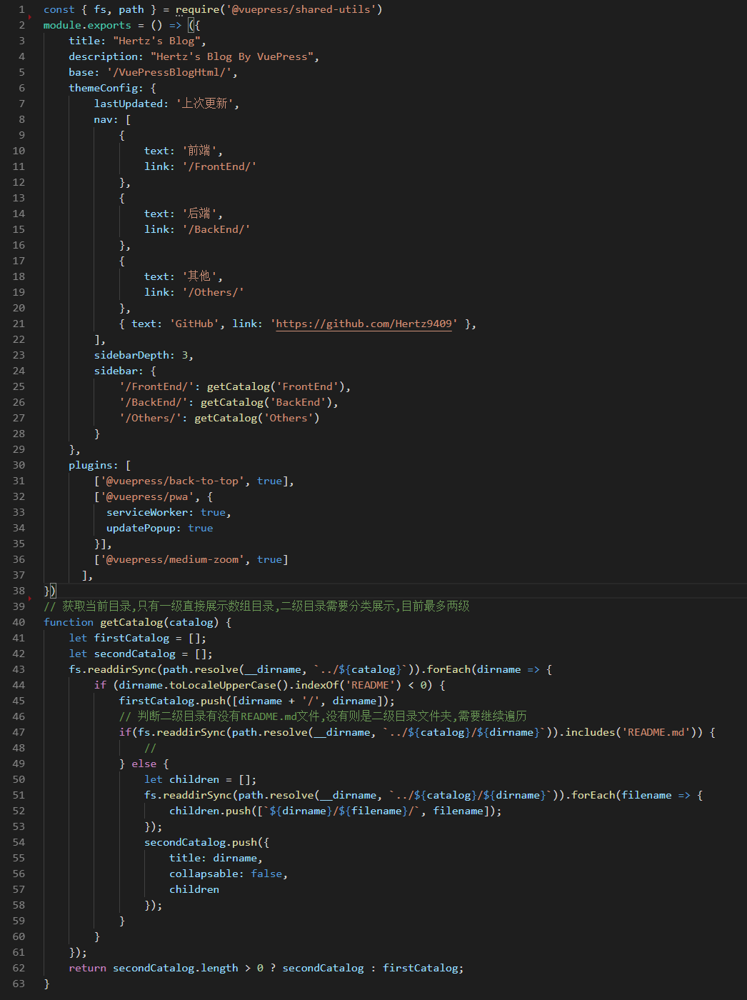
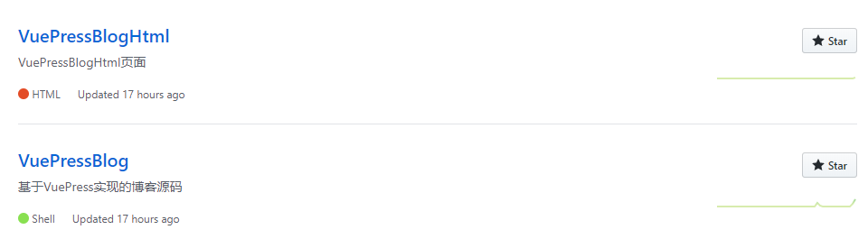
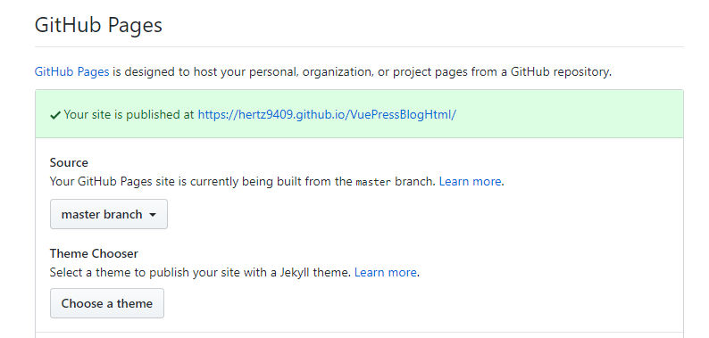
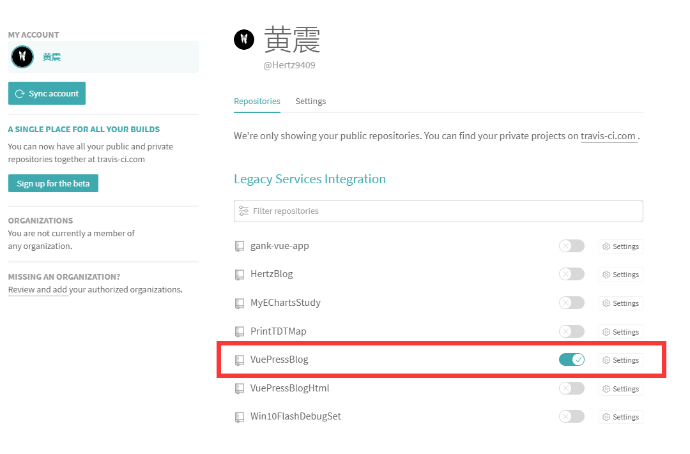
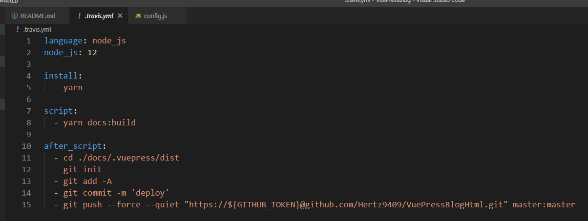
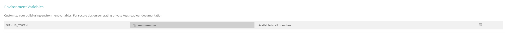
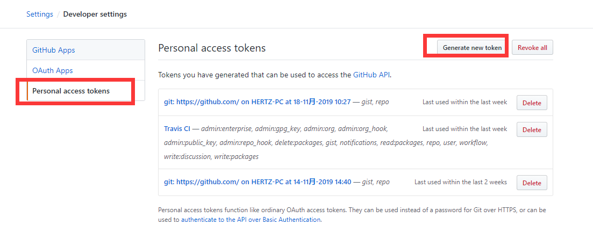
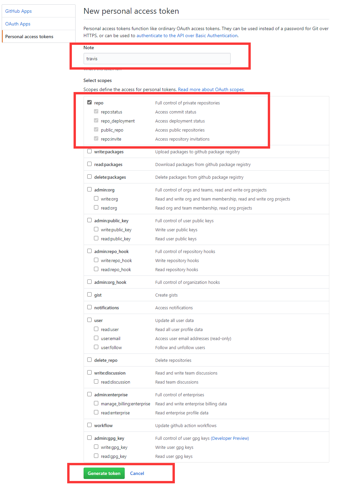

# VuePress博客部署和Travis CI持续集成

## VuePress介绍
VuePress是由Vue框架团队开发的一款静态网页生成器,它诞生的初衷是为了支持Vue及其子项目的文档需求.类似于Hexo.
### 快速开始
1. 环境安装
``` javascript
# 安装
yarn global add vuepress 或者 npm install -g vuepress
# 新建一个md文件
echo '# hello vuepress' > README.md
# 开始写作
vuepress dev .
# 构建静态文件
vuepress build .

# 在package.json中添加开发和编译命令
{
  "scripts": {
    "docs:dev": "vuepress dev docs",
    "docs:build": "vuepress build docs"
  }
}
```
2. 目录结构
```
.
├── docs
│   ├── .vuepress (可选的) // 存放全局的配置,组件,静态资源等
│   │   ├── components (可选的) // 该目录的Vue组件会被注册为全局组件
│   │   ├── theme (可选的) // 存放本地主题
│   │   │   └── Layout.vue
│   │   ├── public (可选的) // 静态资源目录
│   │   ├── styles (可选的) // 存放样式相关文件
│   │   │   ├── index.styl // 自动应用的全局样式文件,具有比默认样式更高优先级
│   │   │   └── palette.styl // 重写默认颜色常量或设置新的颜色常量
│   │   ├── templates (可选的, 谨慎配置) // 存储HTML模板文件
│   │   │   ├── dev.html // 开发环境HTML模板文件
│   │   │   └── ssr.html // 基于Vue SSR的HTML模板文件
│   │   ├── config.js (可选的) // 配置文件入口文件
│   │   └── enhanceApp.js (可选的) // 客户端应用的增强
│   │ 
│   ├── README.md
│   ├── guide
│   │   └── README.md
│   └── config.md
│ 
└── package.json
```
默认页面路由

|文件相对路径|页面路由地址|
|:-:|:-:|
|/README.md|/|
|/guide/README.md|/guide/|
|/config.md|/config.html|

3. 基本配置

一个VuePress网站必要的配置文件为`.vuepress/config.js`,它应该导出一个JavaScript对象.目前我的个人Blog网站就只进行了该文件的配置,其他的自定义样式和主题都是使用的VuePress默认的.


* title: 网站标题
* description: 网站描述,以\<meta\>标签渲染在当前页面的HTML中
* base: 部署站点的基础路径,如果将网站部署在`https://foo.github.io/bar/`,那么base应设置为`"/bar/"`,值应当总是以斜杠开始,斜杠结束.
* themeConfig: 为主题提供一些配置.目前使用的是默认主题.
  * logo: 配置导航栏logo
  * nav: 导航栏配置,可配置路由,跳转链接等,具体配置规则可查看[官方文档](https://vuepress.vuejs.org/zh/theme/default-theme-config.html#%E5%AF%BC%E8%88%AA%E6%A0%8F)
  * sidebar: 侧边栏配置,这是一个比较复杂的配置,并且由于侧边栏直接和文章目录挂钩,所以最好使用node.js方法自动生成目录结构,这样就省去了每次添加修改文章要手动修改的问题(getCatalog方法)
  * 其他相关配置都可以在官方文档中查看,如果没有深入的页面定制需求,可以不用配置,直接使用默认值.
* plugins: 插件配置.官方提供了几个好用的[插件](https://vuepress.vuejs.org/zh/plugin/using-a-plugin.html#%E4%BD%BF%E7%94%A8%E6%9D%A5%E8%87%AA%E4%BE%9D%E8%B5%96%E7%9A%84%E6%8F%92%E4%BB%B6),就不一一介绍了,根据自己需求使用.

VuePress还有其他很多特性,由于在使用中还没用到,所以暂时不做介绍,待后续补充

## 使用VuePress配合Github Page搭建个人博客

在完成VuePress Blog的环境搭建以后,我们就可以开始编写自己的md文章了.

然后我们可以配合GIthub Page功能,将我们的个人blog部署到网上供其他人访问.

为方便后续的持续集成,我们需要在Github上建立两个仓库,一个为源码仓库,一个为page页面代码仓库


建库过程以及代码上传过程我就不再演示了.

开启Github Page功能也非常简单,在page页面仓库的Settings -> Options -> GitHub Pages选项下修改Source为master分支就行,这时就会生成一个链接地址,此地址就是我们以后访问在线blog的地址.


这时,环境就配置完成了.

每当编写完一篇文章后,可以先执行`npm run docs:build`命令,此时会执行VuePress编译过程,会在`.vuepress/dist/`文件夹下生成编译完成后的静态网页文件,我们将此文件夹下的文件都上传到page页面仓库后,就可以在线查看我们的文档了.

## Travis CI持续集成

由于每次编辑完文章,我们需要手动编译和上传静态文件,操作比较繁琐,于是决定使用Travis CI来配合github钩子实现自动构建和部署.

### Travis CI简介
持续集成指的是只要代码变更,就自动运行构建和测试,反馈运行结果,确保符合预期后,将代码合并到发布分支,并进行代码发布的过程.这个过程完全由脚本控制,可以节省大量人力时间和避免人为错误.

Travis CI是最受欢迎的和GitHub配合使用的持续集成服务

### 如何使用Travis CI
1. 首先登陆[Travis CI网站](https://travis-ci.org/),然后使用自己的GitHub账号登陆网站,此时个人主页下会列出所有的仓库,打开博客源码仓库的监听按钮,此时Travis CI会监听这个仓库的变化,一旦代码有所变更,就行执行后续方法.

2. 配置.travis.yml,实现持续集成
Travis要求项目根目录下必须有一个.travis.yml文件.这是一个配置文件,指定了Travis监听到仓库变化后的行为,一旦代码变化,Travis就会去找到仓库下的这个文件,执行其中的命令.


上图是一个很简单的配置信息,Travis提供了很多的配置功能,同时也提供了很多控制脚本执行过程的关键字,目前我只使用了`install`,`script`,`after_script`.

travis支持多种语言,所以先要定义脚本执行语言.上图可以看出,我定义了脚本在nodejs 12版本的环境下运行,此时travis是支持yarn命令的.所以直接在install阶段执行`yarn`命令来安装各种依赖.

在install阶段执行完成后,会执行script阶段,此时可以执行编译命令,最终在script阶段执行完成后,我们进行dist发布文件夹下,执行git上传命令将编译后的网页文件上传到github page仓库下,这时整个过程就完成了.

>>travis提供了deploy阶段,但是为了方便编写脚本,我这边就没有使用deploy钩子

>>仔细看脚本最后一行的上传代码,其中我们使用了`${GITHUB_TOKEN}`这个模板插值,这其实就涉及到github personal access tokens的配置.

那么,上图的加密token来自哪里呢

在gihub个人中心 --> Settings -> Developer Settings --> Personal access tokens --> Generate new token中

设置token名称,赋予权限,点击生成token,此时将生成的一串字符串配置到travis的环境变量中,就可以实现不需要账户密码就可以向仓库中提交代码了.

至此,我们就完成了VuePress环境的搭建,Github Page在线查看Blog以及利用Travis CI实现Blog项目的持续集成.
我们编写完文档后,只需要将代码上传到源码仓库,Travis CI就会自动构建并更新Page页面仓库.
