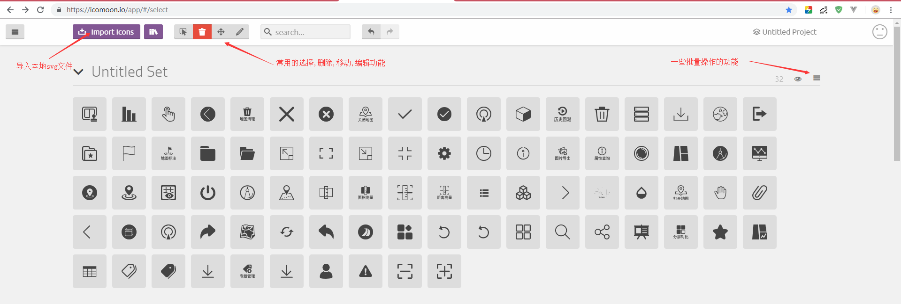
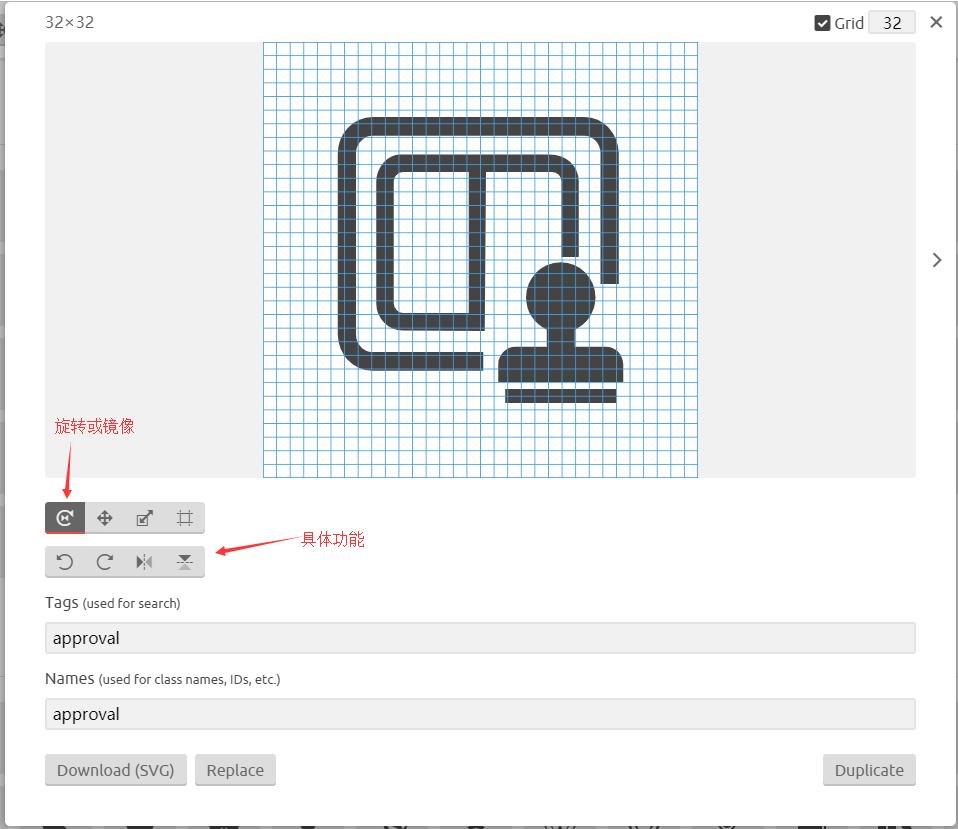
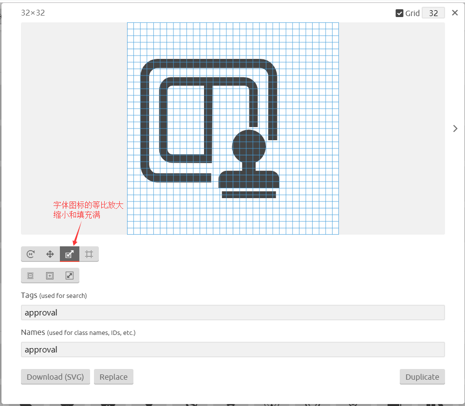
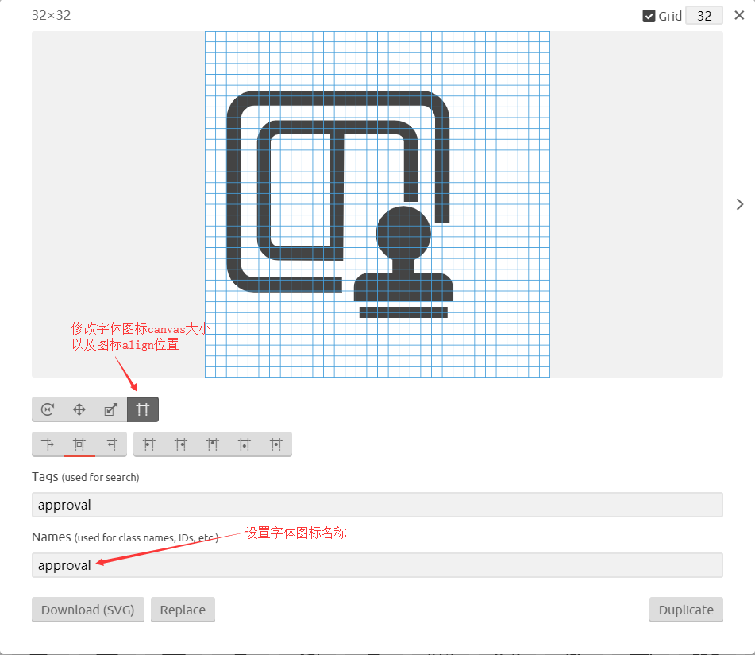
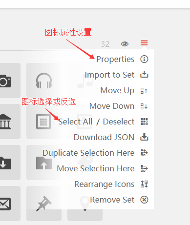
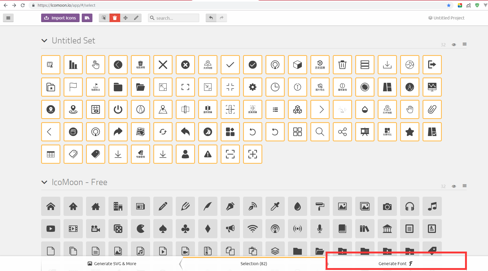
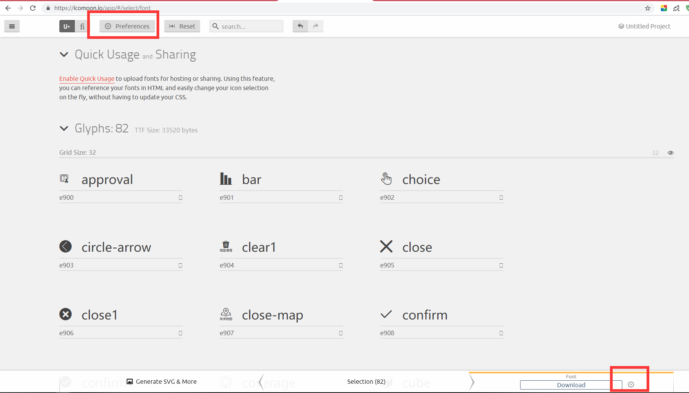
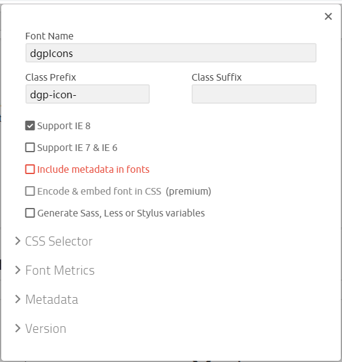

字体图标相比传统的图标有很多优势,现在在前端项目中已经非常流行了,而且网上也提供了很多开源的图标库.

关于字体图标的相关介绍可以看[前端团队知识仓库中的这篇文章](https://github.com/DIST-XDATA/Library/blob/master/WebFont/IconFont.md)

<!-- more -->

## 现状

目前在项目中使用iconfont时,一般是UI画好图以后上传到[iconfont](http://www.iconfont.cn/),然后前端开发从iconfont下载,使用icomoon生成图标字体库使用.

那么,为什么不直接使用iconfont提供的图标字体库呢?

iconfont已经提供了生成iconfont的方法,并且支持生成unicode,font class和symbol三种类型,而且也提供了简单的图标编辑功能,但是在批量编辑图标和其他一些功能的支持上没有icomoon强大.所以目前为了统一,选择先从iconfont下载图标以后,然后统一使用icomoon编辑.

## 使用方法

1. 首先访问[icomoom网站](https://icomoon.io/app/#/select), 导入本地已经准备好的svg格式的图标文件

   

2. 使用常用的功能对图标进行编辑,修改和调整顺序

重点讲一下编辑修改的功能.

当我们最后在系统中使用iconfont时,我们需要使用的是字体图标的类名,如果类名不统一或者不能直观表达图标的意思,在使用时是非常不方便的,这也是为什么不直接使用iconfont原因之一.

此时我们有两种方法修改类名称: 一种是直接修改图标源文件,一种是在icomoon中修改.

有时候ui绘制的icon并不能很好的满足需求,这时我们需要自己对图标的padding或者align等进行修改,这时候我们就需要使用icomoon提供的编辑功能,其中包括了旋转,镜像,移动,放缩和修改canvas大小和图标align.

在进行图标编辑时,我们可以使用键盘左右切换按钮快速切换下一张图片进行编辑.

在进行图标组编辑时,我们可以点开右侧的汉堡键,弹出功能列表,其中图标组属性设置和全选按钮时比较常用的功能

图标组属性设置中,我们可以设置图标网格大小和图标的padding大小,还可以移除所有图标颜色.

3. 当我们将所有的图标都编辑修改完成以后,选中需要导出的图标,点击Generate Font按钮,跳转导出预览页面

4. 修改导出参数,此时可以修改图标库的名称,图标类的前缀,是否支持低版本ie等等

5. 最后下载生成的图标库,替换原来的版本就可以使用.

## 目前使用字体图标的不足

字体图标有很多优点,这里就不说了,在使用过程中确实发现了很多不足:

1. 不能增量更新,这应该是字体图标目前最大的一个缺陷,必须全量更新,这就要求我们必须保留好源svg文件
2. 图标查看不便,不过这个问题已经被图标库生成工具解决了,图标库在生成时会带有一个展示所有图标的demo网页
3. 图标维护成本较高,对UI绘制的图片要求较高.当图标库有图标重复,或者由于UI绘制的图标不符合要求,我们需要在icomoon中修改时,每当我们修改了图标,都必须记得更新本地图标源文件,导致维护不便