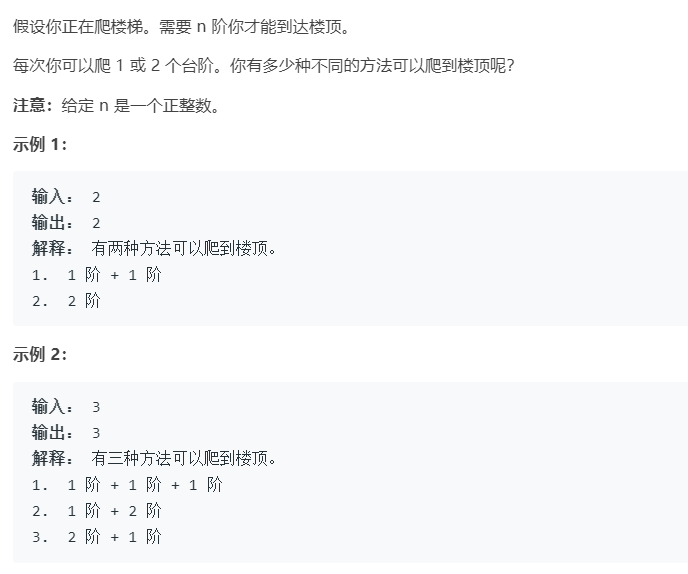

# 动态规划

## 背景

前两天刷掘金的时候看到一篇讲解动态规划算法的文章,讲的还不错,所以也就萌生了自己总结一篇文章的想法.其实现在程序员面试,很大的概率会考动态规划算法,主要是因为像排序算法或二叉树搜索这些算法,可以通过记忆背诵来应付过面试,但动态规划问题大概率是不行的,在没有理解算法思想的前提下,我们是没办法应对那些千变万化的题目的,著名的刷题网站leetcode上,动态规划分类的题目有数百道之多,充分说明了这个算法的重要性和难度.

掘金上有一篇通过漫画形式讲解动态规划的文章,推荐[阅读](https://juejin.im/post/5a29d52cf265da43333e4da7),我也会在此基础上进行总结.

## 问题引入

我们从经典的爬楼梯问题开始讲起,leetcode上有这样一道[题目](https://leetcode-cn.com/problems/climbing-stairs/).



我们最先想到的就是暴力枚举,通过排列组合,列出所有的情况,但是这是最笨的办法.

首先,我们假设n=5,那么我们只走一步就到达第五级阶梯有几种情况:1.现在在第三级阶梯,走两步到达,2现在在第四级阶梯,走一步到达.

此时,我们假设走到第三级阶梯的方法有F(3)种,走到第四级阶梯的方法有F(4)种,那么走到第五级阶梯的方法有多少种呢?答案是F(3)+F(4).

所以F(5)=F(3)+F(4);依次类推,我们就得出了F(4)=F(3)+F(2);F(3)=F(2)+F(1),而F(2)=2;F(1)=1.这个时候,我们就找到了计算规律,可以通过递归来实现计算.

直接上代码,n代表目标台阶.

```javascript
function climb_Stairs(n) {
	if (n === 1 || n === 2) {
    	return n;
    } else {
        return climb_Stairs(n - 2) + climb_Stairs(n - 1);
    }
}
climb_Stairs(n);
```

如果我们将这段代码提交到leetcode,会提示说超时,这说明我们这段代码执行时间太久,时间复杂度太高.

由于此算法是递归算法,当前值由前两个值计算获得,所以可以看作是一个树形递归,时间复杂度为O(2^n),n越大,时间复杂度成指数级增长.

### 优化

常见的优化方案中,如果时间复杂度高,第一想到的就是以空间换时间的方案.

通过观察会发现,这个递归算法和斐波那契数列类似,而优化斐波那契数列的一个方法就是将已经计算过的数据保存下来,避免重复计算,对上面的代码进行改造.

```javascript
function climb_Stairs(n) {
	if (n === 1 || n === 2) {
        tempObj[n] = n;
    	return n;
    } else {
        if(tempObj[n]) {
            return tempObj[n]
        } else {
            let tempValue = climb_Stairs(n - 2) + climb_Stairs(n - 1);
        	tempObj[n] = tempValue;
        	return tempValue
        }
    }
}
let tempObj = {};
climb_Stairs(n);
```

此时,重新提交代码后,测试通过,但是在执行时间上还是比较慢,而在内存占用上成绩很差.由于我们以空间换时间,从而造成了内存的浪费.建立缓存后,不需要重复计算,我们的时间复杂度降低到了O(n).

既然我们已经想到了这个问题和斐波那契数列类似,那为什么不更进一步呢

上面我们都是通过递归来从大到小得计算,这会导致时间复杂度和空间复杂度都急剧上升,由于当前值是和前两个值有关联的,那我们为什么不从小到大开始计算,通过循环,正向执行呢.

直接上代码

```javascript
function climb_Stairs(n) {
    let arr = [];
    arr[0] = 0;
    arr[1] = 1;
    arr[2] = 2;
    for(let i=3;i<=n;i++) {
        arr[i] = arr[i - 1] + arr[i - 2];
    }
	return arr[n];
}
climb_Stairs(n);
```

再进一步,我们只需要保存当前值的前两个值就可以了,没必要保存所有的值.

```javascript
function climb_Stairs(n) {
    if (n === 1 || n === 2) {
    	return n;
    }
    let first = 1;
    let second = 2;
    for(let i=3;i<=n;i++) {
        let temp = first + second;
        first = second;
        second = temp;
    }
	return second;
}
climb_Stairs(n);
```

此时,我们时间复杂度降为O(n),空间复杂度降为O(1).

通过一步步的优化,我们成功得解决了问题,并在算法时间复杂度和空间复杂度上做到了尽量最优.

在优化过程中,将递归计算转换为正向循环计算,其实就是动态规划思想的体现.

## 动态规划

动态规划(Dynamic Programming,简称DP)是一种在数学,管理科学,计算机科学,经济学和生物信息学中使用的,`通过把原问题分解为相对简单的子问题的方式求解复杂问题的方法`.

动态规划适用于有`重叠子问题`和`最优子结构`性质的问题,动态规划方法所耗时间往往少于朴素解法.它将问题重新组合成子问题,为避免多次解决这些子问题,它们的结果都逐渐被计算并保存,从简单的问题开始,直到整个问题被解决.

动态规划中,有三个重要的概念: 最优子结构, 边界, 状态转移公式.

`最优子结构`是指局部最优解能决定全局最优解,简单说就是问题能够分解成子问题解决.

上面的例子中,最优子结构就是F(10)=F(9)+F(8);即上10个台阶的方法等于上9个台阶和上9个台阶的总和.而边界就是F(1)=1;F(2)=2.最重要的状态转移方程则是F(n)=F(n-1)+F(n-2).获得了状态转移方程后,我们就可以很快的写出动态规划的代码,同时要注意处理边界情况和记录缓存避免重复计算.

## 背包问题

接下来,介绍下动态规划算法最经典的应用--背包问题

背包问题可描述为: 给定一组物品,每种物品都有自己的重量和价格,在限定的总重量内,我们如何选择,才能使得物品的总价格最高.

背包问题存在9种类型的变种问题,这篇文章不会将所有的问题都记录下来,有兴趣的可以查看这篇[博客](https://www.cnblogs.com/jbelial/articles/2116074.html),讲解非常详细.

### 01背包问题

题目: 有`N`件物品(每个物品只有1件)和一个容量为`W`的背包,第`i`件物品的重量为`weight[i]`,价值为`value[i]`.求解将哪些物品装入背包,可使这些物品的容量总和不超过背包容量,且价值总和最大.

01背包问题是最基础的背包问题,特点就是每种物品仅有一件,可以选择放或不放.

#### 解题思路

首先按照惯例,我们先分析最优子结构.

定义 `f[i][W]`表示前`i`件物品恰好放入一个容量为`W`的背包可以获得最大价值,那么对于前`i-1`件物品,存在两种情况: 第`i`件物品没放进去了,那么最大价值为`f[i-1][W]`;如果第`i`件物品放进去了,那么最大价值就可以表示为`f[i-1][W-weight[i]]+value[i]`.此时,我们就可以确定这个问题的状态转移方程`f[i][v]=max(f[i-1][W], f[i-1][W-weight[i]]+value[i])`.

明确状态转移方程后,我们来思考它的边界问题.`f[i][0]=0`:容量为0的背包,总价值自然是0;还有,当`weight[i]>W`时,即第i个物品的重量比背包容量还大的话,那么第`i`件物品是一定放不进去的,此时`f[i][W]=f[i-1][W]`.

依然从暴力枚举开始上代码:

```javascript
for(let i=1;i<=N;i++) {
    for(let j=1;j<=W;j++) {
        if(widget[i] > j) {
            f[i][j] = f[i-1][j];
        } else {
            f[i][j] = Math.max(f[i-1][j], f[i-1][j-weight[i]] + value[i]);
        }
    }
}
console.log(f[N][W]);
```

网上关于01背包问题的文章,都会讲到一个优化,即将第二层循环反过来,实现二维数组降为一维数组,节省空间,那具体是怎么实现的呢?看一个例子.

##### 01背包问题样例分析

问题描述: 有编号a,b,c,d,e五件物品,重量分别为2,2,6,5,4,价值分别为6,3,5,4,6;现在有一个承重为10的背包,如何让背包内装入的物品具有最大价值总和?

我们通过表格穷举出所有可能的情况:

| 物品 | 重量 | 价值 |  1   |  2   |  3   |  4   |  5   |  6   |  7   |  8   |  9   |  10  |
| :--: | :--: | :--: | :--: | :--: | :--: | :--: | :--: | :--: | :--: | :--: | :--: | :--: |
|  a   |  2   |  6   |  0   |  6   |  6   |  6   |  6   |  6   |  6   |  6   |  6   |  6   |
|  b   |  2   |  3   |  0   |  6   |  6   |  9   |  9   |  9   |  9   |  9   |  9   |  9   |
|  c   |  6   |  5   |  0   |  6   |  6   |  9   |  9   |  9   |  9   |  11  |  11  |  14  |
|  d   |  5   |  4   |  0   |  6   |  6   |  9   |  9   |  9   |  10  |  11  |  13  |  14  |
|  e   |  4   |  6   |  0   |  6   |  6   |  9   |  9   |  12  |  12  |  15  |  15  |  15  |

上方的表格穷举了所有的情况,然后我们根据状态转移方程`f[i][v]=max(f[i-1][W], f[i-1][W-weight[i]]+value[i])`会发现,对于`f[b][8]`值,它所有的计算结果都来自于`f[a][1-8]`,即我们只需要保存一组数据,然后在计算第二组数据时,从后往前计算并不断替换数组中已经计算过的值,我们在优化后的一维数组之间增加了一块隔板,隔板左侧为上次循环计算的`f[a][1-8]`,隔板右侧为当前反向循环计算的`f[b][9-10]`,并且通过反向循环,利用隔板左侧的值计算出隔板右侧的值,并替换旧值,同时左移隔板,最终实现通过一个一维数组计算出`f[N][W]`.

明确了这一规律后,我们再观察背包问题的双层循环代码,就能很简单得进行优化了,直接上代码:

```javascript
for(let i=1;i<=N;i++) {
    for(let j=W;j>=1;j--) {
        if(widget[i] <= j) {
           f[j] = Math.max(f[j], f[j-weight[i]] + value[i]);
        }
    }
}
console.log(f[W]);
// 简洁版
for(let i=1;i<=N;i++) {
    for(let j=W;j>=widget[i];j--) {
    	f[j] = Math.max(f[j], f[j-weight[i]] + value[i]);
    }
}
console.log(f[W]);
```

至此,01背包问题完全解决并优化,利用动态规划得思想,我们将一个大问题分解为一个个得重叠子问题,并通过状态转移方程,以小见大,一步步求出最终得解.

同时,我们也可得出一个简单得规律,动态规划问题有两种思路: 一种是由大到小,自上而下进行递归计算,此方法需要注意缓存,防止重复计算,第二种是由小到大,自下而上进行循环计算,此方法在处理一些动态规划问题时,优势更大.

### 完全背包问题

`背包问题一共存在9种类型的题目,本篇文章主要是为了理解动态规划思想,并不准备将所有得背包问题都总结,后续可以单独出一篇背包问题的文章.`

题目: 有`N`件物品(每个物品有无线多个)和一个容量为`W`的背包,第`i`件物品的重量为`weight[i]`,价值为`value[i]`.求解将哪些物品装入背包,可使这些物品的容量总和不超过背包容量,且价值总和最大.

完全背包问题和01背包问题的不同就是物品无限个.

老规矩,依然先寻找问题的状态转移方程.定义 `f[i][W]`表示前`i`件物品放入一个容量为`W`的背包可以获得最大价值,对于第`i`件物品,我们有`k`种选择,其中`0<=k*weight[i]<=W`,即可以选择`0,1,2,3...k`件第`i`件物品.所以状态转移方程可以表示为

`f[i][W]=max(f[i-1][W]  (不放第i种物品,k=0), f[i][W-k*weight[i]] + value[i]*k (至少放一件第i种物品,k>=1))   (0<=k*weight[i]<=W)`

知道状态转移方程后,依然是先使用暴力枚举方法

```javascript
for(let i=1;i<=N;i++) {
    for(let j=1;j<=W;j++) {
        // 当k=0时
        f[i][j] = f[i-1][j];
        // 当k>=1时
        let temp = []
        for(let k=1;k<=j/weight[i];k++) {
            temp.push(f[i][j-k*weight[i]] + k*value[i]);
        }
        f[i][j] = Math.max(f[i][j], temp);
    }
}
console.log(f[N][W]);
```

我们依然通过一个具体的例子画出表格来寻找优化思路

问题描述: 有编号a,b,c,d,e五种物品(每种物品数量不限),重量分别为1,2,6,5,4,价值分别为1,3,5,4,6;现在有一个承重为10的背包,如何让背包内装入的物品具有最大价值总和?

| 物品 | 重量 | 价值 |  1   |  2   |  3   |  4   |  5   |  6   |  7   |  8   |  9   |  10  |
| :--: | :--: | :--: | :--: | :--: | :--: | :--: | :--: | :--: | :--: | :--: | :--: | :--: |
|  a   |  1   |  1   |  1   |  2   |  3   |  4   |  5   |  6   |  7   |  8   |  9   |  10  |
|  b   |  2   |  3   |  1   |  3   |  4   |  6   |  7   |  9   |  10  |  12  |  13  |  15  |
|  c   |  6   |  5   |  1   |  3   |  4   |  6   |  7   |  9   |  10  |  12  |  13  |  15  |
|  d   |  5   |  4   |  1   |  3   |  4   |  6   |  7   |  9   |  10  |  12  |  13  |  15  |
|  e   |  4   |  7   |  1   |  3   |  4   |  7   |  8   |  10  |  11  |  14  |  15  |  17  |

对于`f[c][9]`,由于k取值问题,它和`f[b][9]`以及`f[c][1-8]`有关.

类似于01背包问题的优化,我们也可以将完全背包问题以相似的思想来进行优化,只不过不同的是,对于01背包问题,`f[i][v]`是和`f[i-1][v-weight[i]]`相关的,而完全背包问题则不同,对于第i件物品,我们有多种选择,所以其实`f[i][v]`是和`f[i][v-k*weight[i]]`相关的.那么按照二维数组转一维数组的思路,我们得先计算出`f[i][1-v]`的结果,才能得出`f[i][v]`的结果,故此有如下优化:

```javascript
for(let i=1;i<=N;i++) {
    for(let j=weight[i];j<=W;j++) {
        f[j] = Math.max(f[j], f[j-weight[i]] + value[i]);
    }
}
console.log(f[W]);
```

上述代码中为什么可以省略k值,其实通过观察表格我们就可以发现,`f[e][10]`和`f[e][6]`有关,`f[e][6]`和`f[e][2]`有关,分别对应k=1和k=2的情况,而第二层关于j的循环都会覆盖到这种情况,所以没必要再保留对k的处理.

## 总结

动态规划问题是一种特别难理解也特别难分析的问题,不过我们只要掌握一般的分析思路,遇到问题,还是会有办法下手的.

一般如果是给出几个条件,然后求最大值或最优解的情况,这种就可以考虑是否可以使用动态规划的思想解题.

而解题关键就在于寻求最优子结构,求得状态转移函数,一旦做到这一步,我们就可以通过暴力枚举先计算出几个简单的结果,由结果去推算规律,最终完成递归求解的算法,并进行时间和空间复杂度的优化.

背包问题一共存在九种问题,本文只是分析了其中两种来举例说明了分析动态规划问题的方法,后续可以再写一篇文章具体分析背包问题.


