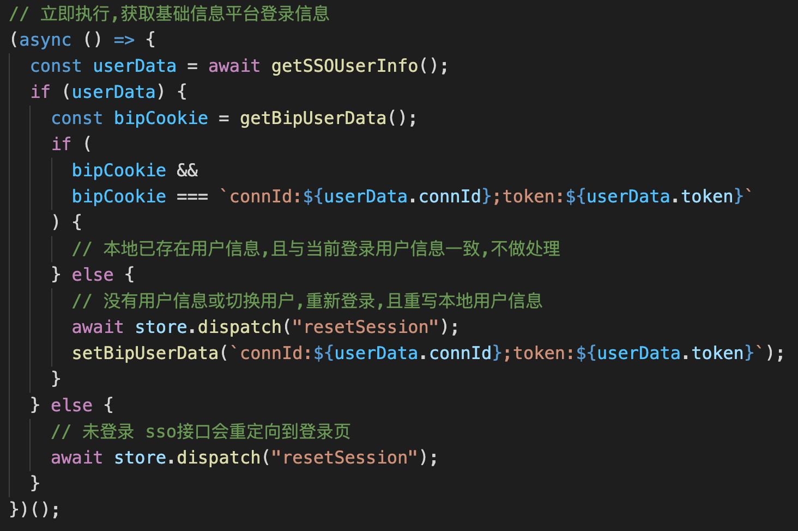
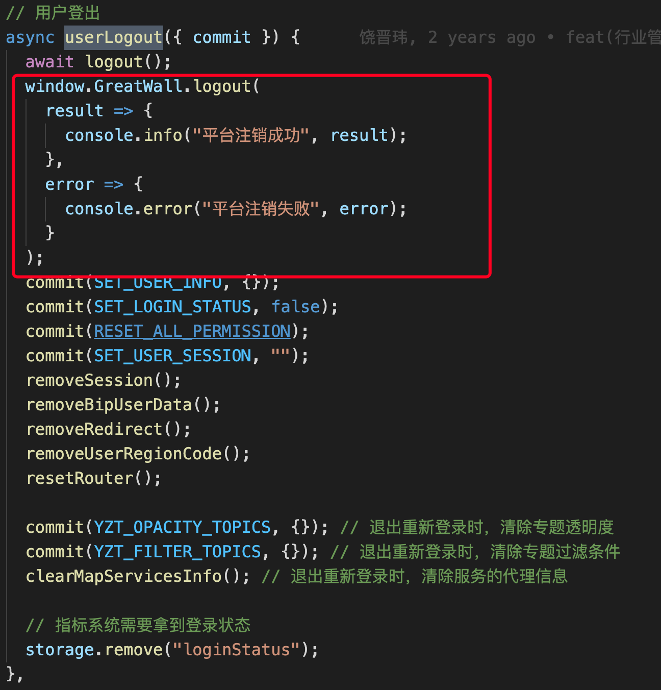

# 实施监督系统对接基础信息平台统一登录

方案一: 整个实施监督系统前后台由平台网关代理,后台修改接口,前端无需修改

方案二: 前后台修改

* 后台调用平台提供的接口同步平台用户信息

* 后台修改或新增登录接口,通过平台提供的`connid`和`token`校验用户信息进行系统登录(具体校验规则询问陈艳平)

* 前端集成网关探针文件,使用`script`标签在head下引入登录js库文件

* 修改登录逻辑

  * 在系统初始化时调用GreatWall.sso接口,获取用户信息(此时若没有登录,可以跳转到平台登录页登录)

    

  * 对比接口返回的用户信息和本地cookie保存的用户信息是否一致

    * 如果一致,则表示本地保存用户信息有效
    * 如果信息不一致,则需要清除本地保存的用户信息并将新的用户信息写入本地cookie

    

  * 读取最新的用户信息,使用`connid`和`token`调用后台提供的接口,登录实施监督信息系统,若登录失败,则清理本地信息并重新跳转到基础信息平台登录页面

    

  * 用户登出时调用GreatWall.logout接口,清除用户信息并重新跳转到平台登录页面

    

* 接入平台代理服务时,需要提供平台用户cookie信息,在开始调用sso接口时,平台已经将cookie信息写入浏览器.

  * 针对ArcGIS API,我们需要将平台IP端口地址配置进可信服务列表(esriConfig.request.trustedServers)
  * 真的一般的ajax请求,我们需要设置允许携带cookie

